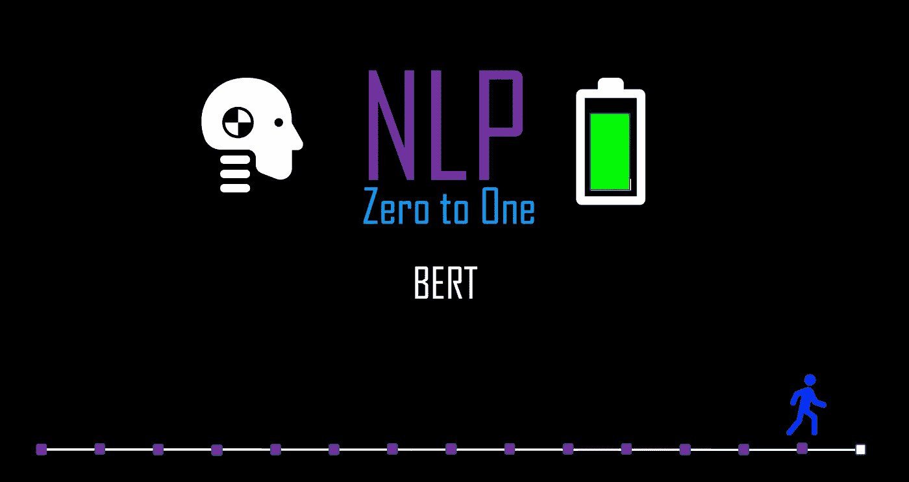
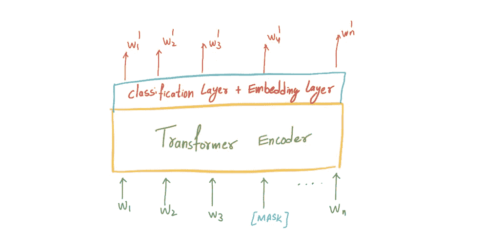
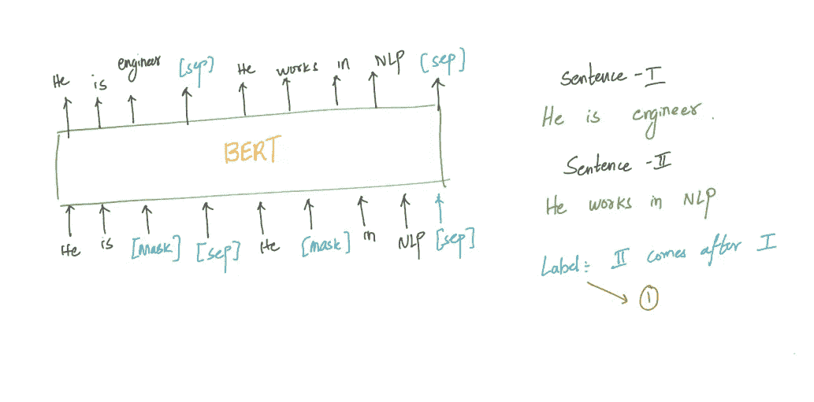

# NLP 零到一:BERT(第 14/30 部分)

> 原文：<https://medium.com/nerd-for-tech/nlp-zero-to-one-bert-part-14-40-691ef069712f?source=collection_archive---------20----------------------->

## 来自变压器的双向编码器表示

由作者生成

# 介绍..

BERT(来自变压器的双向编码器表示)是一种语言表示模型。这是最近在自然语言处理中取得的成功，它在许多自然语言处理任务中被证明优于许多现有的先进模型。这些预先训练好的模型然后可以被 ***微调*** 用于许多 NLP 问题，如问题&回答和情感分析。

预先训练的语言表示可以是 ***与上下文无关的*** 或 ***基于上下文的*** 。像 word2vec 这样的上下文无关模型为词汇表中的每个单词生成一个单词嵌入表示(一个数字向量)。像 Word2Vec 等其他密集表示模型一样，Bert 也采用了无监督学习设置，因此消除了对标记数据的需要。BERT 试图根据上下文(周围的单词)来预测目标单词。在这篇博客中，我们将试图更详细地了解 BERT。

# 想法..

让我们首先尝试修改 Wor2Vec 架构，其中我们基于上下文预测目标。上下文被定义为" **n"** 词两边的目标词。为了更好的理解，请浏览我在这个系列中关于 Wor2Vec 架构的博客。与 Word2Vec 不同，BERT 使用了一种叫做 **Masked LM** (MLM)的新技术，其中 model 随机屏蔽句子中的单词，然后试图预测它们。顾名思义,“来自变压器的双向编码器表示”暗示模型在两个方向上训练，并且它使用来自两个方向的句子的完整上下文来预测被屏蔽的单词。

BERT 是基于上下文的嵌入，它基本上意味着单词的表示依赖于上下文。“学校”这个词在句子中的嵌入会有所不同“他要去 ***学校*** 离得很远”和“这个新来的 ***学校*** 的思想很激进”作为“学校”这个词在两个句子中的意思完全不同。

# 体系结构..

## 掩饰

伯特建筑，由作者生成

BERT 基于 Transformer 模型架构，这是一种自我关注机制，可以学习文本中单词之间的上下文关系。请浏览我在变形金刚系列中的博客，更好地理解这些概念，因为理解 BERT 非常重要。Transformers 使用编码器-解码器设置。但是 BERT 是单词嵌入生成模型，所以 BERT 只包含编码器网络。

我们随机屏蔽输入中的单词，然后通过基于 BERT 注意力的编码器运行整个序列，然后根据序列中未被屏蔽的单词所提供的上下文，仅预测被屏蔽的单词。我们用[MASK]替换被屏蔽的单词，并且模型仅尝试预测[MASK]标记何时出现在输入中。这种掩蔽方法有一个缺点。我们希望模型能够预测正确的单词，而不管输入是什么，为了克服这个缺点，10%的[掩码]被替换为随机单词。

## 下一句预测..

除了预测单词，模型还接收两个句子作为输入。BERT 的任务是预测语料库中第二个句子是否在第一个句子之后。

伯特建筑，由作者生成

BERT 损失函数只考虑屏蔽值的预测，而忽略非屏蔽字的预测。在训练 BERT 模型时，屏蔽 LM 和下一句预测一起训练，目标是最小化两种策略的组合损失函数。

BERT 论文中介绍了两种不同的体系结构。请注意参数的数量。512 个令牌是输入的最大序列长度。任何不在词汇表中出现的单词都被贪婪地分解成子单词。

*   BERT base — 12 层(变压器模块)、12 个注意力头和 1.1 亿个参数。
*   BERT Large — 24 层，16 个注意力头，3.4 亿个参数。

# 应用程序..

BERT 技术已经在各种各样具有挑战性的自然语言任务上取得了最先进的结果。在句子分类任务中，可以通过在 transformer 之上应用分类层来直接应用 BERT。在像“**问答**这样的任务中，任务是标记序列的答案，可以通过学习两个标记答案开始和结束的额外向量来训练 BERT。它还可以执行命名实体识别(NER)任务。值得注意的是，在微调训练中，大多数超参数保持与 BERT 训练中相同。

由作者生成

上一部: [**NLP 零比一:变形金刚(第 13/30 部)**](https://kowshikchilamkurthy.medium.com/nlp-zero-to-one-transformers-part-13-30-5cd5a3ddd93b?source=your_stories_page-------------------------------------)

接下来: [**NLP 零对一:知识图谱部分(15/30)**](https://kowshikchilamkurthy.medium.com/nlp-zero-to-one-knowledge-graphs-part-15-40-df278d91c635?source=your_stories_page-------------------------------------)