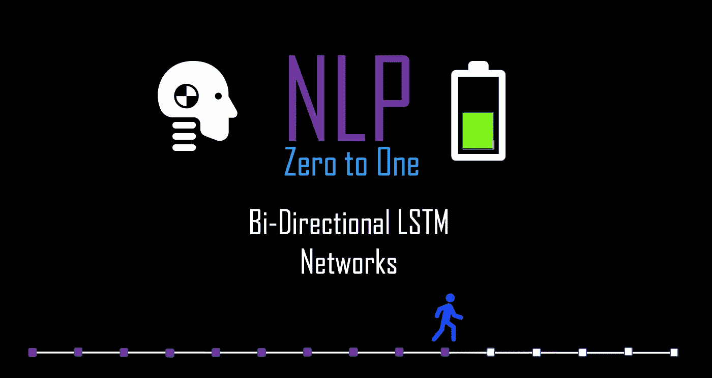
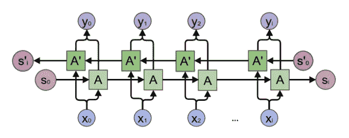
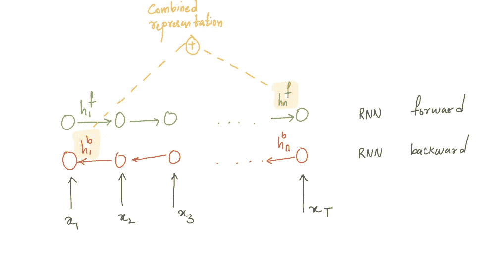

# NLP 零到一:双向 LSTM 部分(10/30)

> 原文：<https://medium.com/nerd-for-tech/nlp-zero-to-one-bi-directional-lstm-part-10-30-cab0eab65533?source=collection_archive---------24----------------------->

## 恒定误差传送带

由作者生成

RNN 或 LSTM 只关心向前方向的记忆环境的积累。但是，我们也希望模型允许将“向前”和“向后”的上下文合并到预测中。如果我们有一个跨越正向序列(“他是一个好人”)和反向序列(“他是一个好人”)的模型架构，这就可以实现。专门为这种双向序列构建的 RNN 称为双向 RNN。在大多数 NLP 任务中，双向网络通常优于仅向前的 rnn，如语言建模、序列标记任务(如词性标记)以及序列分类任务(如情感分析和主题分类)。

在这篇博客中，我们将了解 RNN 和 LSTM 的双向变体，也看看一些应用。

# 双向 RNN..

双向 RNN 只是将两个独立的 rnn 连接在一起。这种结构允许网络在每个时间步都具有关于序列的前向和后向信息。双向 RNN 中的前向和后向 RNN 分别具有不同的隐藏状态“hf”和“hb”。前向 RNN 和后向 RNN 构成单个双向层。

对于输入序列 X = {x1，x2，.。。，xT }，前向上下文 RNN 以前向顺序 t ={1，2，.。。，T}，后向上下文 RNN 以相反的顺序接收输入 t = {T，t1，.。。,1}.这里我们应用两次前向传播，一次用于前向单元，一次用于后向单元。

# 培养

面临的挑战是确保两个网络的学习同时发生，并且应该同步，以便来自两个网络的学习可以被整理用于最终预测。双向 RNN 提出了一个简单的架构，将前向和后向 RNN 网络缝合在一起。其思想是在与正向 RNN 网络相反的方向上运行反向 RNN 网络，以便序列链中每个时间步的输入和输出精确匹配。

所有时间步长的误差是两个网络在每个时间步长的损失总和，我们可以对网络中每个权重的梯度求和，然后用累积的梯度进行更新。这与我们在单向情况下所做的非常相似。

然后，我们连接前向和后向隐藏状态，以获得组合的隐藏状态，并将其输入到输出层，用于预测输出。例如，在试图预测下一个单词的标准 NLP 任务中，该组合的隐藏层然后被用于生成输出层，该输出层通过 softmax 层以生成整个词汇上的概率分布。

组合表示的图解

向前和向后传递的最终隐藏单元被组合来表示整个序列。这个组合的隐藏状态充当整个序列的表示。双向 RNNs 的一个限制是在预测之前必须知道全部输入序列，这限制了 RNN 在一些实际 NLP 问题中的应用。

# 注意:

1.  ***恒误差转盘*** 是 LSTM 的另一个很重要的特点。它允许 LSTM 在传播时有一个平滑和不间断的梯度流。这防止了消失梯度，如果遗忘门和输入门大多为 1，单元状态有效地将输入相加。这些设计被称为“恒定误差传送带”。

2.**教师强制:**在任务中是最小化预测训练序列中下一个单词的误差，使用交叉熵作为损失函数。

3.**序列标签:****网络的任务是从一个小的固定标签集中为序列的每个元素分配一个标签。像词性标注和命名实体识别这样的任务都属于这个范畴**

****

**由作者生成**

**先前: [**NLP 零比一:LSTM 部分(9/40)**](https://kowshikchilamkurthy.medium.com/nlp-zero-to-one-lstm-part-9-40-98e8cc4c296d?source=your_stories_page-------------------------------------)**

**接下来: [**NLP 理论与代码:编码器-解码器模型(第 11/30 部分)**](https://kowshikchilamkurthy.medium.com/nlp-theory-and-code-encoder-decoder-models-part-11-30-e686bcb61dc7?source=your_stories_page-------------------------------------)**