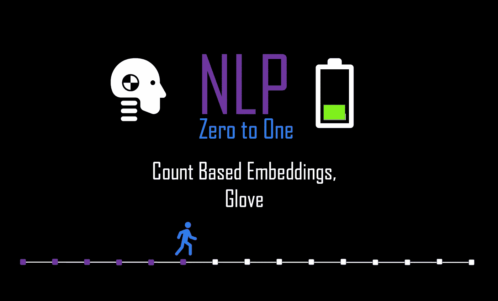
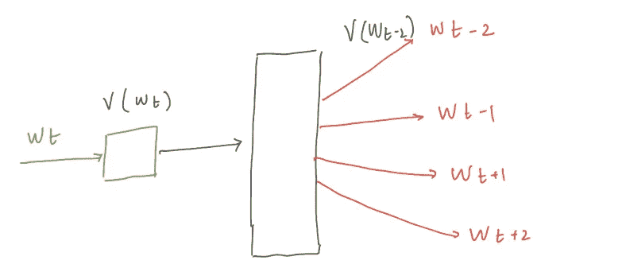
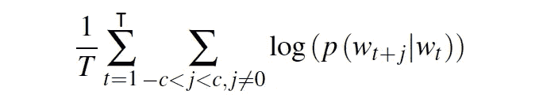
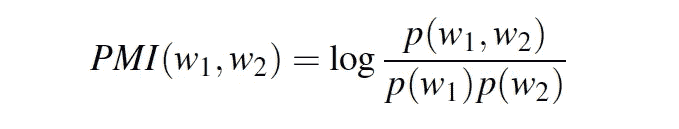
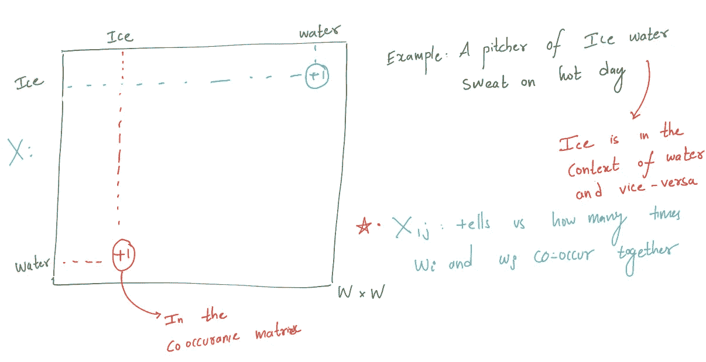
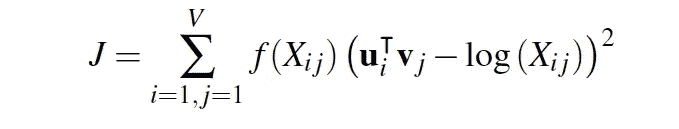
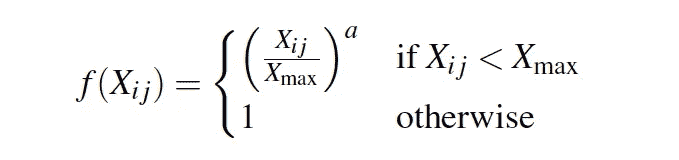

# NLP 零到一:基于计数的嵌入，手套(第 6/30 部分)

> 原文：<https://medium.com/nerd-for-tech/nlp-zero-to-one-count-based-embeddings-glove-part-6-40-c5bb3ebfd081?source=collection_archive---------14----------------------->

## 基于共现的模型和动态逻辑回归。

# 介绍..

在之前的博客中，我们定义了嵌入，并讨论了 Word2Vec 中流行的神经架构之一。在这篇博客中，我们将简要讨论另一个著名的神经架构，叫做 Skip-gram。我们将花费大量时间了解其他可用的嵌入，如 GloVe。

# 跳跃图..

CBOW 模型被训练来基于附近的上下文单词预测目标单词，skip-gram 模型被训练来基于目标单词预测附近的上下文单词。与 CBOW 模型正好相反。对于上下文窗口 c，跳过语法模型被训练来预测目标单词周围的 c 个单词。

skip-gram 的神经结构和训练与 CBOW 非常相似。因此，我们将把我们的讨论限制在跳跃图的神经结构上。跳跃图模型的目标是最大化平均对数概率:

# Word2Vec 的缺点..

尽管 word2vec 给自然语言处理带来了巨大的改进和提高，但它们也不是没有缺点。

1.  Word2vec 是基于本地上下文的，通常在捕获语料库的统计数据方面表现不佳。
2.  无法处理未知的或不在词汇表中的单词:如果你的模型以前没有遇到过一个单词，它将不知道如何解释它或如何为它建立一个向量
3.  Word2Vec 是基于本地上下文的，通常在捕获语料库的统计数据方面表现不佳。

# 基于共现的模型..

众所周知，像 Word2Vec 这样的基于局部上下文的方法不能捕获语料库的全局统计/结构。除了本地化方法之外，还有另一个学派建议对文本或语料库进行全球理解。这个学派提出，通过分析单词在可用语料库中所有文档中的出现，可以理解单词之间的强关联。这种方法被称为共现模型，因为词的共现可以揭示它们的语义接近度和意义。
我们需要一种方法来量化两个词“W1”、“W2”的共现。逐点互信息(PMI)是一种非常流行的同现测度。

采购经理指数（Purchasing Managers' Index 的缩写）

p(w)是单词出现的概率，p(w1，w2)是联合概率。高的 **PMI 表明单词之间有很强的关联性。**

同现方法通常是非常高维的，并且需要很多存储空间。NLP 工程师通常利用降维技术来处理高维数据。尽管由于巨大的存储需求，基于全局共现的模型成功地捕获了全局统计，但是这些模型不能代替静态的 Word2Vec 嵌入。

# 手套(全局向量)..

除了 word2vec 之外，使用最广泛的静态嵌入模型是 Global Vectors 的 GloVe 简称。该模型基于捕获全局语料库统计数据。该方法结合了共现方法和浅窗口方法。让我们简单了解一下手套向量是如何创建的。

作者生成的图像

**单词-单词共现矩阵:** A 矩阵 X，其中单元格 Xij 为 A 表示 Wi 在语料库中的 Wj 的上下文中出现的频率或者 Wi 和 Wj 在语料库中共现的次数。
**概率比** : GloVe 是基于词-词共现矩阵的概率比，这是起点。让我们看一个例子来理解这个概念(概率比)背后的直觉。
设 **P(k|w)** 为单词 k 出现在单词 w 的上下文中的概率，单词{“水”、“冰”}一起出现所以 **P** (“冰”/“水”)会高。还有字{“水”、“汽”}一起出现，所以 **P** (“汽”/“水”)也会高。
**比例:P** (“冰”/“水”)⊙**P**(“蒸汽”/“水”)；因为分子和分母都很高，所以比率将接近 1。这个比率= 1 所解释的是，“水”(也称为*探测词*)与单词“冰”和“蒸汽”非常接近，因为它们一起出现。这个比率给了我们三个不同单词之间关系的提示。我们将利用这个想法来构建向量。

# 手套训练..

我们将需要建立单词向量来显示每一对单词 *i* 和 *j* 如果同时出现的话是如何同时出现的。GloVe 预测周围单词的方式是通过执行**动态逻辑回归，在给定中心单词的情况下，最大化上下文单词出现的概率。**

对于每个“U”和“V”，我们将使用软约束创建向量。我们将通过最小化目标函数 *J* 来找到向量，

目标函数

其中 V 是词汇量的大小，X 是**单词-单词共现矩阵。**

f(。)是一个加权函数，并且具有截断的幂律形式，以处理低共现单词，这些单词比频繁出现的一次携带更少的信息。所以我们在目标函数中给对应于这些低共现词的损失较小的权重。

手套嵌入可以通过向量加法和减法表达语义和句法关系。在许多 NLP 任务中，GloVe 甚至比 Word2Vec 执行得更好，因为 GloVe 还捕获了全局上下文依赖。

# 注意..

**分级 Softmax:** 普通**CBOW 和 skip-gram 中的 Softmax 层是输出层中的用户，用于预测单词和计算损失，使用 softmax 预测单词可能是非常计算昂贵的步骤，因为词汇量很大。分层 softmax 的计算效率更高，它使用输出层的二叉树表示。
**负采样:**替代基于噪声对比估计的分层 softmax)。基本思想是，好的模型应该能够通过逻辑回归将数据与噪声区分开来。**

****

**接下来: [**NLP 零对一:使用 Gensim 和可视化训练嵌入(第 7/30 部分)**](https://kowshikchilamkurthy.medium.com/nlp-zero-to-one-training-embeddings-using-gensim-and-visualisation-part-7-30-f0540e976568?source=your_stories_page-------------------------------------)
上一篇: [**NLP 零对一:密集表示，Word2Vec(第 5/30 部分)**](https://kowshikchilamkurthy.medium.com/nlp-zero-to-one-dense-representations-word2vec-part-5-30-9b38c5ccfbfc?source=your_stories_page-------------------------------------)**