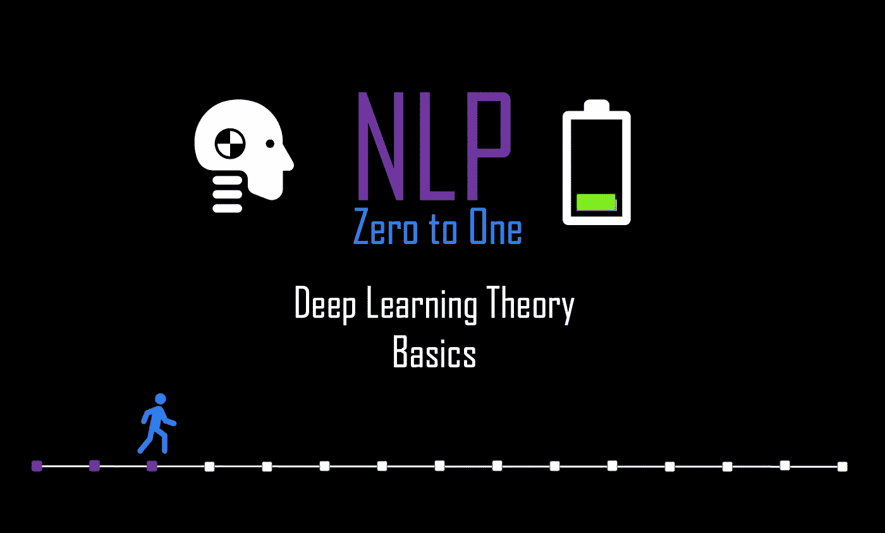
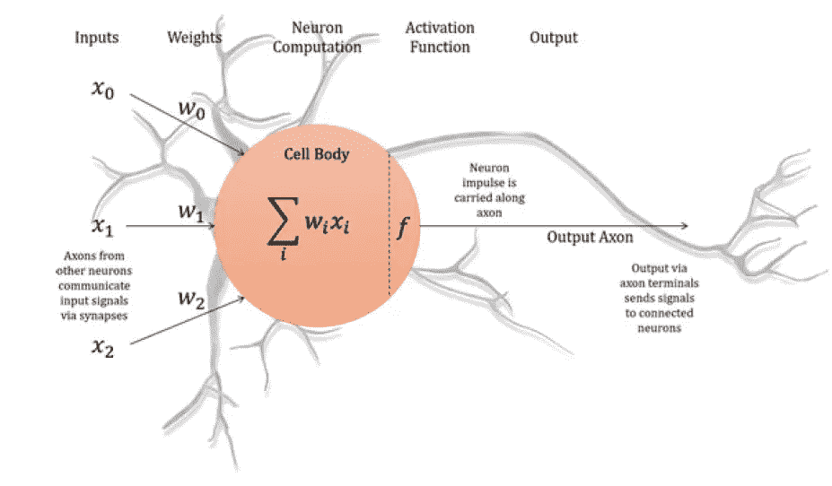
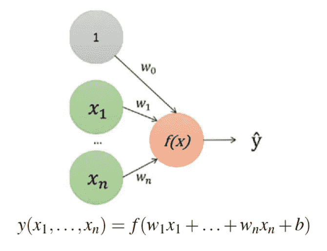
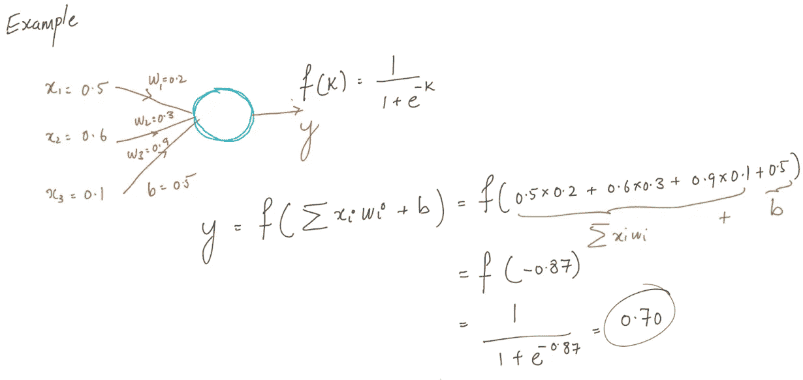
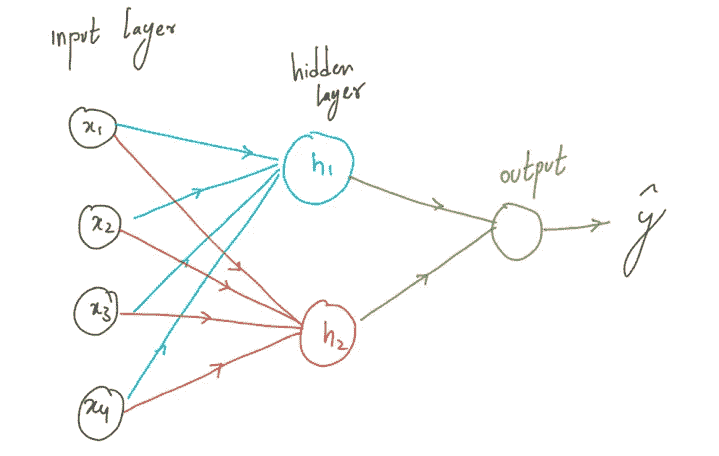
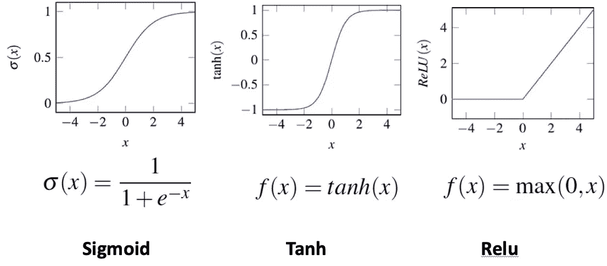
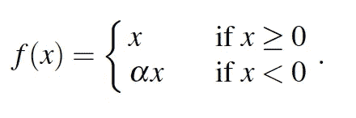
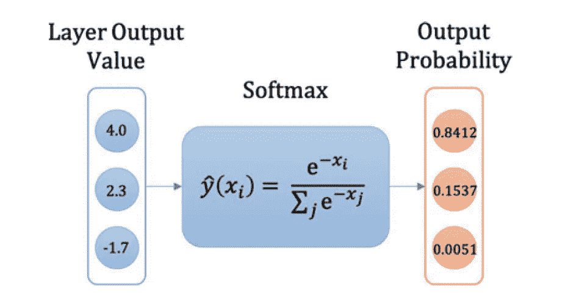

# NLP 零到一:深度学习理论基础(第 3/30 部分)

> 原文：<https://medium.com/nerd-for-tech/nlp-zero-to-one-deep-learning-theory-basics-part-3-30-baa8cbbe271d?source=collection_archive---------12----------------------->

## 感知器，神经网络，激活函数

由作者生成

# 介绍..

神经网络的想法从人脑的生物神经元中汲取灵感。神经网络是一个由小计算单元组成的网络，每个计算单元取一个输入值“**X”**的向量，输出单个值“**y”**。神经网络通常被称为深度学习，因为这些网络有许多层小型计算单元。在这个博客中，我们将介绍每个 NLP 从业者都应该知道的基本神经网络。

# 基本计算单元:感知器算法..

图 1:单个神经元中的感知器算法(神经网络中的基本计算单元)

> 深度学习是结合人工神经元网络，在神经元之间传递信息。这些神经元中的每一个都从其输入向量中学习不同的函数，并输出单个值。

在我们讨论深度学习的概念之前，让我们试着了解一下发生在每个神经元(基本计算单元)内部的**感知器算法**。感知器算法的基本形式与逻辑回归的数学相同。

“b”是可学习的偏差术语。我们可以把 b 看作是 w₀.的一个附加重量
单独学习的重量 wᵢ乘以 x 的 xᵢ，并传递给函数 **f(。)**得到输出 **y.** f(。)称为激活功能。值得注意的是，偏置项或**w₀也是可学习的参数。该偏差项允许模型在感知器级别将*决策边界从原点*移开。**

由谷歌剪贴板生成

可以清楚地看到，感知器假设输入变量 **X** 和输出变量 **y** 之间存在线性关系。在现实世界的问题中，感知器的这些线性假设经常失效。

# 前馈全连接神经网络..

1.  将这些神经元连接成不同层次的网络。
2.  在每个中子中使用可微分的非线性激活函数

神经网络由相互连接的神经元组成，数据单向流动，因此被称为前馈神经网络。层被定义为一组神经元。这些层是“完全连接的”，这意味着每层中的每个神经元都将前一层中所有神经元的输出作为输入，并且在两个相邻层的每对神经元之间都有联系。NN 必须包含一个输入和输出层以及至少一个隐藏层。

单层神经网络的插图，由作者生成

h1 和 h2 是隐藏层中的节点。观察隐藏层中的每个节点都完全连接到输入 x。**非线性激活函数**应用于每个神经元的末端，这允许输出值是其输入的**非线性加权组合，从而创建下一层使用的非线性特征。1.**

# 非线性激活函数

在节点中，使用神经网络激活函数中的基本计算块来确保输出值是其输入的非线性加权组合。非线性激活函数在提高神经网络的代表性方面起着非常重要的作用。我们将讨论三个流行的非线性函数 f(。).

来源[1]

## 乙状结肠的

使用**范围(0，1)，**该功能作为连续挤压功能。它还具有连续导数，非常适合梯度下降法。

## 双曲正切

对于范围(1，1)，这是以零为中心的函数，它解决了 sigmoid 激活函数的一个问题。
**缺点**:梯度饱和在函数的极端，这将导致梯度非常接近 0。

## 热卢

与 range(0,♾)，简单，快速激活功能，通常发现在计算机视觉。如果输入大于 0，函数是线性的。
ReLU 函数的计算速度非常快，因为 sigmoid 和 tanh 函数需要指数运算。由于在一个方向上的不饱和梯度，它保证了更好的收敛性。
**缺点**:如果涉及大梯度，必须非常小心地使用 Relu，大梯度更新会阻止神经元再次更新。因此，在处理 Relu 时，学习评级必须保持较低。

# 注意:

参考文献 1 中的泄漏 Relu 函数

**Leaky ReLU** : Leaky ReLU 引入了一个α参数，允许小梯度反向传播。

参考文献 1 中的 Softmax 函数

**soft max:**soft max 函数允许我们输出 K 个类别的分类概率分布。我们可以使用 **softmax 根据神经元的输出产生一个概率向量**

由作者生成

上一篇: [**NLP 零对一:稀疏文档表示(Part 2/30)**](https://kowshikchilamkurthy.medium.com/nlp-zero-to-one-sparse-document-representations-part-2-30-d7ce30b96d63?source=your_stories_page-------------------------------------)
下一篇: [**NLP 零对一:深度学习训练程序(Part 4/30)**](https://kowshikchilamkurthy.medium.com/nlp-zero-to-one-deep-learning-training-procedure-part-4-30-c8d1e3ba0db6?source=your_stories_page-------------------------------------)