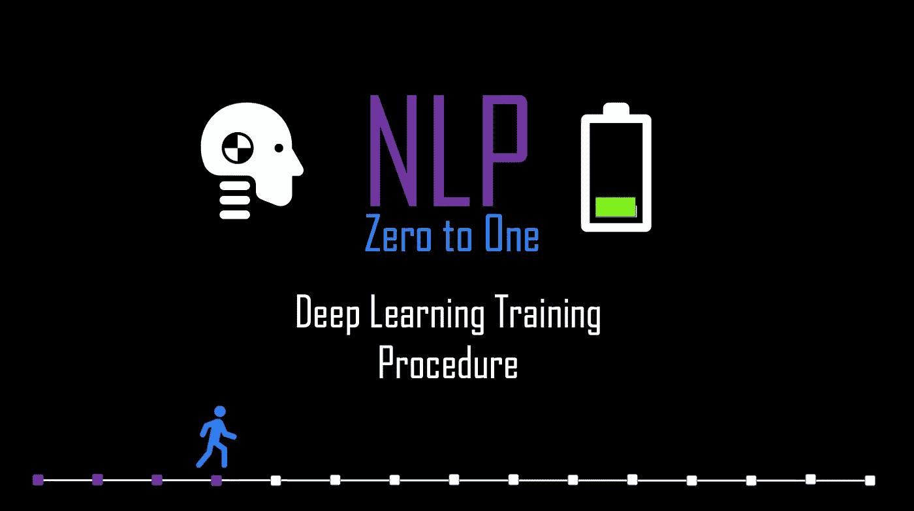
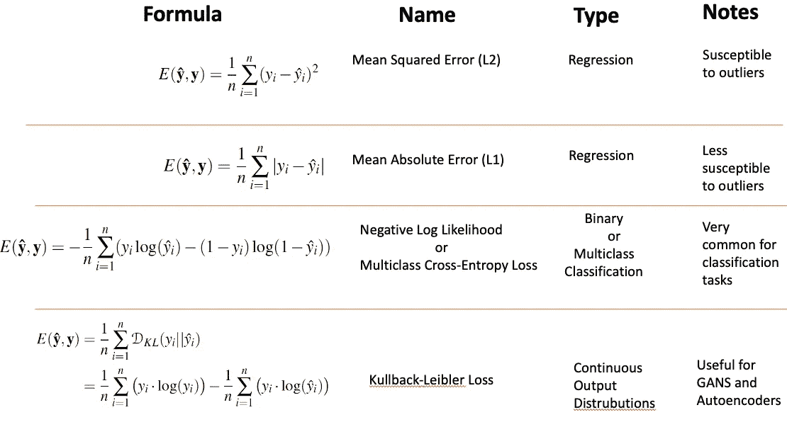
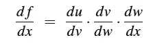
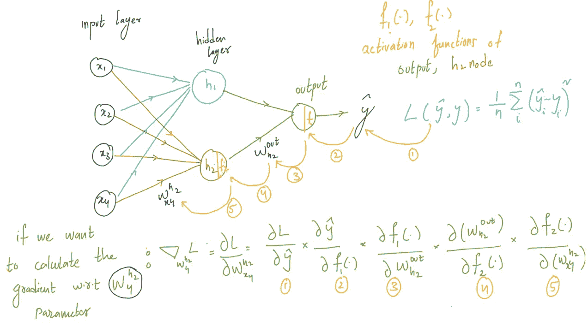
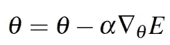

# NLP 零到一:深度学习训练程序(第 4/30 部分)

> 原文：<https://medium.com/nerd-for-tech/nlp-zero-to-one-deep-learning-training-procedure-part-4-30-c8d1e3ba0db6?source=collection_archive---------18----------------------->

## 反向传播、损失函数和批处理

# 介绍..

在上一篇[博客](https://medium.com/p/68a5bca3bcf4/edit)中，我们讨论了感知器算法如何在称为节点/神经元的基本计算模块中工作，并了解了这些神经元如何聚集在一起形成深度完全连接的分层神经网络。我们还讨论了不同的激活函数。在这个博客中，我们将专注于神经网络的学习/训练过程。

# 训练深度神经网络..

一个神经网络的工作是正确地/ ***准确地*** 预测给定特征输入“X”的“y”。训练的目标是学习所有层中所有节点的参数*“权重”*“wᵢ”*“偏差”*“bᵢ”*“*，以使每个训练观测的预测输出尽可能接近真实值。让我们将所有网络可学习参数(所有节点的 Wᵢ,bᵢ)表示为θ

一般来说，在机器学习中，我们遵循两个重要步骤来促进这个训练过程。我们将定义**损失函数**来计算预测输出和实际输出之间的距离
2。找出最小化该损失函数的参数，即最小化实际和预测之间的距离。我们将使用梯度下降算法来优化该参数(*在我们的例子中，参数是每个节点*的“权重”和“偏差”)

在像逻辑回归这样的传统机器学习模型中，计算这个梯度是非常简单的。但是在神经网络中，当一个神经元的权重不直接影响损失时，当损失被附加到更后面的层时，很难计算第一层中某个权重的偏导数。
为了找出给定权重的梯度，我们需要**将误差**从输出节点反向传播到感兴趣的节点。一旦获得了网络中所有可学习参数的梯度，我们就可以通过优化来更新参数。让我们详细看看每个步骤:

# 损失计算

损失计算步骤给出了我们的网络对特征输入 X 的预测程度。因此，对于给定的输入 X，我们必须设计一个损失函数 **L(预测，实际)。**取决于它是分类还是回归，损失函数被定义。让我们看看一些流行的损失函数:

不同的损失函数，由作者生成

一旦为输入 x 和网络参数θ计算出输出预测 y^。我们可以计算**损失/误差 L(ŷ,y)** ，其中“y”是输入 x 的真值

# 误差反向传播

为了改进我们的预测，我们可以使用 SGD 来减少整个网络的误差。为了计算每个参数θᵢ的梯度(导数:*d*l(ŷ,y)/*d*θᵢ)，我们可以使用微积分的链式法则。
在查看如何计算梯度的示例之前，让我们简要了解一下链式法则的概念:

图形链规则

对于 f (x) = u(v(w(x)))，
***d*f(x)/*d*x**可以使用图中所示的链规则来计算。

让我们来看一个如何使用链式法则计算参数θᵢ:梯度的示例

作者生成的示例

# 参数更新..

在获得网络中所有可学习参数θᵢ的梯度后，我们可以根据学习速率α更新每层的参数。

来源[1]

在**训练**过程中，权重的更新量被称为步长或**“学习率”**如果学习率很高，则参数更新会更大。我们到目前为止讨论的训练神经网络是基于**梯度下降法，特别是随机梯度下降法。**随机梯度下降的思想很简单，它更新为梯度方向的一组权重θ:*d*t22】l(ŷ,y)/*d*θ)以减少误差 **L(ŷ,y).**

还有其他优化方法，如随机梯度下降法，最流行的方法是 *Adagrad、RMS-Prop 和 ADAM。让我们简单讨论一下:*

**Adagrad:** 它是基于自适应梯度的优化方法。它使学习速率适应网络中的每个参数。它对不频繁的参数做更多的更新，对频繁的参数做更少的更新。
**RMS-Prop***:它将学习率除以梯度平方的平均值，并按指数规律衰减。
**亚当:** 自适应矩估计像 Adagrad 就是一种自适应优化方法。它还计算每个参数的学习率，此外，它还结合了过去梯度的平均值[1]*

# *注意..*

***小批量梯度下降:**既不使用整个数据更新模型，也不使用数据中的单个数据点更新模型。小批量梯度下降将数据集分成多个批次，并使用小批量计算单次更新的误差。它具有更快的训练和收敛速度。
**更多主题:**消失梯度、正则化(L1、L2)、辍学和批量归一化是深度学习中的其他重要概念**。我们将在接下来的博客中详细讨论这些话题。***

**

*由作者生成*

*上一篇: [**NLP 零对一:深度学习理论基础知识(Part 3/30)**](https://kowshikchilamkurthy.medium.com/nlp-zero-to-one-deep-learning-theory-basics-part-3-30-baa8cbbe271d?source=your_stories_page-------------------------------------)
下一篇: [**NLP 零对一:密集表示法、Word2Vec (Part 5/30)**](https://kowshikchilamkurthy.medium.com/nlp-zero-to-one-dense-representations-word2vec-part-5-30-9b38c5ccfbfc?source=your_stories_page-------------------------------------)*