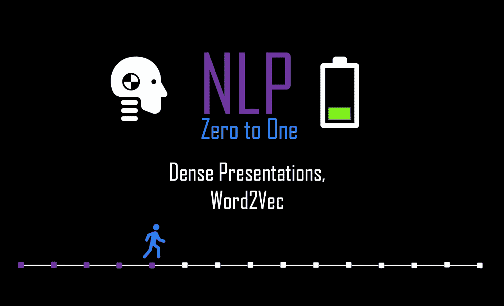
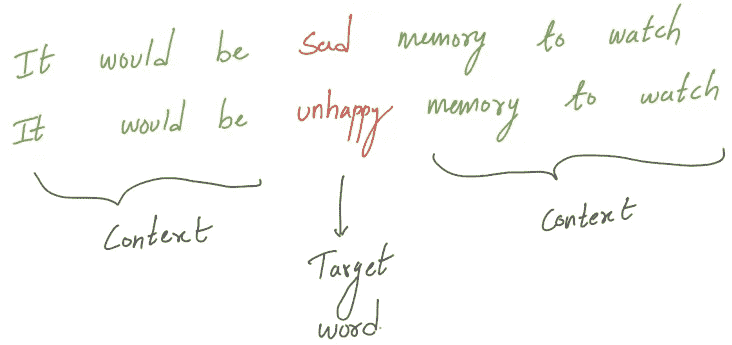
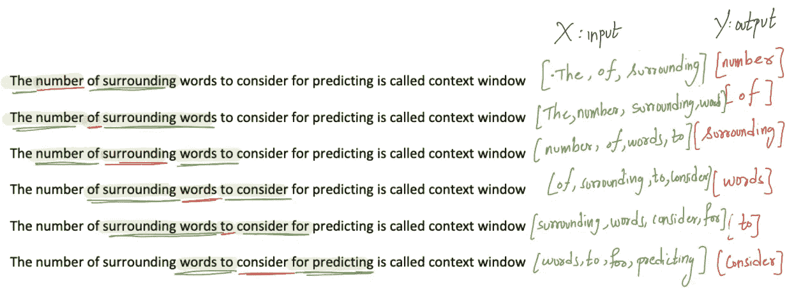
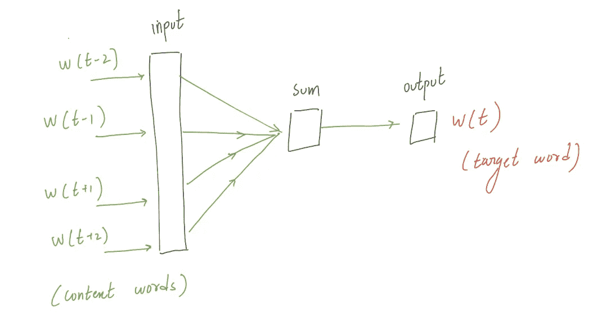
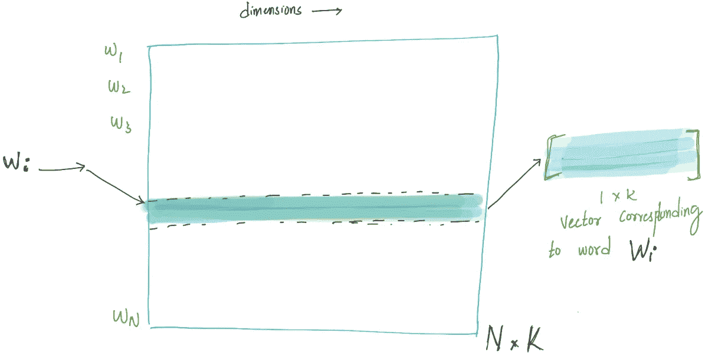
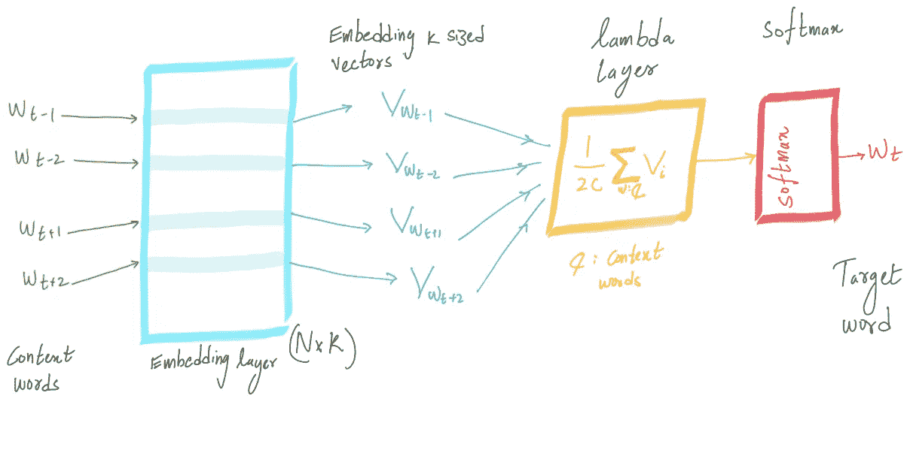
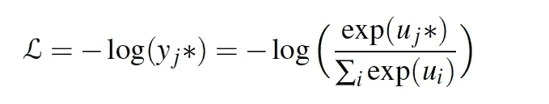

# NLP 零到一:密集表示，Word2Vec(第 5/30 部分)

> 原文：<https://medium.com/nerd-for-tech/nlp-zero-to-one-dense-representations-word2vec-part-5-30-9b38c5ccfbfc?source=collection_archive---------6----------------------->

## 词语嵌入和语义表征

# 介绍..

我们已经了解了如何为文档创建稀疏向量，如“TF-IDF”和“BoW ”,其维度对应于语料库的**词汇表中的单词(这个维度将是巨大的)。请浏览我在这个系列中的早期博客: [NLP 零到一:稀疏文档表示(第 2/30 部分)](https://medium.com/p/9b96854d412a/edit)了解稀疏表示。(*稀疏意味着向量表示中有太多的零)
正如在之前的博客中所讨论的，这些长的稀疏向量表示有一些严重的缺点，如“TF-IDF”和“BoW”。
1。大内存和昂贵的计算，因为向量很长
2。因为文档中单词的顺序是不相关的。
3。难以建模，因为要训练的模型参数的数量将在输入向量长度的范围内，这是巨大的。**

在这篇博客中，我们将看到如何使用降维技术和**重要的深度学习**来解决这些问题。使用不同的技术，我们将提取强大的单词表示，称为**嵌入**(密集、短向量)。与 TFIDF 或 BoW 不同，这些向量的长度范围是 50–300。这些向量在每个 NLP 问题中比稀疏向量工作得更好，因为单词的顺序/结构起着主要作用。所以意思相近的词有相似的表示。
例如:“boat”和“ship”在稀疏向量表示中表示两个不同的事物，但是嵌入成功地捕捉到了这些词之间的相似性。有两个最流行和开源的嵌入模型 Word2Vec 和 GLoVe。word2vec 方法速度快，训练效率高，并且容易在线获得静态代码和预训练的嵌入。

# Word2Vec..

在本节中，我们将了解如何使用深度学习来创建单词嵌入。这些嵌入是如此强大，以至于皇后的向量表示非常类似于 v(国王)v(男人)+ v(女人)的向量表示。这些表示在捕捉句法关系方面是强大的。

但我们即将了解如何使用深度学习来创建这种嵌入，如果我们从神经架构和该架构背后的直觉开始，那将是最好的。提出了两种流行的不同架构，每个 NLP 从业者必须熟悉这两种架构。提议的架构由**连续词袋(CBOW)模型**和**跳格模型组成。**

# 连续词袋..

## 直觉..

以相似方式/上下文使用的单词导致相似的表示。例如，类似 sad 和 unhappy 这样的同义词也用在类似的上下文中。但是我们如何定义语境呢？

相邻单词将使用目标单词的上下文(在上面的例子中是“sad”)。所以这里的上下文只是目标左右两边的 c *单词的窗口。*

## 分类问题设置..

本着所描述的直觉，我们将尝试基于上下文单词(周围的单词)来预测当前的目标单词(“sad”)。考虑用于预测的周围单词的数量被称为**上下文窗口**。对于上面的例子，如果上下文窗口等于 2，那么训练数据将是(["将"、"是"、"存储器"、"到"]、["sad"])。因此，如果你仔细观察，这个神经架构是无人监管的，我们需要给出的只是巨大的语料库(所有文档的集合)，仅此而已。它可以以滚动方式创建 **X(输入为周围变量)、y(目标词)****如下图和所示，它可以从语料库中构造密集的词嵌入。**

****

**描述以滚动方式收集训练数据的图片**

**一旦如上所述从语料库中创建了 **X:** 输入/上下文单词和 **y:** 输出/目标单词，接下来的任务是设计一个为我们进行分类的模型，其中我们尝试从上下文单词中预测目标单词。**

****

**分类设置说明**

## **神经架构..**

**这种神经架构有 3 个重要方面:输入层、λ层/平均层和密集 softmax。最重要也是最容易混淆的组件是**输入层。**输入层通常称为嵌入层。假设我们有一个 N 个单词的词汇表，我们计划得到一个 K 大小的密集向量。输入层通过嵌入矩阵 N 将每个上下文单词映射到 K 维的密集向量表示，因此它是一个 **NxK 矩阵，其中每个单词都有一个 K 大小的向量。****

****输入图层描述:****

****

**图片描绘输入以后，对于一个单词 Wi，有相应的 K 长度嵌入向量**

**一旦我们理解了输入层的工作原理，架构的其余部分就很容易理解了。所有的上下文单词被馈送到嵌入层/输入层，并且对应于上下文单词的所有向量被平均。这方面由λ层或平均层处理。一旦平均向量被馈送到 softmax 层，该层从语料库的整个词汇中预测目标单词。**

****

**整个 CBOW 神经架构的描述**

## **CBOW 培训..**

**现在我们理解了直觉和随后的神经结构。现在，我们将尝试深入了解训练机制以及权重是如何更新的。我敦促读者浏览我早期的博客( [NLP 理论和代码:深度学习训练程序(第 4/40 部分)](https://kowshikchilamkurthy.medium.com/nlp-theory-and-code-deep-learning-training-procedure-part-4-40-f05866105717?source=your_stories_page-------------------------------------))以了解训练如何在神经网络中进行。**

**训练过程可以通过回答两个问题来描述:
1 .什么是可训练/可学习的参数？
2。什么是损失函数？**

****什么是可训练/可学习的参数？** 嵌入层被随机初始化，嵌入层中的所有数字都是可训练参数。因此，随着更多的数据输入到模型中，嵌入层变得越来越好。
**什么是损失函数？****

****

**给定上下文词的目标词条件概率的对数。我们将预测的单词与实际的目标单词进行匹配，通过利用**类别交叉熵损失**来计算损失，并在每个时期执行反向传播，以在该过程中更新嵌入层。**

# **注意..**

**我们将在本系列的下一篇博客中讨论 Word2Vec 中的下一个流行架构“Skip-gram”。我们还将讨论手套，另一个流行的预训练嵌入。**

****

**由作者生成**

**上一篇: [**NLP 零对一:深度学习训练过程(第 4/30 部分)**](https://kowshikchilamkurthy.medium.com/nlp-zero-to-one-deep-learning-training-procedure-part-4-30-c8d1e3ba0db6?source=your_stories_page-------------------------------------)
下一篇: [**NLP 零对一:基于计数的嵌入，手套(第 6/40 部分)**](https://kowshikchilamkurthy.medium.com/nlp-zero-to-one-count-based-embeddings-glove-part-6-40-c5bb3ebfd081?source=your_stories_page-------------------------------------)**