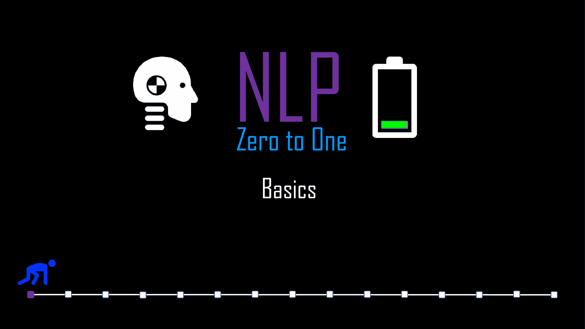

# NLP 零到一:全程

> 原文：<https://medium.com/nerd-for-tech/nlp-zero-to-one-full-course-4f8e1902c379?source=collection_archive---------5----------------------->

## 对 15 篇博客中涉及的最重要的 NLP 主题进行简单、清晰和精确的解释(每篇不到 5 分钟！)

由作者生成

# 系列

1.  [**【NLP 零比一:基础知识(1/30 部分)**](https://kowshikchilamkurthy.medium.com/nlp-zero-to-one-basics-part-1-30-35c3f6bc7097?source=your_stories_page-------------------------------------)
2.  [**NLP 零对一:稀疏文档表示(第 2/30 部分)**](https://kowshikchilamkurthy.medium.com/nlp-zero-to-one-sparse-document-representations-part-2-30-d7ce30b96d63?source=your_stories_page-------------------------------------)
3.  [**【NLP 零对一:深度学习理论基础知识(第 3/30 部分)**](https://kowshikchilamkurthy.medium.com/nlp-zero-to-one-deep-learning-theory-basics-part-3-30-baa8cbbe271d?source=your_stories_page-------------------------------------)
4.  [**NLP 零对一:深度学习训练程序(第 4/30 部分)**](https://kowshikchilamkurthy.medium.com/nlp-zero-to-one-deep-learning-training-procedure-part-4-30-c8d1e3ba0db6?source=your_stories_page-------------------------------------)
5.  [**NLP 零对一:密集表示，Word2Vec(第 5/30 部分)**](https://kowshikchilamkurthy.medium.com/nlp-zero-to-one-dense-representations-word2vec-part-5-30-9b38c5ccfbfc?source=your_stories_page-------------------------------------)
6.  [**NLP 零对一:基于计数的嵌入，手套(第 6/30 部分)**](https://kowshikchilamkurthy.medium.com/nlp-zero-to-one-count-based-embeddings-glove-part-6-40-c5bb3ebfd081?source=your_stories_page-------------------------------------)
7.  [**NLP 零对一:使用 Gensim 和可视化训练嵌入(第 7/30 部分)**](https://kowshikchilamkurthy.medium.com/nlp-zero-to-one-training-embeddings-using-gensim-and-visualisation-part-7-30-f0540e976568?source=your_stories_page-------------------------------------)
8.  [**NLP 零对一:递归神经网络基础知识部分(8/30)**](https://kowshikchilamkurthy.medium.com/nlp-zero-to-one-recurrent-neural-networks-basics-part-8-30-ca77af9d47ff?source=your_stories_page-------------------------------------)
9.  [**NLP 零比一:LSTM 部分(9/30)**](https://kowshikchilamkurthy.medium.com/nlp-zero-to-one-lstm-part-9-40-98e8cc4c296d?source=your_stories_page-------------------------------------)
10.  [**【NLP 零对一:双向 LSTM 部分(10/30)**](https://kowshikchilamkurthy.medium.com/nlp-zero-to-one-bi-directional-lstm-part-10-30-cab0eab65533?source=your_stories_page-------------------------------------)
11.  [**NLP 理论与代码:编码器-解码器模型(第 11/30 部分)**](https://kowshikchilamkurthy.medium.com/nlp-theory-and-code-encoder-decoder-models-part-11-30-e686bcb61dc7?source=your_stories_page-------------------------------------)
12.  [**【NLP 零比一:注意机制(第 12/30 部分)**](https://kowshikchilamkurthy.medium.com/nlp-zero-to-one-attention-mechanism-part-12-30-c5c36670c81f?source=your_stories_page-------------------------------------)
13.  [**NLP 零比一:变形金刚(第 13/30 部)**](https://kowshikchilamkurthy.medium.com/nlp-zero-to-one-transformers-part-13-30-5cd5a3ddd93b?source=your_stories_page-------------------------------------)
14.  [**NLP 零对一:BERT(第 14/30 部分)**](https://kowshikchilamkurthy.medium.com/nlp-zero-to-one-bert-part-14-40-691ef069712f?source=your_stories_page-------------------------------------)
15.  [**NLP 零对一:知识图谱部分(15/30)**](https://kowshikchilamkurthy.medium.com/nlp-zero-to-one-knowledge-graphs-part-15-40-df278d91c635?source=your_stories_page-------------------------------------)

感谢您的时间/