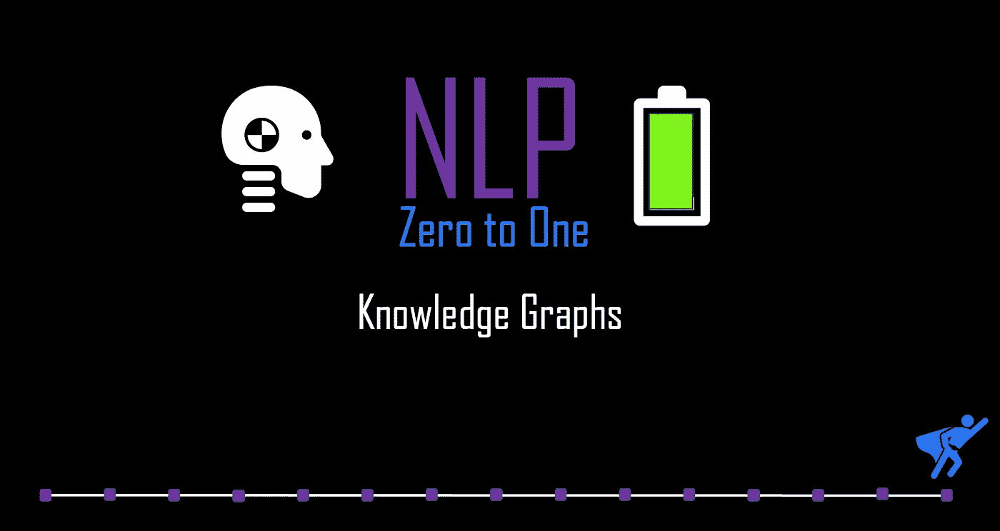
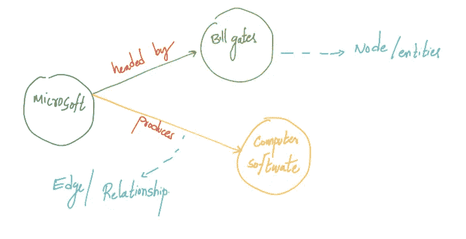
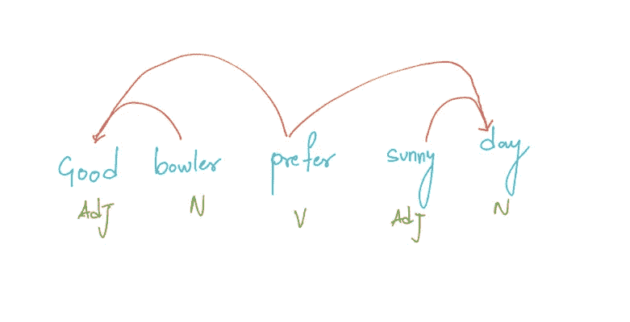

# 自然语言处理零到一:知识图表部分(15/30)

> 原文：<https://medium.com/nerd-for-tech/nlp-zero-to-one-knowledge-graphs-part-15-40-df278d91c635?source=collection_archive---------2----------------------->

## 实体对、关系和依赖分析

由作者生成

# 介绍..

这个世界上的数据量一直在增长，因此数据的复杂性也在增加。人们越来越需要从这些复杂的数据中获取价值的方法。文本数据的数量非常庞大，应该从中获取有意义的信息，以便为企业创造价值。

知识图解决了协调数据的问题，并为其提供了从数据中提取洞察力的结构。所有数据、数据源和各种类型的数据库都可以在知识图中表示和操作。不同的公司已经开发了各种类型的知识图，这些知识图被部署用于不同的目的

在这个博客中，我们将讨论知识图的重要概念，并了解它如何成为 NLP 工程师的重要工具。

# 什么是知识图？

知识库是任何信息的集合。知识图是一个结构化的知识库。知识图以不同的**实体**之间的**关系**的形式存储事实。知识图主要描述现实世界中的实体及其在图中组织的关系。这些实体和关系是以图形结构组织的提取的知识。目前许多知识图以**主谓宾(SPO)** 三元组的形式表示提取的事实，这符合 RDF(Resource Description Framework)规定的标准。

> 在寻求更有效的方法来连接数据世界和商业世界的企业中，知识图表正在兴起。与机器学习和自然语言处理等互补的人工智能技术相结合，知识图正在为利用数据创造新的机会，并迅速成为现代数据系统的基本组成部分。”——[**乔伊斯·威尔斯**](https://www.instagram.com/joyce_wells_/?hl=en)

让我们快速看一个例子来理解信息或知识是如何嵌入到这些图表中的。

> 微软由比尔·盖茨领导，微软生产计算机软件。

让我们看看这些信息是如何嵌入到知识图表中的。单词“微软”、“比尔·盖茨”和“计算机软件”是实体。在图形结构中，实体表示为节点，关系表示为边。

由作者生成

在上面的例子中,{"Microsoft "，" Bill Gates"}是**实体对**，而{ ' Headed by ' }是**关系。**

# 知识抽取

让我们看看如何从文本信息中创建好的知识图表。从文本中提取实体和关系是关键任务。从语法模式中提取实体对应该是快速的，并且可扩展到大量文本。流行的自然语言处理(NLP)技术，如**依存解析**被用于这个关键任务。知识图可以使用**词性**和**依存解析从文本中自动构建。**

## 依存句法分析

句法分析是自然语言处理任务，在给定语言语法规则的情况下，识别句子中单词的句法关系。一种方法是根据依存关系将单个单词链接在一起。这被称为依存语法分析，它将一个句子映射到一个依存语法分析树。

由作者生成

注意，依存解析树中的两个单词之间的链接是定向的，从中心单词指向依存单词来传达关系。解析算法试图从语法规则中找到最可能的派生。

从上面的例子中名词和专有名词“bowler”和“day”将是我们的**实体**。接下来，我们需要提取关系。为此，我们必须找到句子的词根，也就是句子的动词。在上面的例子中，**关系**将是“首选”。

# 知识图构建

构建知识图，最重要的是节点和节点之间的边。我们将输入大量文本数据来找出实体对和关系。这些知识图表将用于从文本数据中提取不同的见解。

完整知识图的图解，来自[来源](https://favpng.com/png_view/linked-data-knowledge-graph-data-structure-open-data-png/aYqWCKLD)

先前: [**NLP 零对一:BERT (Part 14/40)**](https://kowshikchilamkurthy.medium.com/nlp-zero-to-one-bert-part-14-40-691ef069712f?source=your_stories_page-------------------------------------)

下一个:TBD..