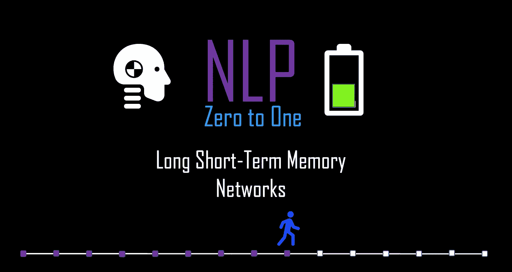
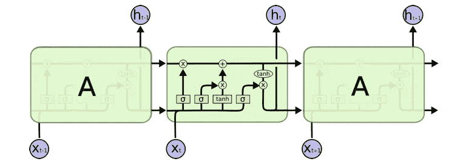
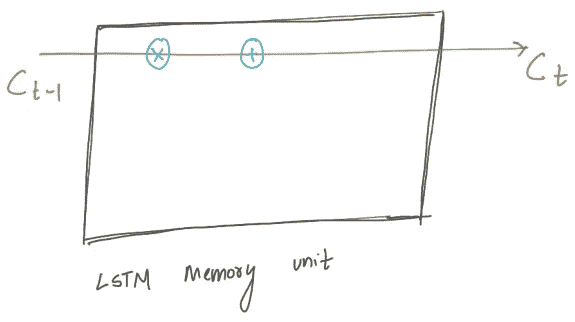
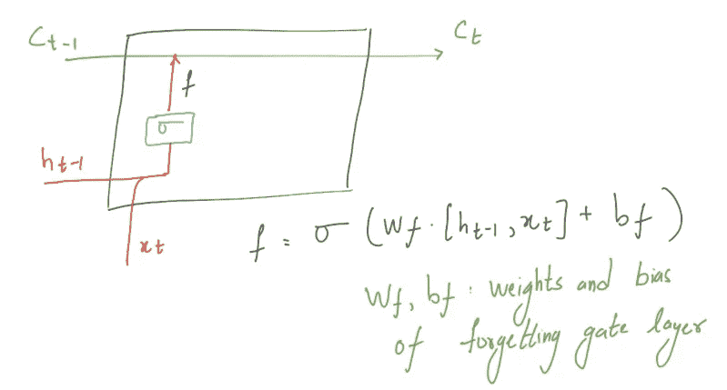
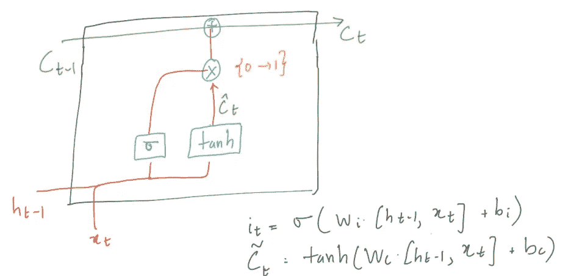
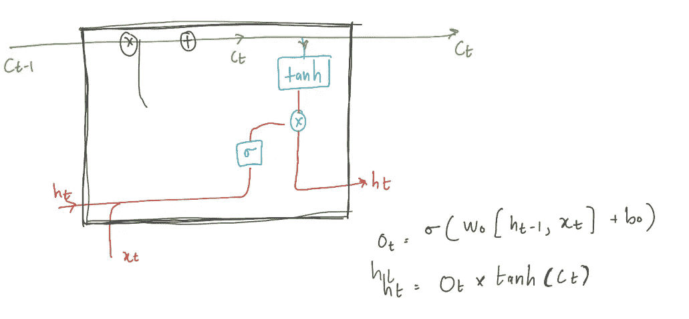

# NLP 到 1:LSTM 部分(9/30)

> 原文：<https://medium.com/nerd-for-tech/nlp-zero-to-one-lstm-part-9-40-98e8cc4c296d?source=collection_archive---------23----------------------->

## 存储单元、单元状态和栅极层

由作者生成

# 介绍..

在上一篇博客中，我们讨论了香草 RNN 架构，也讨论了它的局限性。消失梯度是一个非常重要的缺点，它限制了 RNN 对较短序列的建模。在相关输入事件和目标信号之间存在大于 5-10 个离散时间步长的时间滞后的情况下，传统的 RNNs 无法学习。这基本上限制了香草 RNN 应用于许多实际问题，特别是 NLP，因为句子中的单词数通常远远超过 10 个。

长短期记忆(LSTM)是一种流行的递归神经网络结构的更好的变体，专门设计用于解决消失梯度问题。LSTM 调整了 RNN 循环单元的内部结构，为消失的渐变带来了一个解决方案。LSTM 在翻译和序列生成方面获得了巨大的成功。在这篇博客中，我们将讨论 LSTM 的神经结构。如果你不熟悉 RNN，请参考我以前的博客。

LSTM 神经架构

# 神经架构

LSTM 和我们所了解的 RNN 有很多相似之处，它有一个类似于循环神经网络的控制流程。在 RNN 的理论中，当进行反向传播时，信息(隐藏状态/梯度)在时间步长上不间断地传递。LSTM 所做的只是利用简单的门来控制递归网络单元中的梯度传播。通过不同的门，LSTM 存储单元处理数据，在信息向前传播时传递信息。让我们看看这个信息是如何在 LSTM 记忆单元中处理的，首先让我们定义细胞状态，然后我们将定义用于处理信息的门。

# 细胞状态

细胞状态图解

细胞状态就像网络的流动记忆。你可以把细胞状态想象成一条传送带，在不同的时间点上传送相关的信息。这是我们的记忆单元在每个时间点看到的信息，并且该细胞状态“Ct”可以被视为模型在时间“t”之前看到/学习的内容的总结。它沿着整个序列直线运行，只有一些小的线性相互作用，正如你在图中看到的。这种细胞状态的概念可以使来自较早时间步骤的信息能够进入较晚的时间步骤，从而减少短期记忆的影响。

# 盖茨..

这些门是不同的神经网络，决定哪些信息被允许遗忘、忽略或保留在记忆细胞中。门控机制本身是神经网络层，因此 LSTM 记忆单元中的门从它看到的数据中学习。让我们仔细讨论每个门。

## 1.忘记栅极层

忘记栅极层

首先，我们想要确定它在时间步长“t”之前已经学习的信息(“Ct”)在多大程度上是有用的。忘记门层负责这个操作。
遗忘门层接收“ht1”和“xt”，并具有从 **0** 到 **1** 的输出。我们可以强制这个输出，因为它是一个 sigmoid 函数。 **1** 表示“完全保持小区状态 Ct-1”，0 表示“完全摆脱 Ct-1”

## 2.输入栅极层

输入栅极层

接下来，在每个时间步长“t ”,我们的存储单元接收一个输入“xt”。问题是输入“xt”在多大程度上被存储到单元状态？。这个输入门层决定了我们在单元状态中保留多少新信息“xt”。这分两部分发生。

**1。**双曲正切层，采用“ht1”和“xt”并创建候选值“C̃ t”，可添加到单元状态。
**2。**一个 sigmoid 层，接受“ht1”和“xt”并输出从 0 到 1 的值，决定我们允许多少候选值，“C̃ t”。
在这样的 2 个门之后，旧的单元状态“ct1”现在更新为新的单元状态“Ct”。

## 3.输出栅极层

输出栅极层

最后，我们需要决定我们在时间 t，“ht”的隐藏状态。该输出将是更新的单元状态“Ct”的函数。这也分两步进行

**1。**一个 tanh 层，以“Ct”为输入，输出一个矢量“V”
**2。**一个 sigmoid 层，它接受“ht1”和“xt”并输出从 0 到 1 的值，这些值是向量“V”的倍数，以获得输出“ot”或隐藏状态“ht”。

# 完整存储单元

LSTM 神经架构

LSTM 的训练过程与 RNN 的训练过程非常相似。需要再次强调的是，LSTM 存储单元中的门也是参数化的，因此这些参数也是用梯度下降优化方法调整/更新的。

由作者生成

接下来: [**NLP 零比一:双向 LSTM 部分(10/30)**](https://kowshikchilamkurthy.medium.com/nlp-zero-to-one-bi-directional-lstm-part-10-30-cab0eab65533?source=your_stories_page-------------------------------------)
上一篇: [**NLP 零比一:递归神经网络基础部分(8/30)**](https://kowshikchilamkurthy.medium.com/nlp-zero-to-one-recurrent-neural-networks-basics-part-8-30-ca77af9d47ff?source=your_stories_page-------------------------------------)