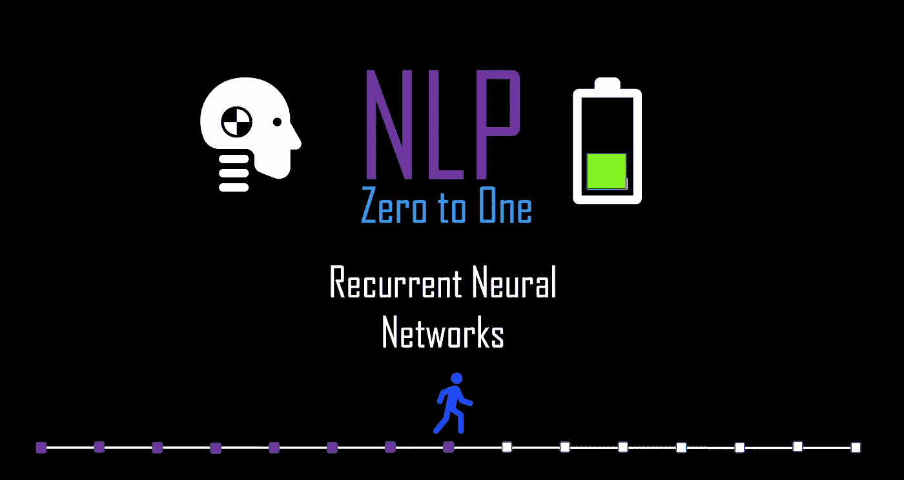
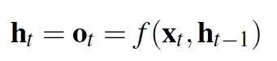
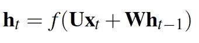
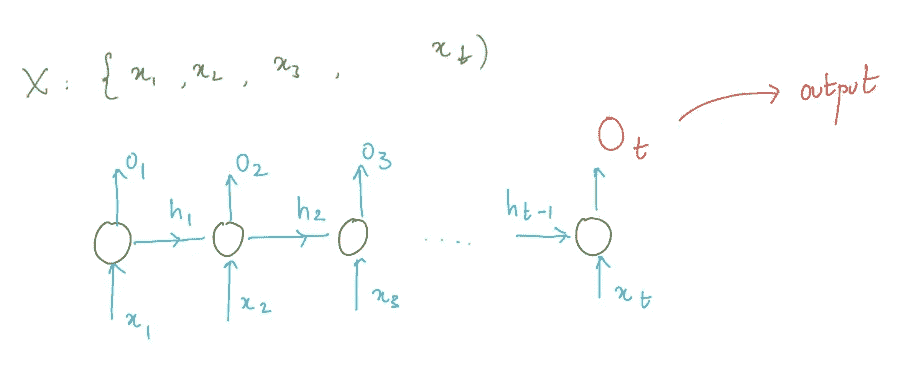
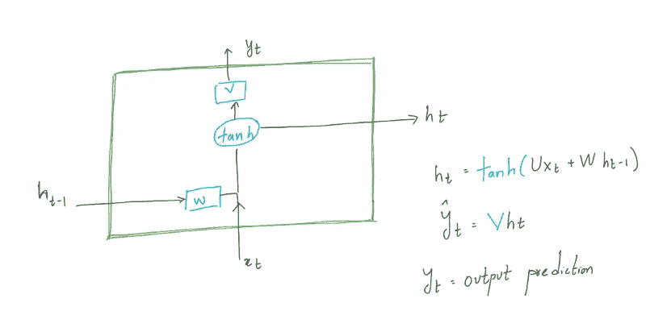
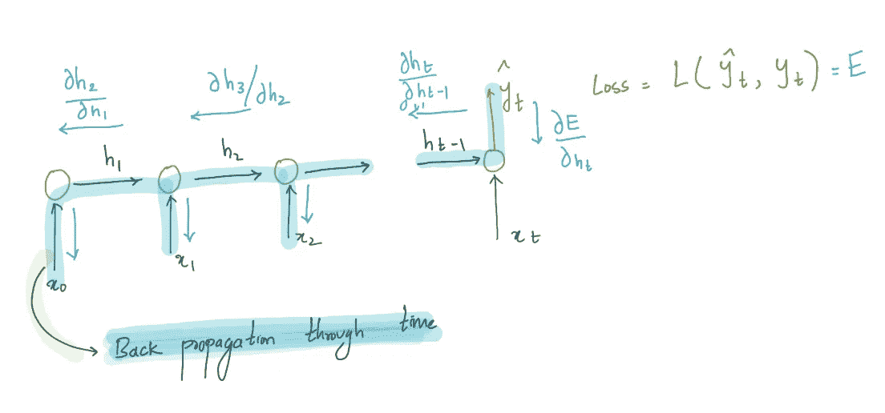
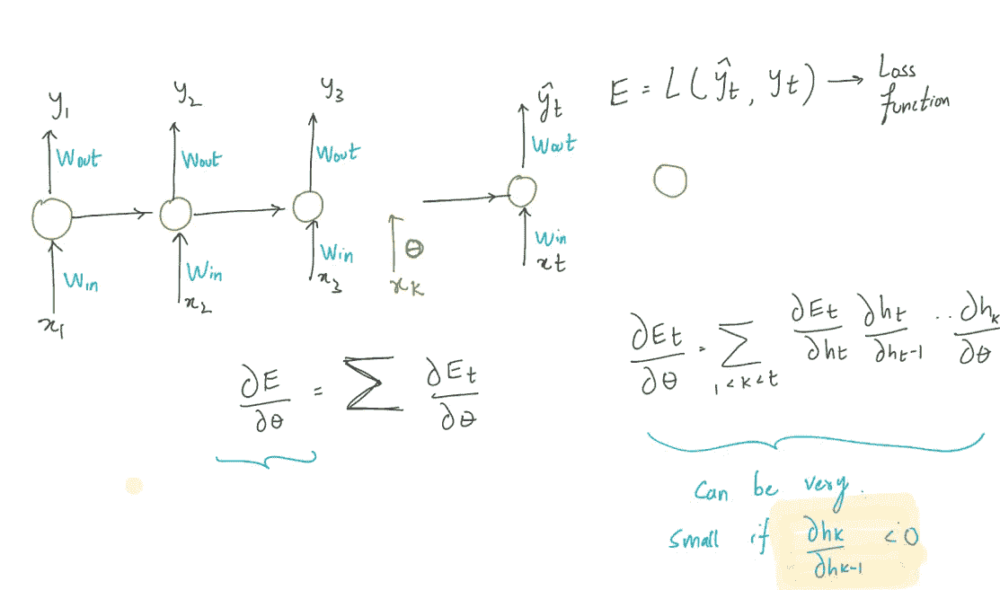

# NLP 零到一:递归神经网络基础部分(8/30)

> 原文：<https://medium.com/nerd-for-tech/nlp-zero-to-one-recurrent-neural-networks-basics-part-8-30-ca77af9d47ff?source=collection_archive---------22----------------------->

## 通过时间的反向传播、消失梯度、剪辑

由作者生成

# 介绍

到目前为止，我们研究了不考虑单词之间的长期依赖性和上下文顺序的方法。即使在开发单词嵌入时，在上下文单词中仍然不考虑单词的顺序。词的顺序在许多自然语言处理任务中起着非常重要的作用。例如“人咬狗”和“狗咬人”这两个句子用词相同，但意思完全不同。所以，我们到目前为止对*包词*的理解必须延伸到*词序*。在这篇博客中，我们介绍了将深度学习扩展到序列的递归神经网络(RNNs ),我们还将描述 RNN 的训练过程。

# 重复…

RNN 是简单的前馈网络，就像我们之前介绍的神经网络一样，它采用一系列向量作为输入。但是有一个额外的组件使它能够学习序列。这个成分叫做记忆/历史。让我们试着理解记忆的概念。

如前所述，RNN 消耗一系列向量作为输入，让我们将输入序列定义为时间步长为 T 的 X，其中 **X = {x1，x2，.。。，xT }** 其中 xT 是在时间 t 的向量输入。然后我们将直到时间 t 的记忆或历史定义为 **ht。**

为了将连续上下文结合到下一个时间步的预测中，必须保留序列中先前时间步的记忆 **(ht)** 。

函数 **f(。)**将**存储器和输入**映射到时间 t 的输出。上一时间步的存储器为**ht1**，输入为 **xt** 。很明显，输出直接依赖于上一步的结果，这就是**循环**概念的来源。

# 神经网络..

如果映射函数 f(。)是用神经网络近似的，那么我们称这种建模为递归神经网络

其中 **W 和 U** 是可学习的权重矩阵。

递归神经网络图

RNN 的训练过程

RNN 的训练与前向网络非常相似，前向网络在本系列的[前一篇博客中介绍过。通常的步骤包括计算预测误差，通过反向传播计算每组权重的梯度，并根据梯度下降优化方法更新权重。尽管 RNN 的训练过程看起来非常类似于前馈网络，但是在梯度的计算过程中存在偏差。递归连接的权重矩阵 V。因此，计算梯度与标准多层感知器前馈网络完全相同。](https://medium.com/p/98eb23e5c589/edit)

## 穿越时间的反向传播(BPTT)

穿越时间的反向传播(BPTT)

在 RNN，所有早期时间步长的权重对网络的输出有贡献，因此所有时间步长的权重必须用梯度下降优化方法计算。通过评估对预测有贡献的每条路径来计算梯度。这个过程被称为时间反向传播(BPTT)。

在上图中，我们说明了如何针对在时间步长 t 计算的损失 **(Et)** 更新权重。所有时间步长的误差是 Et 的总和，我们可以对网络(U、V 和 W)中每个权重的梯度求和，然后使用累积的梯度进行更新。

## 消失渐变

在作为标准前馈网络的多层感知器中，当用反向传播训练多层神经网络时，消失问题出现。如果你仔细观察反向传播中的梯度，我们将梯度乘以每个连续层的输出。这意味着，如果它沿其路径拾取的偏导数项小于 1，则接近输入的层中存在的权重/偏差的梯度会越来越小。
这种现象被称为消失梯度:梯度可以小到误差反向传播到层中的权重/偏差项在更新任何权重时都是无效的。这阻止了早期层的学习。神经网络越深入，问题就越大。

## RNN 的消失渐变

RNN 的消失渐变

渐变消失的问题在 RNN 非常明显。由于递归方面，在通过时间的反向传播期间，梯度乘以每个时间步长上权重对误差的贡献。这种在每个时间步长上相乘的影响显著地减少了传播到前一个时间步长上的梯度，而前一个时间步长又会再次相乘。这导致了与上面讨论的相同的问题。当梯度很小时，权值更新可以忽略不计，网络不再学习。我们可以给 RNN 增加门来对抗消失梯度。

## 注意:

**渐变裁剪:**限制渐变爆炸的一个简单的方法就是强制渐变到一个特定的范围。这防止了训练时的溢出错误。此外，梯度剪辑有助于改善收敛。

由作者生成

接下来: [**NLP 零比一:LSTM 部分(9/40)**](https://kowshikchilamkurthy.medium.com/nlp-zero-to-one-lstm-part-9-40-98e8cc4c296d?source=your_stories_page-------------------------------------)

上一篇: [**NLP 零对一:使用 Gensim 和可视化训练嵌入(第 7/30 部分)**](https://kowshikchilamkurthy.medium.com/nlp-zero-to-one-training-embeddings-using-gensim-and-visualisation-part-7-30-f0540e976568?source=your_stories_page-------------------------------------)