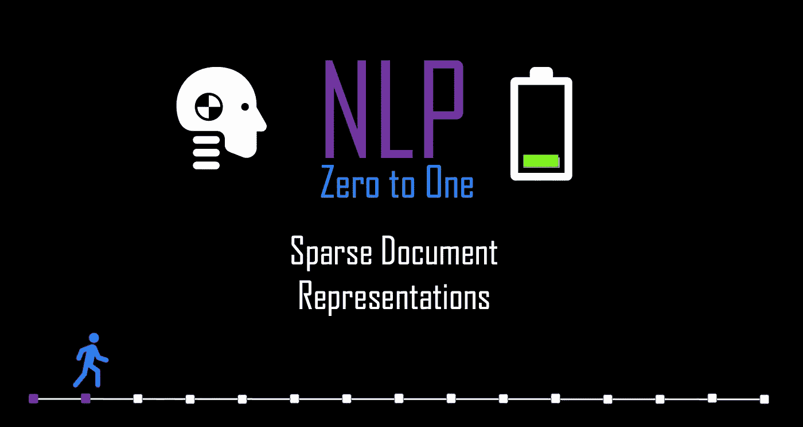
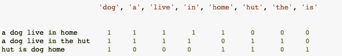
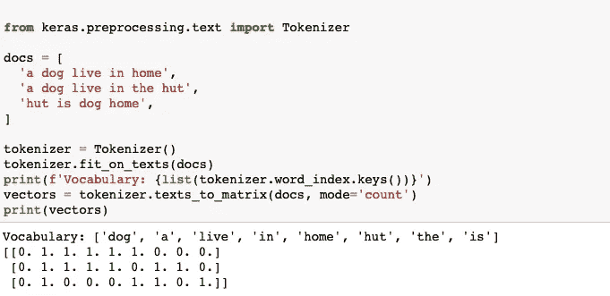
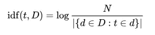
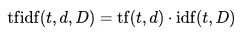

# NLP 零到一:稀疏文档表示(第 2/30 部分)

> 原文：<https://medium.com/nerd-for-tech/nlp-zero-to-one-sparse-document-representations-part-2-30-d7ce30b96d63?source=collection_archive---------9----------------------->

## 词汇袋和 TFIDF



由作者生成

# 介绍..

NLP 工程师经常处理文档或文本的语料库。原始文本不能直接输入机器学习算法。开发一些方法以计算机/算法理解的方式表示这些文档是非常重要的，例如数字向量。这些方法也被称为特征提取方法或特征编码。在这个博客中，我们将学习和实现 3 个非常重要的特征提取方法。

# 1.词汇袋

这是非常灵活、直观和最容易的特征提取方法。文本/句子被表示为唯一单词的计数列表，因此这种方法也被称为计数矢量化。为了对我们的文档进行矢量化，我们所要做的就是计算每个单词出现的次数。

因为词袋模型基于出现来加权词。实际上，像“是”、“该”、“和”这样最常见的词没有任何价值。在计数矢量化之前，停用词(在本系列的博客中介绍过)被移除。

## 例子..



词汇是这些文档中唯一单词的总数。

```
Vocabulary: [‘dog’, ‘a’, ‘live’, ‘in’, ‘home’, ‘hut’, ‘the’, ‘is’]
```

## 密码



## 缺点..

该模型只关心已知单词是否出现在文档中，而不关心它在文档中的位置。显然，当文档中的单词的顺序或结构被丢弃时，通过简单地使用文档向量来表示整个文档会有显著的信息损失，但是这对于许多计算语言学应用来说已经足够了。它在计算上更简单，并且在定位或上下文信息不相关时被积极地使用。

# 2.TF-IDF(术语频率-逆文档频率)

TFI-DF 是一种方法，它提供了一种给予更少的单词更大权重的方式。为了更好地理解，我们将尝试分别理解 TF-IDF 中的两个定义。

## 词频:tf(t，d)

这总结了给定单词在文档中出现的频率。它衡量一个单词在文档中出现的频率。有两种流行的方法来表示这一点。

```
1\. Term frequency adjusted for document length: **tf(*t*,*d*) = ( number of times term t appear in document d )÷ (number of words in d)**2\. logarithmically scaled frequency: **tf(*t*,*d*) = log (1 + number of times term t appear in document d )**
```

## 例子..

```
doc1 = ‘a dog live in home’
```

> **tf(** *狗，doc1* **) =** 1/5。*(按方法 1)* **TF(***dog，doc1***)= 1+log(1)***。(根据方法 2)*

## 反向文档频率:idf

IDF 是衡量术语重要性的指标。它是文档总数与带有术语 t 的文档数的对数比例。



来源:维基

**分子:**文档总数
**分母:**带术语的文档总数

## 例子..

```
D = [ ‘a **dog** live in home’, ‘a **dog** live in the hut’, ‘hut is **dog** home’ ]   
D is the corpus
```

> **idf(** dog，D **)** = log(文档总数(3) /带有术语“dog”的文档总数(3) ) = log(3/3) = log(1) = 0

## TFIDF: tf x idf



来源:维基

我们现在可以计算文档中每个术语的 TF-IDF 分数。分数暗示了这个词的重要性。正如你在上面的例子中看到的。如果术语“dog”出现在所有文档中，则该单词的逆文档频率将为零，因此 TFIDF 分数将为零。这基本上意味着，如果同一个单词出现在所有文档中，那么它就没有相关性。

## 密码..


## 缺点..

TF-IDF 使得特征提取比仅计数词袋模型中呈现的文档中的术语的实例数量更健壮。但是它没有解决 BoW 模型的主要缺点，TF-IDF 模型仍然抛弃了文档中单词的顺序或结构。

# 注意:

***稀疏:*** 由于大多数文档通常会使用语料库中使用的单词的非常小的子集，因此得到的矩阵将具有许多为零的特征值(通常超过 99%)。NLP 实践者通常应用主成分分析(PCA)来降低维数。
**朴素贝叶斯模型:**一种过度简化的假设模型，朴素贝叶斯分类器在许多现实世界中工作得相当好，著名的有 **BoW** 模型或 **TF-IDF** 的文档分类


由作者生成

上一篇: [**NLP 零对一:基础知识(Part 1/30)**](https://kowshikchilamkurthy.medium.com/nlp-zero-to-one-basics-part-1-30-35c3f6bc7097?source=your_stories_page-------------------------------------)
下一篇: [**NLP 零对一:深度学习理论基础知识(Part 3/30)**](https://kowshikchilamkurthy.medium.com/nlp-zero-to-one-deep-learning-theory-basics-part-3-30-baa8cbbe271d?source=your_stories_page-------------------------------------)