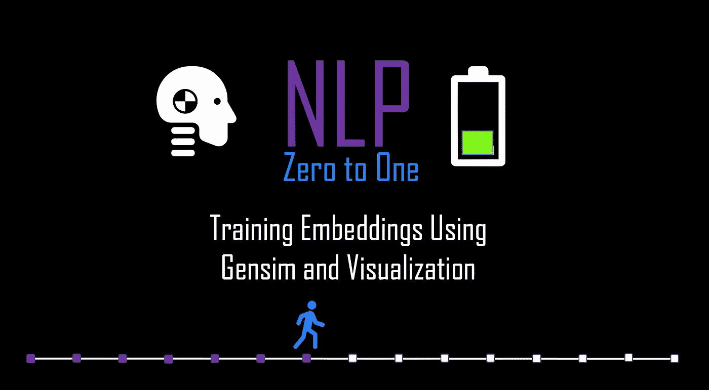
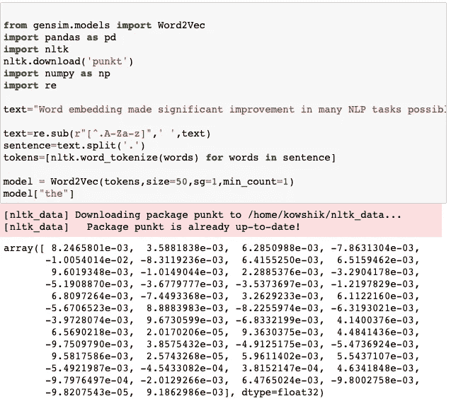
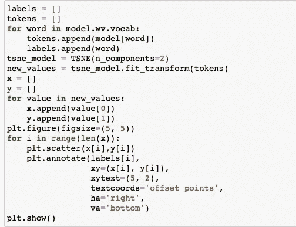
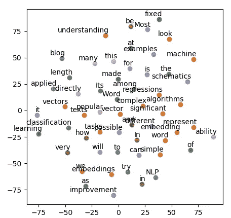
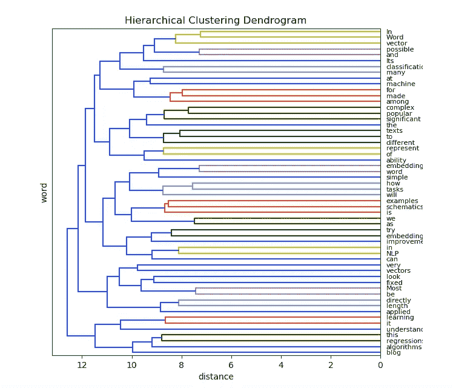
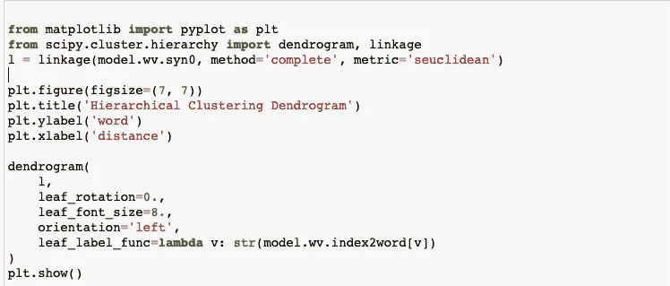

# NLP 零到一:使用 Gensim 和可视化训练嵌入(第 7/30 部分)

> 原文：<https://medium.com/nerd-for-tech/nlp-zero-to-one-training-embeddings-using-gensim-and-visualisation-part-7-30-f0540e976568?source=collection_archive---------15----------------------->

## t 分布随机邻居嵌入，嵌入偏差

由作者生成

# 介绍..

单词嵌入使得许多 NLP 任务的显著改进成为可能。它对 word schematics 的理解和用固定向量表示不同长度文本的能力使它在许多复杂的 NLP 任务中非常受欢迎。由于向量的长度是固定的，大多数机器学习算法可以直接应用于用于分类和回归任务的单词嵌入。在这篇博客中，我们将尝试看看帮助我们使用两种流行的方法 CBOW 和 Skip-Gram 实现 Word2Vec 的包。我们也将看看嵌入的一些属性和可视化。

# 培训 CBOW 和跳过程序..

我们可以只把上面的一小段作为单词嵌入的文本。我们将会看到如何在密集空间中编写代码来表示上述文本中的单词。

代码可在此处获得

正如在之前的博客中所解释的，首先我们需要使用 NLTK 进行标记化，然后在 gensim 库中使用 Word2Vec。参数**“SG”**指定了训练算法 CBOW (0)，Skip-Gram (1)。
她我们可以清楚地看到单词**“the”的密集矢量表示。**这是一个 50 维向量，再次作为参数提供给 gensim 库 Word2Vec 函数。

# (英)可视化(= visualization)..

代码可在此处获得

最常见的观想方法是将一个单词的 100 个维度投射成 2 个维度。
可将 PCA 和 TSNE 等降维技术应用于密集矢量，以创建二维或三维矢量。让我们简单讨论一下 TSNE 的概念，并理解为什么它在可视化单词嵌入中如此流行。

代码输出:50 维向量简化为 2d，并使用 matplotlib 可视化

## TSNE (t 分布随机邻居嵌入)

t-分布式随机邻居嵌入(t-SNE)主要用于数据探索和可视化高维数据。它帮助我们将高维数据分解成 2 维或 3 维数据，这使得我们很容易对这些高维数据点进行绘图并获得一种直觉。

t-SNE 算法计算高维空间和低维空间中的实例对之间的相似性度量。它试图保持从高维空间到低维空间的相似性。但是我们如何量化更高和更低维空间中的相似性，因为相似性的一些尺度不变度量将帮助我们在更高和更低维空间中保持相似性。

**更高维度中的相似性度量**(联合概率) **:** 对于每个数据点，我们将在该点上集中高斯分布。然后我们测量所有其他点的密度。原始或空间中的相似性由高斯联合概率表示。

**较低维度的相似性度量**(联合概率) **:** 不使用高斯分布，而是使用一个自由度的学生 t 分布。因此嵌入空间中的相似性由学生的 t 分布联合概率来表示。

**成本函数:**为了保持从高维到低维的相似性度量，我们将需要找到一个度量/成本函数，该函数找到联合概率之间的距离。
Kullback-Liebler 散度(KL)是我们的选择，因为它是计算两个概率分布之间距离的非常流行的指标。我们可以使用梯度下降来最小化我们的 KL 成本函数。

TNSE 是用于可视化单词嵌入的流行技术，因为它保留小的成对距离或局部相似性的能力不同于其他维度技术，如 PCA，其涉及保留大的成对距离以最大化方差。

**层次聚类可视化**

另一种流行的可视化方法是使用聚类算法来显示嵌入空间中哪些单词与其他单词相似的分层表示。
这种聚类层次结构被表示为一棵树(或树状图)。树根是收集所有样本的唯一聚类，树叶是只有一个样本的聚类。

生成上图的代码:

代码可在此处获得

# 注意..

**分配伤害:**嵌入类比还表现出文本中隐含的性别刻板印象和其他偏见。比如:“医生”职业接近“男人”，“护士”职业接近“女人”。当使用嵌入建模时，NLP 工程师必须记住嵌入的这种固有偏差。嵌入的去偏处理从这些嵌入中移除偏置。

**一阶和二阶共现:**如果两个词通常彼此相邻，则称它们具有一阶共现。如果两个词有相似的邻居，它们就有二阶。

由作者生成

接下来: [**NLP 零比一:递归神经网络基础部分(8/30)**](https://kowshikchilamkurthy.medium.com/nlp-zero-to-one-recurrent-neural-networks-basics-part-8-30-ca77af9d47ff?source=your_stories_page-------------------------------------)
上一篇: [**NLP 零比一:基于计数的嵌入，手套(6/40)**](https://kowshikchilamkurthy.medium.com/nlp-zero-to-one-count-based-embeddings-glove-part-6-40-c5bb3ebfd081?source=your_stories_page-------------------------------------)