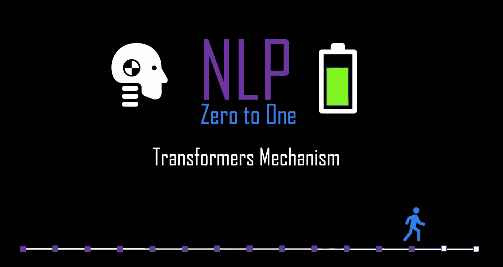
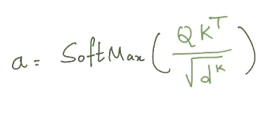
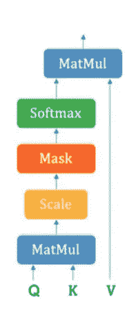
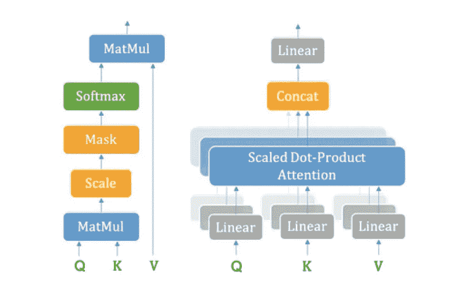
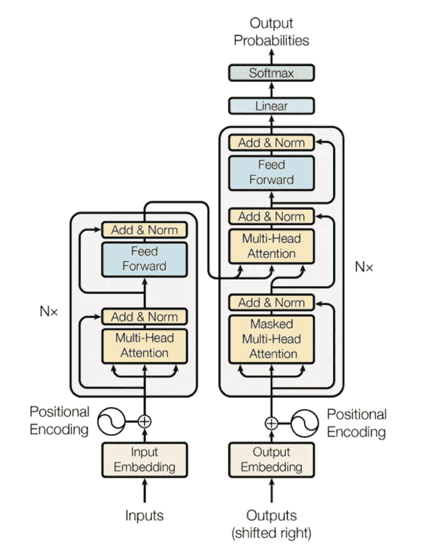
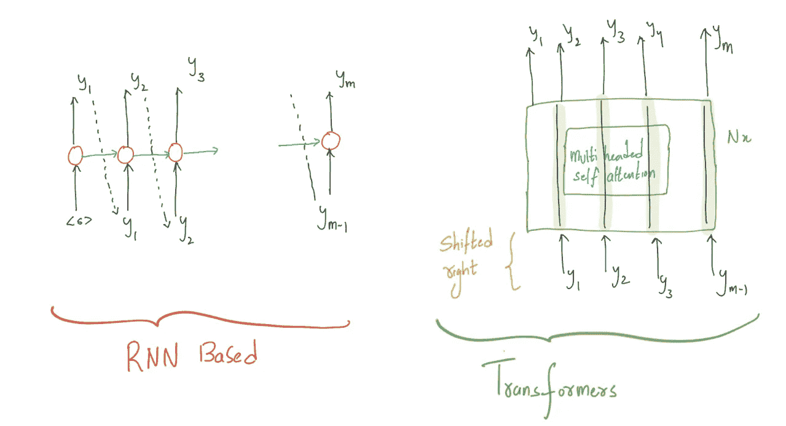

# NLP 从零到一:变压器(第 13/30 部分)

> 原文：<https://medium.com/nerd-for-tech/nlp-zero-to-one-transformers-part-13-30-5cd5a3ddd93b?source=collection_archive---------21----------------------->

## 标度点积注意力，多头自我注意力，

由作者生成

# 介绍..

Transformers 是一种新颖的神经架构，被证明是最近在机器学习翻译方面取得的成功。像编码器-解码器模型一样，Transformer 是一种使用编码器和解码器将一个序列转换成另一个序列的架构。与之前基于 RNN 的序列到序列模型的不同之处在于 transformer 不使用任何递归网络(GRU、LSTM 等)。)既不是编码器也不是解码器。因此，变压器消除了在编码器和解码器网络中使用 RNN 连接的需要。

transformer 的想法是，不使用 RNN 来累积内存，而是直接在输入序列上使用**多头注意力**。这使得它类似于允许并行执行计算的前馈网络。只有不含 RNN 的注意机制才能显著提高翻译任务和其他任务的成绩。

# 自我关注..

自我注意的想法是我们想要模拟序列中的每个单词是如何被给定序列中的所有其他单词影响的。所以这个想法是得到自我关注权重"**，它告诉我们序列中的单词是如何受到序列中所有其他单词的影响的。设感兴趣的词用 Q 表示，其他词依次用 k 表示。**

****

**自我关注权重，由作者生成**

****

**标度点积注意力**

**SoftMax 函数被应用于自我关注权重"**"*以具有 0 和 1 之间的分布。然后，将计算出的自我关注权重“***”****”*应用于表示为“ **V** 的序列中的所有单词。***

# **多头自我关注..**

****

**左:比例点积注意，右:多头注意，Ref: [1]**

**这种自我注意机制被并行成多个并排的机制，如右图所示。自我注意机制通过 Q、K 和 v 的线性投影重复多次。这种自我注意的并行版本被称为多头自我注意。这允许系统从 Q、K 和 V 的不同表示中学习，这对模型是有益的。这些线性表示是通过将 Q、K 和 V 乘以在训练期间学习的权重矩阵 W 来完成的[2]。**

# **变形金刚(电影名)..**

****

**变压器架构**

**在这一节中，让我们试着理解转换器架构。正如我们已经介绍过的它由注意机制组成，没有任何 RNN(递归神经网络)。编码器和解码器都由重复的多头自关注机制组成。这种多头自我注意机制的重复在图中被描述为 *Nx* 。**

**变压器架构中有几个重要的组件和细节。让我们简单讨论一下:**

1.  ****位置编码:**我们不能直接使用字符串，所以输入和输出序列被输入到一个嵌入层，并把序列转换成一个 n 维空间。**
2.  ****输出(右移):**理解我们为什么需要将输出右移非常重要。我们将需要有很多句子对，我们可以开始训练我们的模型。假设我们想从英语翻译成泰卢固语。我们的编码输入将是一个英语句子，解码器的输入将是一个泰卢固语句子**右移**。**

****

**比较基于 RNN 和基于变压器的 E-D 模型的解码器设置，由作者生成**

**在基于 RNN 的编码器-解码器中，我们不必给出移位的输出语句，该模型简单地使用时间步长“**t”**的预测作为时间步长“**t+1”**的解码器的输入。如果你观察到这种转变已经在基于 RNN 的编码器-解码器内部发生。
在变压器中，我们采用顺序模型，因此在时间步长“ **t** ”时解码器的输入应独立于时间步长“ **t-1”时发生的情况。**因此，通过将解码器输入移动一个位置，我们的模型需要预测位置 *i.* 的目标单词/字符**

****3。预测:**预测与我们训练模型的方式略有不同，因为预测时我们不会有输出序列。显然，我们将不得不使用解码器的输出作为每一步，并使用它作为解码器的输入。我们需要多次运行解码器来完成输出序列的预测。**

****

**由作者生成**

**上一篇: [**NLP 零对一:注意机制(第 12/30 部分)**](https://kowshikchilamkurthy.medium.com/nlp-zero-to-one-attention-mechanism-part-12-30-c5c36670c81f?source=your_stories_page-------------------------------------)**

**接下来: [**NLP 零对一:BERT (Part 14/40)**](https://kowshikchilamkurthy.medium.com/nlp-zero-to-one-bert-part-14-40-691ef069712f?source=your_stories_page-------------------------------------)**