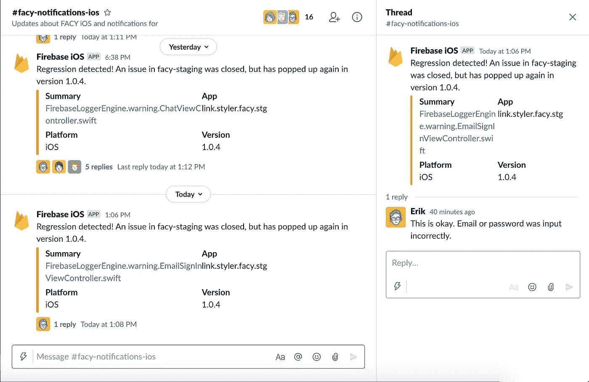
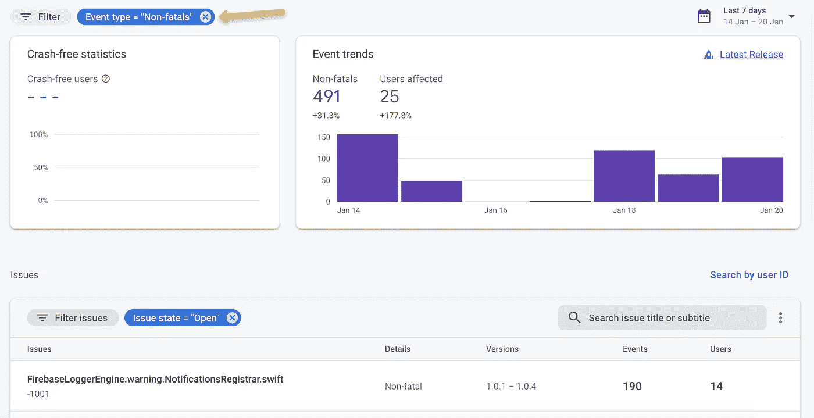

# 我们的代码中没有错误

> 原文：<https://medium.com/nerd-for-tech/no-bugs-in-our-code-ca176ed4d27b?source=collection_archive---------12----------------------->

我们在 [Styler](https://styler.link/?utm_source=medium&utm_medium=link&utm_campaign=david) 的应用团队在避免 bug 方面做得非常好，而且当它们出现时也能快速修复。这方面的第一步在于找出它们何时发生。



快速响应，检查报告的错误是否是新的

## 在客户端，没有人能听到你尖叫

在服务器端工作很容易收集、监控和报告日志。他们通常来自同一个地方。无论是日志文件还是 stderr 流，我们都可以很容易地在出错时读取它。许多服务器软件甚至带有内置工具，用于在崩溃时发送电子邮件，如果不是更复杂的话。

然而，在客户端，应用程序会在我们不知道的情况下崩溃、挂起或者干脆一片空白。如果我们运气不好，经常会有一些可怜的用户伸出手来问我们发生了什么。

但是有更好的方法。

当设置一个新的客户端应用程序时，无论是移动应用程序还是单页面应用程序，我建议首先添加一个全面错误处理程序。捕捉任何错误，并确保将它们发送到您的后端。

更好的是，节省时间和精力，并利用其中一个很好的错误和日志记录服务，它们不仅提供崩溃处理，而且还提供批量日志延迟节省功能和监控。

一些例子是:

*   [谷歌云日志](https://cloud.google.com/logging/docs)
*   [Firebase Crashlytics](https://firebase.google.com/products/crashlytics) (之前为 Fabric)
*   [哨兵. io](https://sentry.io/)
*   来自微软 Azure 的[应用洞察](https://docs.microsoft.com/en-us/azure/azure-monitor/app/app-insights-overview)

## 燃烧基分解剂

这是我们的 iOS 和 Android 应用程序用来报告错误和崩溃的。每当应用程序停止时，它都会在下次启动时报告错误。

我们还会捕获任何错误或异常，并使用明确的消息手动记录它们:

```
Crashlytics.Log(string message);
```

这可能有点不直观，因为它被保存为一个`Non-Fatal`错误。起初可能很难找到这些，因为您需要显式地删除和添加非致命的过滤器。但是一旦完成，你就可以得到这些数据的良好统计，并按照你处理崩溃的方式跟踪它们。



在 Crashlytics 中过滤非致命的

正如你在上面看到的，我们的团队已经将它连接到一个松弛的通道上。他们确保在出现任何错误时立即采取行动，进行调查，要么确保这不是什么严重的问题，要么我们将其作为一个 bug 添加进来。

❌最大的缺点是，Firebase Crashlytics 还没有网络支持。
✅为 [iOS 和 Android](https://firebase.google.com/docs/crashlytics) 添加和使用它非常容易，无论是原生的还是跨平台的框架，如 [Flutter](https://pub.dev/packages/firebase_crashlytics) 。

## 谷歌云日志

我们使用这个服务器端进行所有的日志记录。对于非致命错误来说，这甚至是一个更好的选择，因为我们可以记录验证错误，这并不是真正的错误，当然，除非它们大量出现。

由于 Crashlytics 不可用于 Vue.js 和其他 SPA 客户端框架，我们对 Vue.js SPA 应用程序使用 Google Cloud logging([stack driver-errors-js](https://github.com/GoogleCloudPlatform/stackdriver-errors-js))。随着问题的记录，我们使用发布/订阅来检测任何错误并提交给 slack。

❌它的级别比✅的 Crashlytics 低，在服务器端非常容易使用，与✅的 Kubernetes 一起本机运行，非常广泛，并捆绑了一套用于发现问题、监控和跟踪问题的基本工具


与谷歌云日志捆绑在一起的错误报告界面

## 外卖食品

除非我们在客户端记录错误，否则我们可能永远不会知道它们。在拥有许多用户之前，向应用程序添加错误报告听起来可能有些违反直觉。但是相信我，即使你第一次不得不要求用户给你发送错误日志，你也会后悔没有它。

添加错误报告是第一步，第二步是确保跟进。监控和错误警告只有在被倾听的情况下才有帮助，如果错误一直被发布而没有回应，您很快就会淹没在噪音中。

如果你自己有任何经验，任何你想分享的库、框架或其他请做！

附言

这个头衔与其说是现实，不如说是野心🤣