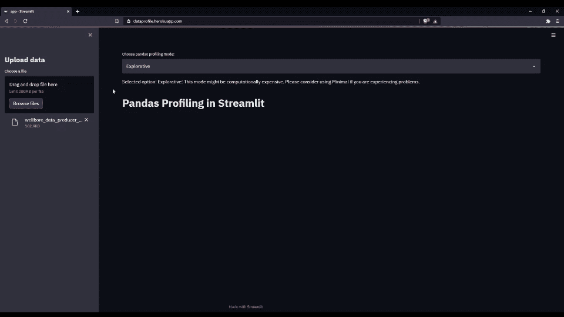

# 无代码探索性数据分析:数据概要

> 原文：<https://medium.com/nerd-for-tech/no-code-exploratory-data-analysis-dataprofile-537446151334?source=collection_archive---------13----------------------->

dataprofile.herokuapp.com

在这篇文章中，我将解释如何使用 Python 和 Streamlit 创建一个熊猫档案应用程序，它部署在 Heroku([**【dataprofile.herokuapp.com】**](https://dataprofile.herokuapp.com/))上。开发的仪表板允许用户执行探索性数据分析，无需代码！只需将您的数据拖放到仪表板上，让奇迹发生吧！

节目链接:【dataprofile.herokuapp.com】

**[视频中使用的示例数据可在此处找到。](https://github.com/sercangul/2021-Energy-AI-Hackathon/blob/main/data/wellbore_data_producer_wells.csv)**

**我建议读者浏览一下我以前的文章:[如何使用 Heroku](https://sercangl.medium.com/how-to-deploy-streamlit-dashboard-with-heroku-ca00064402e8) 和 [Pandas Profiling 部署 Streamlit 应用程序:探索性数据分析](https://sercangl.medium.com/pandas-profiling-exploratory-data-analysis-9a2e3ef5471c)以获得关于 Heroku 和 Pandas Profiling 的更多详细信息。**

# ****开始—生成 app.py 文件****

**生成这个应用程序需要四个库。**

**熊猫:需要处理表格数据。**

**Streamlit:用于生成仪表板的库。[查看此链接了解更多详情。](https://sercangl.medium.com/how-to-deploy-streamlit-dashboard-with-heroku-ca00064402e8)**

**Pandas-profiling:一个使用 Pandas 数据框创建探索性分析的伟大工具。[查看此链接了解更多详情。](https://sercangl.medium.com/pandas-profiling-exploratory-data-analysis-9a2e3ef5471c)**

**Streamlit_pandas_profiling:将用于将报告嵌入到 Streamlit 仪表板中。**

**Streamlit 有一个设置，我们可以用它来设置页面配置布局。我喜欢使用宽选项。这不是强制性的。**

**让我们创建加载数据的函数。为此，我使用 pd.read_csv()函数通过 pandas 将数据读取为 dataframe。**

**让我们创建一个标题为“上传数据”的侧栏。这里引入了一个文件上传器来将数据加载到应用程序中。**

**另一方面，引入了一个选项选择(st.selectbox)来选择 pandas 分析模块中的分析模式。**

**下面的代码可用于为用户从面板加载数据提供错误消息/提醒。**

**数据上传到仪表板后，代码的最后一部分开始工作。首先，使用 pandas 将数据作为数据帧读取。然后，根据所选的选项，创建 ProfileReport 并另存为 pr。**

**配置文件报告准备就绪后，将使用 st_profile_report(pr)在仪表板中进行报告。**

**完整代码如下所示:**

# **部署到 Heroku**

**我在上一篇文章中解释的方法([如何使用 Heroku 部署 streamlit 应用程序)](https://sercangl.medium.com/how-to-deploy-streamlit-dashboard-with-heroku-ca00064402e8)用于将 Streamlit 应用程序部署到 Heroku。下面是该过程的快照(大约需要 3-4 分钟)。**

****

# **结论**

**总之，现在云上有一个 app(data profile . heroku app . com)，可以用来进行无代码的探索性数据分析。**

**特别感谢 streamlit、pandas 和 pandas-profiler 的开发者。**

**参考资料:**

**[如何使用 Heroku 部署 Streamlit 应用](https://sercangl.medium.com/how-to-deploy-streamlit-dashboard-with-heroku-ca00064402e8)**

**[熊猫概况:探索性数据分析](https://sercangl.medium.com/pandas-profiling-exploratory-data-analysis-9a2e3ef5471c)**

**进入仪表盘:[**dataprofile.herokuapp.com**](https://dataprofile.herokuapp.com/)**

**源代码:[https://github.com/sercangul/dataprofile](https://github.com/sercangul/dataprofile)**

**在 GitHub 上关注我:[https://github.com/sercangul](https://github.com/sercangul)**

****关注我，了解更多关于 Python、统计学和机器学习的信息！****