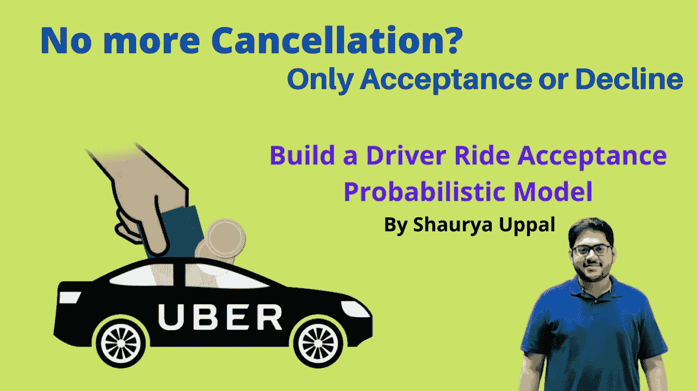
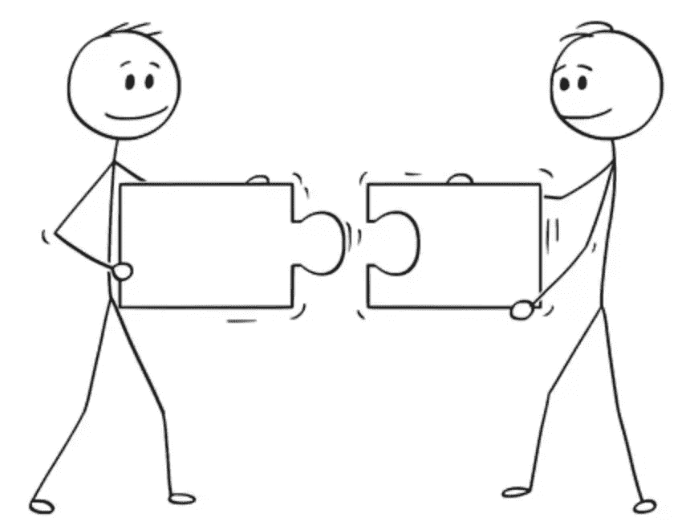

# 优步之旅不再取消了吗？再也没有贾纳·卡汉·海了？` |机器学习构建乘坐接受度模型

> 原文：<https://medium.com/nerd-for-tech/no-more-cancellations-of-uber-rides-by-shaurya-uppal-c64795973989?source=collection_archive---------2----------------------->

优步游乐设备验收

对旅行者来说是个好消息！就我个人而言，在被问及“Jana Kahan Hai？”之后，我的大部分乘车预订都被取消了。。

> 我相信我的读者朋友一定体验过这种感觉，当司机打电话问了一个可怕的问题:“你要去哪里”，然后取消了行程。

随着最新的更新，优步正在向司机展示他们决定接受搭车之前的旅行目的地，使他们能够做出明智的选择。你可能不需要支付优步行程取消费，司机也不太可能取消行程。

从现在开始，很难预测司机是否会取消乘车，因为过去用户和司机的对话是在电话上进行的。由于司机现在更多地了解用户的接送位置，并且对于接送用户的路程有单独的激励，**现在焦点从取消转移到司机接受搭车**。

让我们从数据科学(机器学习)的角度来理解在幕后发生了什么，以将用户请求匹配到司机，司机接受乘坐的概率很高，并在尽可能短的时间内满足你的请求。

匹配算法

总之，在几秒钟内找到最适合你的出租车司机；这些叫车公司(优步、Lyft、Ola、Rapido 等。)运行匹配算法，并且在向驾驶员推送请求之前检查驾驶员的乘坐接受概率。

**在本期简讯中，我们将讨论如何建立一个驾驶员乘坐接受概率模型？**

> *目的:预测驾驶员是否会接受乘车请求，并求出接受的概率？*

本博客由 [**ProjectPro**](https://www.projectpro.io/?utm_source=newsletter&utm_medium=shauryauppal&utm_campaign=june_edition) 赞助。

> 停止去多个在线论坛拼凑解决方案。ProjectPro 有现成的专业项目模板，用于数据提取、数据分析、数据可视化、模型部署等。

如果你有兴趣在打车平台学习[需求预测](https://www.projectpro.io/project-use-case/ola-bike-rides-request-demand-forecast?utm_source=newsletter&utm_medium=shauryauppal&utm_campaign=june_edition)请查看我在 ProjectPro 上的数据科学课程。

 [## LinkedIn 上的 Shaurya Uppal 数据科学#激情#研究

### 我很高兴分享我的迷你项目是活的！！！今天，从我的一个同事那里收到了非常好的赞赏反馈…

www.linkedin.com](https://www.linkedin.com/feed/update/urn:li:activity:6823594709865259008/) 

# 所需的特性/特征-

为了找出解决打车业务中这一问题所需的功能，数据科学家必须精通领域知识。对于数据科学家来说，产品思维总是很重要的。

优步莱德

# 1.旅行

*   司机到用户(客户)的距离(司机到取货点的距离)
*   一天中的时间(早上/下午/晚上/深夜)
*   行程持续时间/距离(从上车到下车的距离)
*   支付方式(与在线支付相比，一些司机更喜欢现金支付方式)
*   客户的目的地(司机不喜欢去一个他们不得不努力争取下一个客户的目的地)
*   游乐设备类型——联营请求或正常请求

# 2.驾驶员

a)途中或可用

*   司机是否有空(不乘车)
*   如果司机正在途中——旅行即将结束或正在途中

b)历史特征

*   过去一周/一个月的平均。乘坐次数接受率
*   全天完成的总行程——驾驶员是否实现了当天的激励目标
*   当前天数接受率(接受率=接受的请求数/收到的请求总数)

# 3.车型

*   出租车/自动人力车/自行车(根据车辆类型，一些司机不接受客户在偏僻地区接车——出于安全考虑)
*   许多自行车/汽车人力车司机不喜欢超过 10 公里的乘车请求

自动驾驶

# 4.附加条款(客户)

*   骑手评分(驾驶员不喜欢与低于 4 分的客户打交道)
*   乘客性别(一些司机不接受基于请求时间和客户性别的乘车请求)
*   骑手形象(有人做了一个有趣的实验，把他的形象换成僵尸形象，得到的司机认可较少；向司机证明客户的形象也很重要)

> *有趣的阅读档案图像对双方(驾驶员和骑手)都很重要😂:* [*【僵尸】司机用恐怖的个人资料图片骗取钱财*](https://www.shortlist.com/news/uber-ghost-drivers-are-tricking-users-out-of-money-in-china)

# 5.交通

*   基于请求时间-司机有时不喜欢在交通繁忙的区域接受搭车(完成行程或到达客户的持续时间-取决于该地区的交通状况)

# 6.特殊事件(偶尔变化)

*   天气——雨天/晴天
*   该区域的 Covid 限制(隔离区)
*   基于地区的节日——胡里节、排灯节、圣诞节等。

困难之时

# 建模

我们现在有一个丰富的功能集，可以帮助我们预测司机是否会接受客户的乘车请求。我们使用标准的统计机器学习监督分类算法(带抽查):

*   逻辑回归(线性模型)
*   决策树(非线性模型)
*   Bagging 分类器—随机森林分类器(集成模型)
*   增强分类器— LightGBM、XGBoost 等。

**模型度量** : AUC-ROC，F-beta 评分(beta = 2；如果召回的重要性是精确度的两倍)

# 结论

我希望您理解了业务问题，并且能够理解我们为模式建模所选择的特性。虽然没有灵丹妙药，这些问题也更加复杂，但我们的目标是改善用户体验，最大限度地缩短用户-驾驶员匹配时间，因为驾驶员-用户匹配算法中哪怕一毫秒的变化都可以帮助节省数百万美元。

根据一篇名为《高频交易中的延迟成本》的论文，延迟 1 毫秒的优势每年价值高达 1 亿美元。

## 我希望你从这篇文章中学到了一些新的东西。如果你喜欢，点击👏，订阅我的时事通讯，并与他人分享。敬请期待下一期！

> 如果你觉得这篇文章有用，请在 [**LinkedIn**](https://www.linkedin.com/in/shaurya-uppal/) 上联系、关注或支持我。更多关于我的信息请访问: [**这里**](https://linktr.ee/shauryauppal)
> 
> 还不是中等会员？请使用此链接 [**成为会员**](https://shauryauppal.medium.com/subscribe) 因为，在不为你额外付费的情况下，我为你引荐赚取一小笔佣金。
> 
> 我还办了一个 [**通迅版**](https://www.linkedin.com/newsletters/problem-solving-data-science-6874965456701198336/) 。如果你正在建立一个人工智能或数据产品或服务，你将被邀请成为未来 [**时事通讯**](https://www.linkedin.com/newsletters/problem-solving-data-science-6874965456701198336/) 的赞助商。请随时联系 shauryauppal97@gmail.com 了解更多关于赞助的细节。

# 其他推荐读物:

[1] [当你不能进行 A/B 测试时的实验|超越 A/B 测试—迂回&合成控制组](https://www.linkedin.com/pulse/experimentation-when-you-cant-ab-test-beyond-testing-shaurya-uppal/)

[2] [通过理解陷阱掌握 A/B 测试](https://www.linkedin.com/pulse/ab-testing-netflix-uber-pinterest-google-linkedin-spotify-uppal/)

[3] [数据科学在 Ola、优步、Rapido 等地的应用。](https://www.linkedin.com/pulse/ola-lyft-gojek-grab-uber-bikes-ride-demand-data-science-shaurya-uppal)

> *订阅获取邮件通知:* [*此处*](https://shauryauppal.medium.com/subscribe)

 [## 问题解决和数据科学| LinkedIn

### Shaurya Uppal |我将分享我从自己开发的各种产品中学到的知识，以及我是如何解决这些问题的…

www.linkedin.com](https://www.linkedin.com/newsletters/problem-solving-data-science-6874965456701198336/) 

## 数据科学书籍推荐:

[1] [为什么之书](https://amzn.to/3x2yVmF)

[2] [裸体统计](https://amzn.to/3N6Q8Rk)