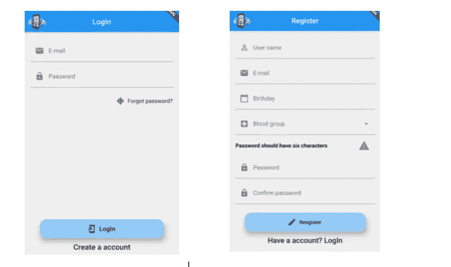
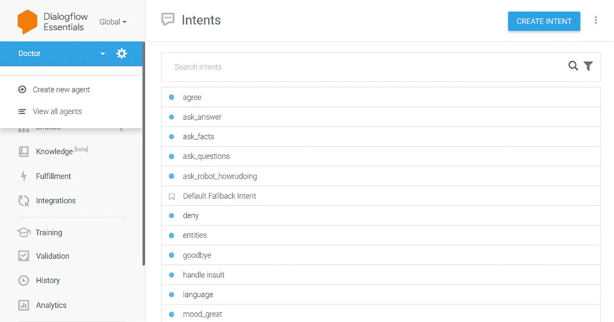
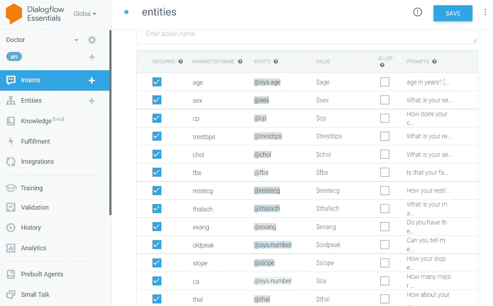
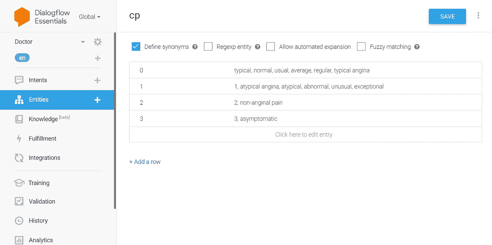
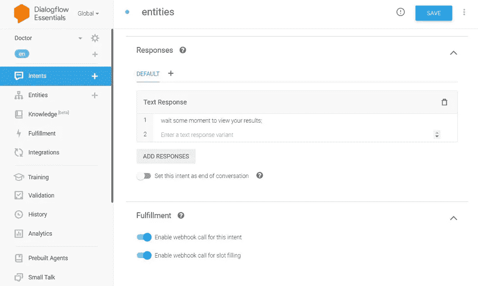
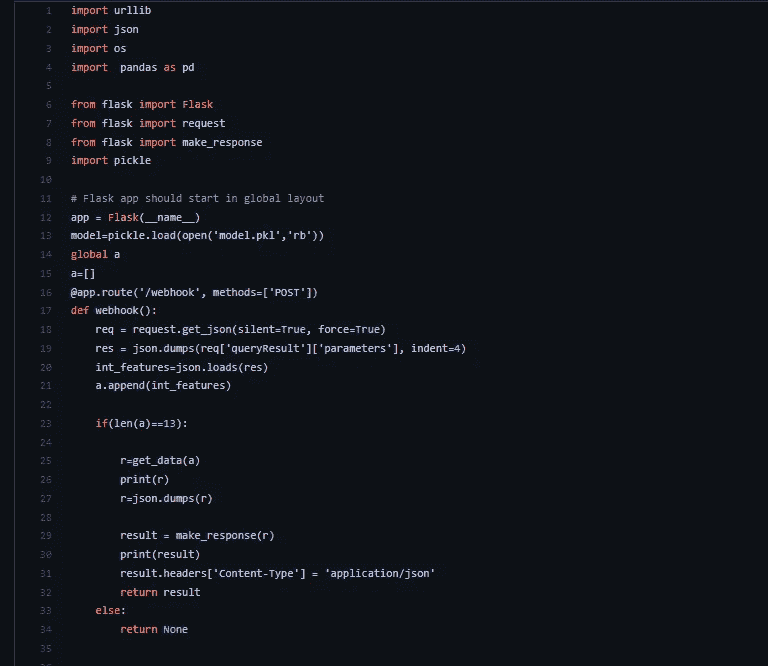
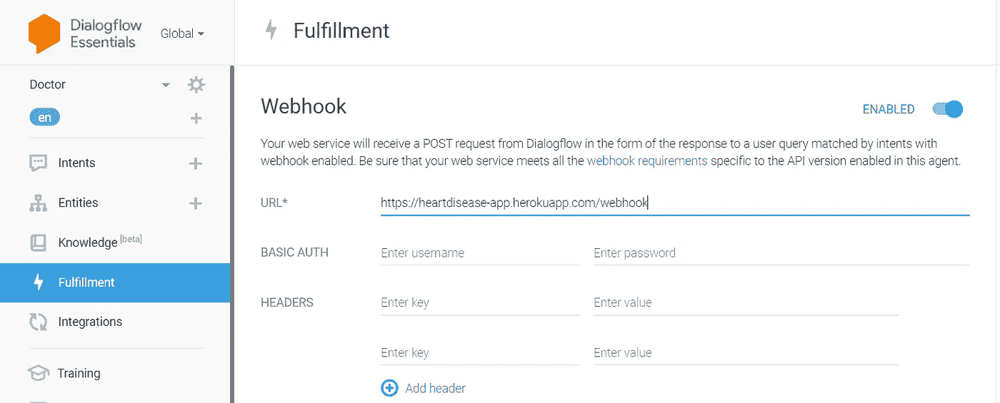

# 不再去医院了

> 原文：<https://medium.com/nerd-for-tech/no-more-visits-to-hospitals-fb5351d4a841?source=collection_archive---------4----------------------->

## 基于手机的医疗决策支持系统

来源:[https://www . elegantthemes . com/blog/tips-tricks/how-to-add-a-chat-bot-to-your-WordPress-website-in-3-steps](https://www.elegantthemes.com/blog/tips-tricks/how-to-add-a-chat-bot-to-your-wordpress-website-in-3-steps)

医院是一个全球性的会议，任何病人都可以在这里进行医疗检查，诊断疾病，并获得治疗建议。世界各地的大多数人都遵循这一习俗。这被认为是记录一个人身体状况的最合适和最真实的方法。然而，在 COVID 期间，这并不是最佳的行动方案。建议的方法试图找到一种替代去医院和预约医生进行检查或诊断的方法。使用自然语言处理和机器学习技术创建的聊天机器人应用程序可以帮助人们通过一系列问题和疑问轻松地与聊天机器人进行交互，类似于人与人之间的交互。与此同时，聊天机器人将发现并识别此人的症状，从而预测此人患有何种疾病，并建议适当的补救措施和治疗方法。它还可以帮助人们了解自己的健康，并敦促更多的人采取必要的健康维护措施。根据调查结果，这样的系统并没有被广泛使用，大多数人并不知道。将该框架付诸实施将极大地帮助个人避免长途旅行到医院，无论他们在哪里都可以简单地使用该应用程序。

为此，我们可以使用 Google Dialog Flow 通过 4 个步骤创建一个集成了机器学习的对话机器人。

1.  机器学习模型(针对每种疾病，如糖尿病、心脏病等。)
2.  对话流聊天机器人收集用户输入。
3.  部署在任何公共主机上并呈现请求和响应的 Flask 应用程序。
4.  聊天机器人对 Flask API 进行 webhook 调用，以发送数据并检索响应。

最后是与移动应用的集成

它是如何工作的？

在这个系统中，我们可以添加任何数量的疾病，但我将谈论我如何试图预测和提供有关心脏病的细节。这是一个基于 flutter 的移动应用程序。通过登录系统，用户可以与聊天机器人开始对话，聊天机器人会提示问题以获取输入数据。

1.  **建立 ML 模型**

出于这个目的，我已经使用[这个](https://www.kaggle.com/ronitf/heart-disease-uci) Kaggle 数据集创建了一个模型来预测一个人是否患有心脏病。我们只需导入数据并对其应用随机森林分类器。如果你想看看我做的模型，你可以看看[这个](https://github.com/thukaraka/health-care-support-system/blob/master/Machine_Learning_Model/heart.ipynb)。然后就把模型腌起来，这个模型，模型。“pkl”稍后将被导入到我们的 flask 应用程序中。

**2。DialogFlow 聊天机器人**

现在，让我们直接进入 DialogFlow 来构建我们的聊天机器人。其他 API 和框架也可以用来开发聊天机器人，但是 Google 的 DialogFlow 是一个显而易见的选择，因为它简单、免费并且构建速度极快！使用您的 Google 帐户登录 DialogFlow。然后，要构建您的聊天机器人，请点击“创建新代理”在这里，我已经创建了代理“医生”来预测和查询心脏病。

创建新代理

接下来，我们必须开发一个向用户请求数据并执行 webhook 调用的意图。在此之前，您必须创建一些意图来欢迎用户，创建一些意图来回答用户的查询。你可以通过[这篇](https://cloud.google.com/dialogflow/es/docs/intents-default)文档来了解更多。

必须添加将包含从用户接收的数据的实体。以我为例，我有 13 个输入。如下图所示，为用户要求的 13 个数据点创建 13 个不同的参数。确保包含要求用户单独输入的提示。

添加参数

要创建实体，有自定义实体和系统实体。我主要使用自定义实体来匹配特定于我的代理的数据。

创建自定义实体

您现在可以测试右边面板上的聊天机器人，看看它是否工作正常。之后，您必须通过选择“为此目的启用 webhook 调用”来允许履行。如下图所示

为意向启用 webhook 调用

通过这样做，这个意图将向我们的应用程序发送一个 webhook 请求，该应用程序托管在 Heroku 的公共云上。我们现在必须构建 flask 应用程序，将其部署到 Heroku，然后在左侧的“Fulfillment”选项卡中输入 URL。

**3。Heroku** 上的烧瓶应用

我们现在必须创建我们的 flask 应用程序，它从我们的 chatbot 接收 webhook 请求，获取数据，使其适合 ML 模型(model.pkl ),并将实现文本和预测一起发送到 DialogFlow。我用的代码

之后，我们必须处理来自 DialogFlow 的履行请求，它是 JSON 格式的。一旦我们收集了数据，我们将把它放到一个数组中，输入到我们的模型中，并获得预测。在这个[环节](https://github.com/thukaraka/health-care-support-system/blob/Thukaraka/Machine_Learning_Model/app.py)你可以看看我是怎么做到的。

之后，我们只需要将代码部署到公共主机上。我选择 Heroku 是因为它又一次简单、免费而且非常快！只需将以下文件添加到您的新 Github 存储库中:flask 应用程序、模型 pickle 文件、Procfile(这非常重要，有助于 Heroku 定位 flask 应用程序)和一个需求文本文件，该文件告诉 Heroku 要预安装哪些库和版本才能正确运行应用程序。

只需在 Github 上创建一个存储库并上传到 Heroku。制作一个“新应用”，然后将你的 Github 库连接到它。一旦链接，只需按下部署按钮，你就大功告成了！

**4。Webhook 调用**

现在到了最后阶段。我们现在必须将部署的应用程序链接到我们的聊天机器人。只需输入应用程序部署的 URL，并在后面附加“/webhook”。请记住，应用程序在 flask 代码中被定向到'/webhook '。只需导航到 DialogFlow 左侧面板的“实现”标签，启用“网页挂钩”，然后输入<your app="" url="">/网页挂钩。</your>

在 DialogFlow 上启用 Webhook

现在我们完成了！。您可以通过在右侧面板中启动对话来检查 webhook 请求/响应是否正常运行。通过预测，您应该会收到一个履约回复。

我们已经到了最后阶段。这里没什么可做的，因为用 DialogFlow 连接移动应用程序很简单。我在这里做的示例，我如何集成到 flutter 移动应用程序，你可以通过修改来使用它。

希望这能有用。感谢您的阅读…