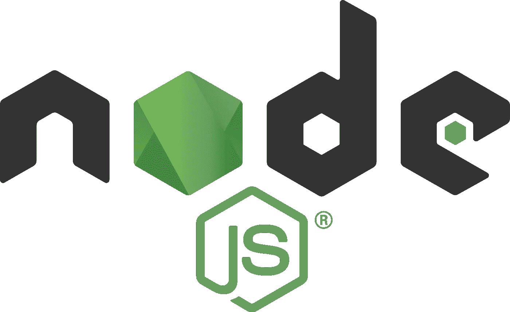
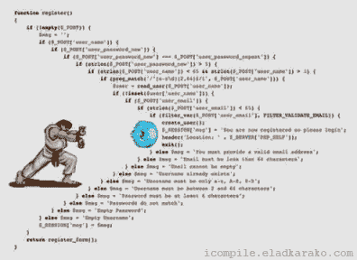

# 节点。所有的一切

> 原文：<https://medium.com/nerd-for-tech/node-js-all-js-everything-154374303b1c?source=collection_archive---------31----------------------->

NodeJS 初学者指南

# 介绍

在 Flatiron 学校期间，我学习了前端的 JavaScript 和后端的 Ruby on Rails，但最近我开始学习后端的 NodeJS，我真的很喜欢它，因为它允许我使用 JavaScript 进行全栈开发。所以，再见吧，记住错误的语法时，由于语言之间的切换而产生的错误。

NodeJS 是一个异步事件驱动的 Javascript 运行时环境，它使用 Google 的 Chrome 引擎(V8)将 JS 编译成可以在各种最流行的操作系统(如 MacOs、Windows 和 Linux)上运行的机器代码。

## 易于安装

 [## 下载| Node.js

### Node.js 是基于 Chrome 的 V8 JavaScript 引擎构建的 JavaScript 运行时。

www.nodejs.org](https://www.nodejs.org/en/download/) 

## 软件包管理器安装

 [## 通过包管理器| Node.js 安装 Node.js

### 该页面上的包由其各自的打包程序维护和支持，而不是 Node.js 核心团队。请…

www.nodejs.org](https://www.nodejs.org/en/download/package-manager/) 

# 为什么使用 Node？

因为 Node 是一个事件驱动的系统，它非常适合运行 web 服务器，所以您可以使用 Node 服务器通过 HTTP 侦听某些请求，并用您选择的一些数据进行响应。此外，Node 还非常适合制作实用程序，例如监听文件更改和根据条件执行一些功能。

Node 使用非阻塞、事件驱动的进程，非常适合创建快速网络应用程序，因为它处理与 CPU 线程的异步连接，从而产生大量数据输出。

它内置了对使用 NPM 的包管理的支持，这通过拥有来自 NPM 生态系统的丰富的库来打开你的可能性。与 Node 结合使用最多的 NPM 包可能是 Express，它是受 Sinatra 启发专门为 Node 构建的框架。

## 赞成的意见

*   高性能
*   NPM 生态系统
*   JS 开发人员简单易学

## 骗局

*   回调地狱
*   不利于繁重的 CPU 任务
*   未处理的异常

现在我们已经讨论了一些优点，让我们来谈谈缺点。

由于 Node 的异步特性，在 Node 中编程需要大量的回调函数，这可能会导致回调地狱。当你的代码过多地嵌套在层中，使得其他开发人员难以理解和维护时，就会发生这种情况。

节点在单个 CPU 线程上运行任务，这使得它很难处理繁重的 CPU 任务。当给定一个繁重的任务时，Node 将分配它所有的 CPU 资源来处理该请求，这将导致事件循环和随后的异步函数变慢。想象一下这就像一个堵塞的下水道，如果你往管道里塞一个大东西，水就会流出来，但是速度有多快呢？

Node 的另一个可怕之处是未处理的异常。似乎 Node 不喜欢错误，当我们不处理错误时会崩溃，所以我们必须到处使用 try-catch 块，这导致了更多的嵌套回调地狱。

# 结论

每种编程语言都有起有落，但是到目前为止我真的很喜欢 Node，主要是因为我只使用一种语言来编码，这真的有助于提高生产率。

希望这篇文章能帮助你理解 NodeJS 的基础知识。如果你喜欢这篇文章，请留下掌声，并在未来关注更多的编码内容。