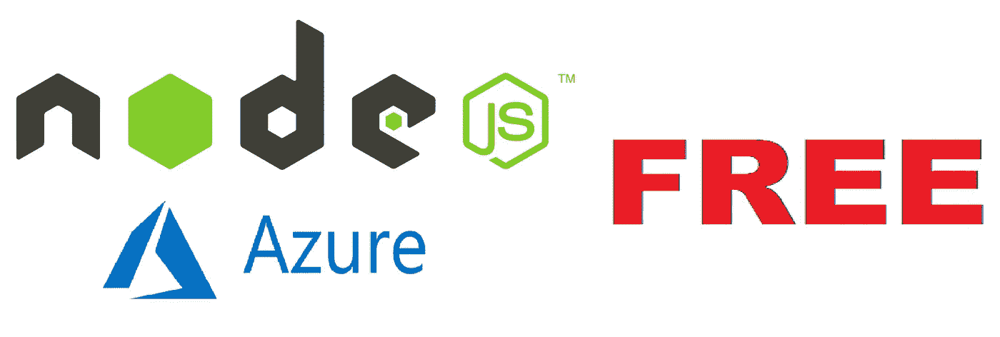
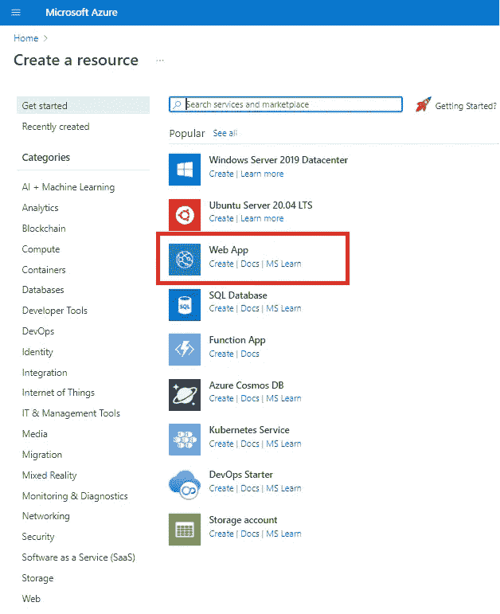
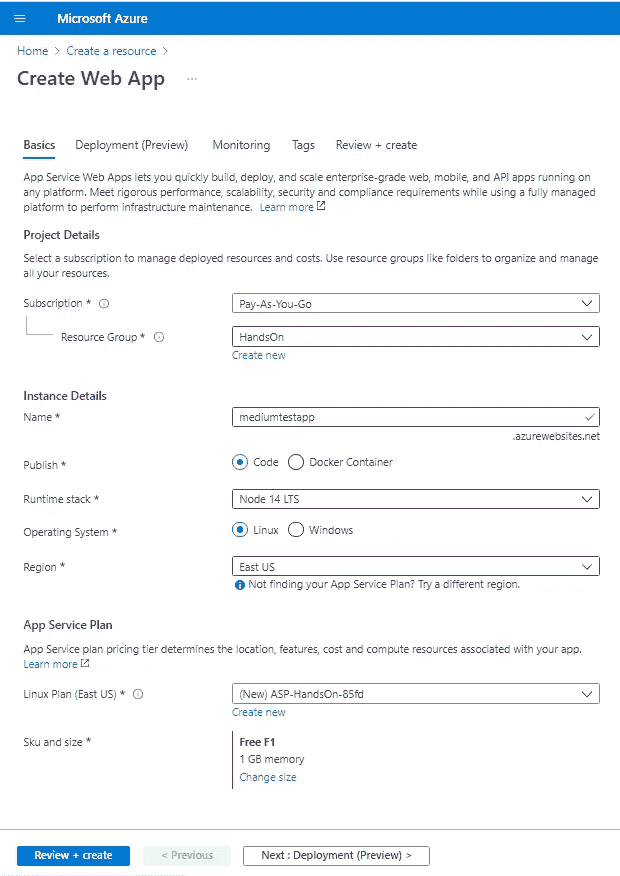
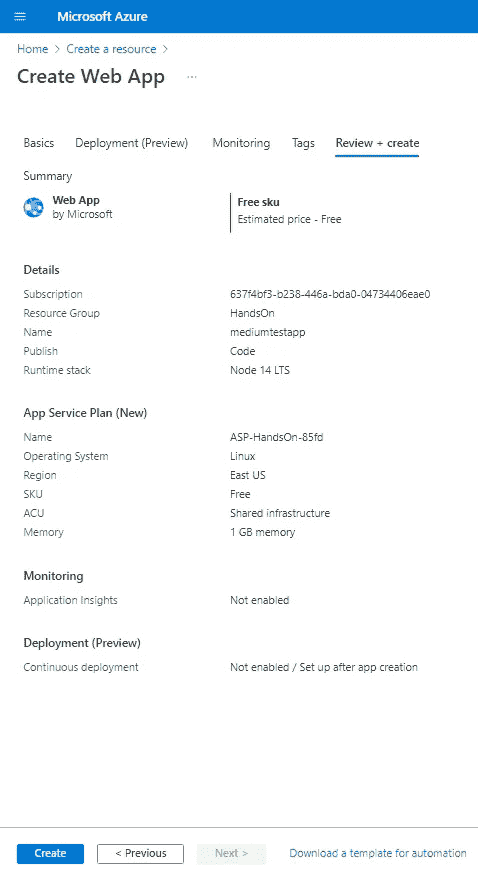
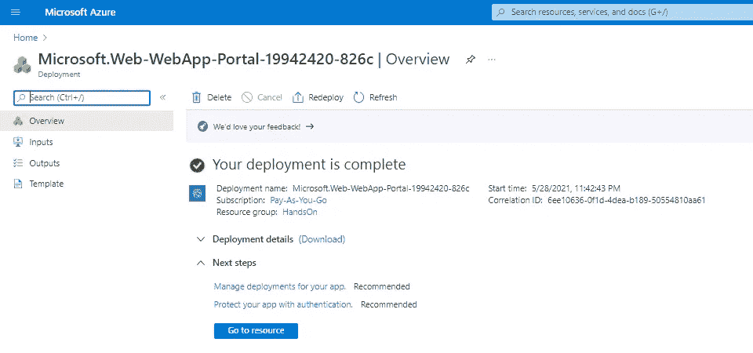
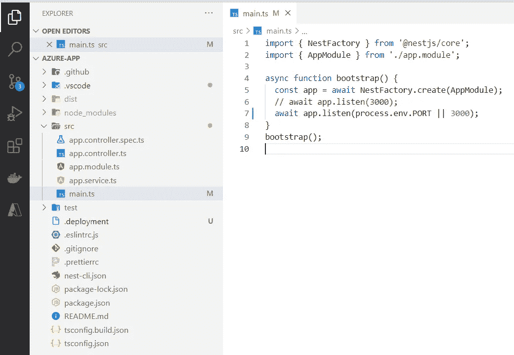
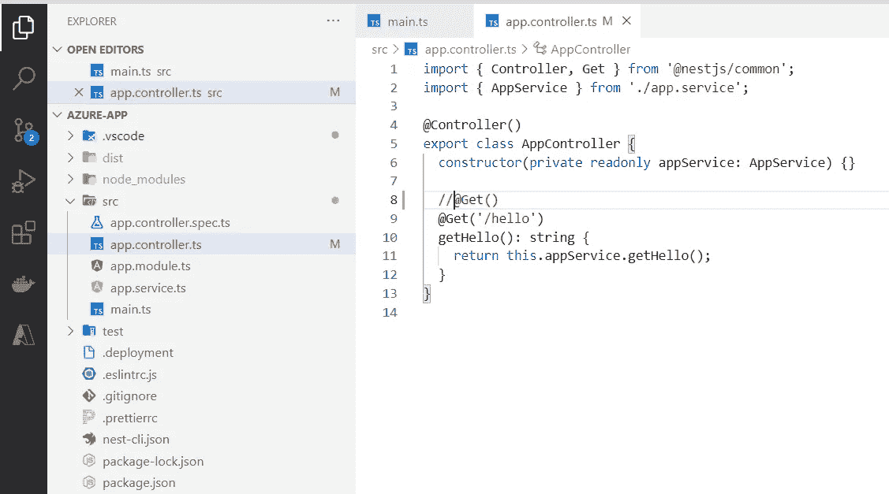
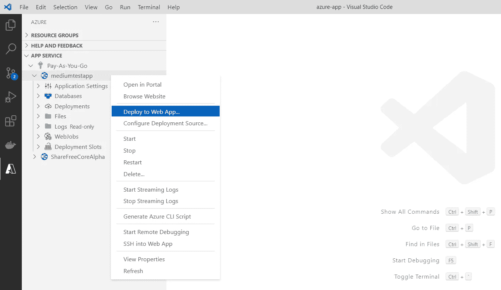
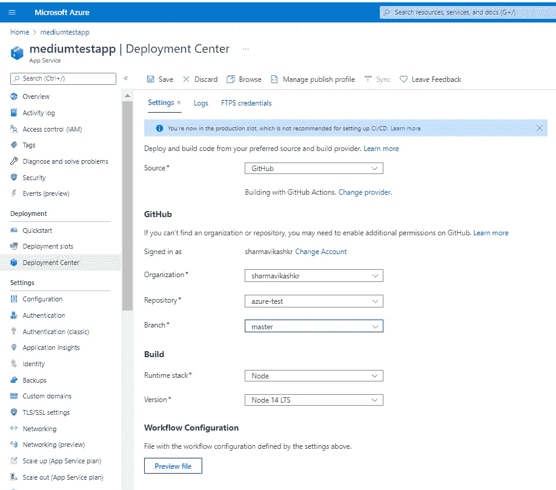
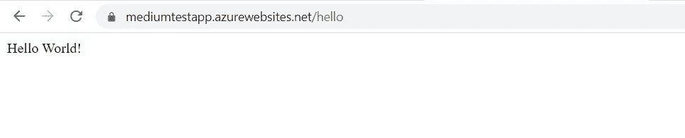

# NodeJs:在 Azure 上免费部署 NodeJs 应用

> 原文：<https://medium.com/nerd-for-tech/nodejs-deploy-your-nodejs-app-on-azure-for-free-fcf26135a845?source=collection_archive---------4----------------------->

让我们面对现实吧，每当我们准备好一些功能时，我们都会想到在云上免费部署我们的应用程序，无论是让其他应用程序与我们的 API 集成，还是向我们的利益相关者演示这些功能。在选择云提供商时，Azure 可能是目前最有吸引力的。它越来越受欢迎，越来越多的企业采用它来满足他们的云计算需求。易用性、一系列 SaaS 应用程序、优秀的 IT 支持文档、相对便宜等等。这是它比其他云提供商增长速度更快的一些原因。

这篇文章将帮助你在 Azure 上免费部署你的 NodeJs 应用。

# **第一步:登录**

登录/注册到 [Azure](https://portal.azure.com/) 。如果你是 azure 的新手，你将获得 12 个月的免费订阅，使用它你可以免费访问许多 Azure 服务。报名[这里](https://azure.microsoft.com/en-us/free/)。

# **第二步:创建一个网络应用**

创建一个资源，选择“Web App”。这是来自 Azure 的 PaaS 产品，Azure 是托管 web 应用程序的完全托管的容器服务。它本质上构建了项目的映像，并使用 docker 进行部署。

创建新资源

创建新的 Azure Web 应用

*   选择/创建(如果您还没有)订阅和资源组。资源组是一组一起计费的服务。
*   为您的 Web 应用程序指定一个唯一的名称。
*   将发布保留为“代码”，并选择运行时堆栈作为开发应用程序的节点版本。
*   选择地区为“美国东部”，并将 SKU 更改为“F1”，这是免费使用的(当您拥有 12 个月的免费订阅时，这将是默认选项)。

# ***第三步:*** 审核+ ***创建***

转到“查看+创建”选项卡，点击“创建”。

审查和创建

Web App 服务将在您的 Web 应用中部署一个虚拟的 Microsoft-Web-WebApp-Portal。

虚拟应用程序已部署

# ***第四步:创建 NodeJs 应用***

创建 NodeJs 应用程序。在这里，我从 NestJs starter 应用程序创建了一个项目，并将其推送到 Git 存储库。我对入门应用程序所做的更改:

*   我已经更新了 main.ts 文件，主要从环境中监听端口，而不是硬编码的 3000。这是因为 Azure Web App Service 部署了一个 App 容器@ 8080(通过 env。PORT)并绑定到 docker。

用于监听 process.env.PORT 的应用程序

我已经更新了 Hello 控制器来监听“/hello”而不是“/”。
*PS:*appservice . get Hello()返回“Hello World！”。

更改 Hello API 的路径

# ***第五步:部署***

现在我们终于部署了！！你可以通过 VS 代码部署你的应用。此步骤要求您在 VS 代码中安装“Azure Tools”扩展。

*   在 VS 代码中安装“Azure Tools”扩展。
*   在扩展中登录到您的 Azure 帐户(最初会有提示)。
*   部署到 Web 应用程序。此选项将要求您选择一个项目目录，压缩它，并在 Web 应用程序中上传和部署您的项目。

通过 VS 代码部署

或者，您可以将您的 Web 应用程序挂接到一个源代码控制库分支，当代码被推送到该分支时，它将自动触发一个构建。要实现这一点，请转到 Web 应用程序的部署中心，并连接到 NodeJs 应用程序的源代码控制存储库。保存。

将您的 NodeJs 应用程序存储库与 Web 应用程序挂钩

# ***第六步:验证***

完成后，尝试 WebApp 的 url 来检查它是否部署良好。

应用程序已部署