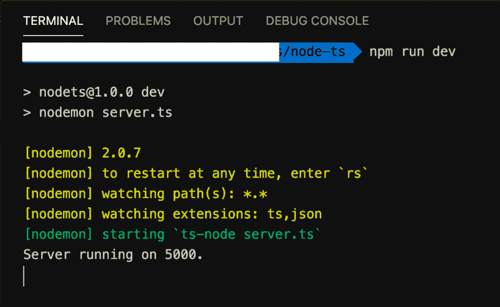
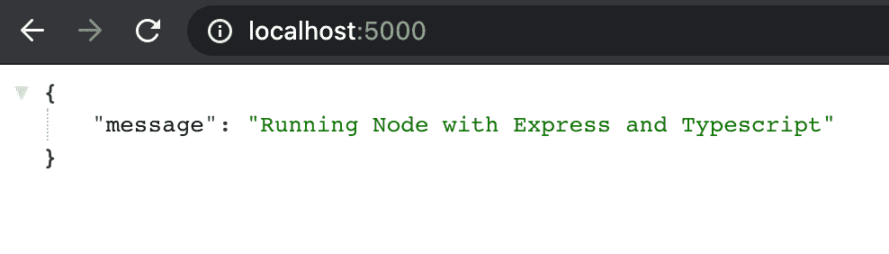

# 带有类型脚本的 NodeJs & Express

> 原文：<https://medium.com/nerd-for-tech/nodejs-express-with-typescript-9cc5f4007fae?source=collection_archive---------2----------------------->


大家好啊！！

在这篇文章中，我将讨论如何在你的 **NodeJs** 和 **Express** 项目中使用 typescript。到目前为止，Typescript 已经成为 JS 社区中使用最多的语言之一。

随着整个行业使用 React 趋势的增加，typescript 在经验丰富的开发人员和新手中获得了很大的流行。


从上面的图表中可以看出，Typescript 自创建以来就越来越受欢迎。

# 什么是 Typescript？

Typescript 是微软开发的 Javascript 的超集。

> *Typescript 是一种建立在 Javascript 之上的开源语言，增加了静态定义类型。*
> 
> *—打字稿首页*

一旦编译完成，TS 文件就被转换成等价的 Javascript 代码。那么出现的问题就是我们为什么要用它。

如果你仔细观察这个定义，它确实提到了“静态定义类型”这个短语。总的来说，Javascript 不是一种强类型语言，也就是说，有时脚本在执行时不会像预期的那样运行。调试代码并找出逻辑错误会让开发人员付出代价，并显著增加工作量。

Typescript 让我们 ***用 ***强类型检查*** 写出整洁有序的代码*** 。这有助于开发人员成倍地减少调试时间。

在这里，我不打算深入研究 typescript 的基础知识，而是主要关注如何在我们的 node/express 项目中使用 Typescript。

# 项目设置

让我们先快速地为 express 设置项目。

创建新的 express 项目的过程与任何常规的 express 或 node 项目相同。

启动机器上的终端，执行以下命令进行设置。

```
npm init
```

这将在终端中弹出向导，允许我们定义一些基本设置。完成向导，这样，package.json 文件就会出现在您试图安装项目的文件夹中。

```
{
  "name": "nodets",
  "version": "1.0.0",
  "description": "Sample nodejs express and typescript project.",
  "main": "server.js",
  "scripts": {
    "test": "echo \"Error: no test specified\" && exit 1"
  },
  "author": "",
  "license": "ISC"
}
```

现在让我们继续安装项目的依赖项。

```
npm i -P express
npm i -D nodemon
```

以上语句将 **express** 以及 **nodemon** 包安装到您的项目中。我使用 **npm** 作为包管理器，但是如果你喜欢，你也可以使用 **yarn** 。Nodemon 允许我们在本地运行我们的项目，这就是我把它作为一个开发依赖项安装的原因。

# 启用 Typescript

现在是时候在我们的项目中引入 typescript 了。

```
node i -D typescript ts-node
```

上述语句将 typescript 和 typescript 支持的 nodejs 包安装到项目中。

# 安装声明文件

这些文件具有特定的格式，并且包含您希望在项目中使用的库或模块的类型定义。

如果您愿意，您可以编写自己的声明文件，但是对于常用的库，有一些预定义的文件可用。这里有这样做的指南— [如何编写声明文件？](https://www.typescriptlang.org/docs/handbook/declaration-files/introduction.html)

这些通常以@types 名称空间开头，后跟库名。

您可以根据需要在库名中浏览包，因为[是明确键入的](https://github.com/DefinitelyTyped/DefinitelyTyped)。一般来说，各自的定义可以在库名下找到。例如，节点将在@types/node 下可用。

要安装带有 Node 类型定义的声明文件，请在终端中快速执行以下命令。

```
npm i -D @types/express @types/node
```

# TSConfig 定义

TSConfig 只不过是一个 json 文件，由 typescript 编译器将要用来构建项目的编译器设置组成。它被命名为 **tsconfig.json** ，编译器会试图在你的项目的根目录下找到这个文件。

您可以手动创建此文件，或者如果您已经全局安装了 typescript，则可以使用以下内容

```
tsc --init
```

这将在项目的根目录下创建一个新的 tsconfig.json。将会有很多注释代码，您可以清除它们，并继续使用下面提供的选项。

```
{
  "compilerOptions": {
    "target": "es6",
    "module": "commonjs",
    "rootDir": "./",
    "outDir": "./build",
    "esModuleInterop": true,
    "strict": true
  }
}
```

*   **compile options**—需要作为 tsconfig.json 的一部分提供的强制对象
*   **target** :指定编译器应该编译代码的 javascript 版本。如果您想启用对旧浏览器的支持，可以选择较低版本。
*   **模块**:设置项目的模块系统。“CommonJs”主要用于节点项目。
*   **rootDir** :所有非声明输入文件的最长公共路径。它指定项目中文件的位置。
*   **outDir** :编译器输出所在的输出目录。
*   **esModuleInterop** :该选项允许编译器将 ES6 模块编译成 CommonJs 模块。
*   **严格**:启用严格类型检查选项

为了方便起见，您可以使用其他选项。你可以在这里阅读这些选项— [tsconfig.json 选项](https://www.typescriptlang.org/tsconfig)

定义好之后，启动 package.json 文件，并将以下代码添加到脚本部分

```
"scripts": {
  "dev": "nodemon server.ts"
}
```

我之前确实安装了 **nodemon** 包来观察我们文件的变化。上述命令将只在本地服务器上运行代码。

# 使用 Typescript 的基本服务器

一旦您完成了以上所有步骤，您就可以在您的 express 项目中继续使用 typescript 了。

```
import express from 'express';const app = express();
app.use(express.json());const PORT = 5000;app.get('/',(req,res,next) => {
    res.status(200).json({
        'message': 'Running Node with Express and Typescript'
    });
});app.listen(PORT, () => {
    console.log(
        `Server running on ${PORT}.`
    )
});
```

转到项目文件夹下的终端并运行

```
npm run dev
```



转到您的浏览器或任何 http 客户端，如 POSTMAN，并尝试访问以下 URL

```
[http://localhost:5000](http://localhost:5000)
```



# 构建您的项目

要构建您的项目，请将以下内容添加到您的 package.json 文件的脚本部分下。

```
"build": "tsc --project ./"
```

这将使用 typescript 构建您的项目，并将您的构建文件输出到您的 **tsconfig.json** 中配置的文件夹。在我们的例子中，这将是“**构建**文件夹。

# 结束语

就是你。您的项目现在启用了 typescript，您可以将 typescript 中的所有功能作为项目的一部分来使用。

记住，要为要与 typescript 一起使用的包安装声明文件。如果包的声明文件丢失了，当您试图运行您的项目时，编译器会抱怨包丢失了。

厉害！我希望你喜欢读我的文章。如果你有什么建议，请在下面留下评论。

示例项目的完整源代码可以在— [链接到 GitHub 库](https://github.com/cmgabriel/NodeTs/tree/main)找到

谢谢大家！快乐编码:)