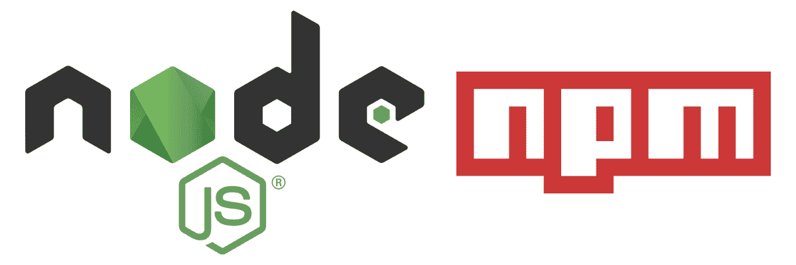
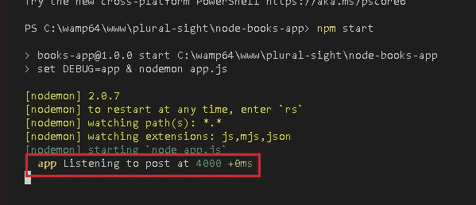

# 你必须知道的 NodeJs 库

> 原文：<https://medium.com/nerd-for-tech/nodejs-libraries-you-must-know-ff3fb2df56f6?source=collection_archive---------8----------------------->

日常使用中很有用的几个必须知道的 NodeJs 库。



我们知道**节点**。 **js** 是一个使用 JavaScript 构建快速可伸缩的服务器**应用**的平台。因此，当我们开始开发一个项目时，我们希望创建一个可扩展的免调试应用程序。

这里我们讨论一些在调试时有用的节点 Js 库。

> 注意:我们知道 console.log()在处理 javascript 应用程序时起着重要的作用，但有时我们会忘记删除 console.log()，这样我们就可以将应用程序上传到生产环境中。因此，在下面的讨论中，我们将使用 am 替代 console.log()。

## 1.调试

在调试库的帮助下，我们可以在调试模式下创建 Node Js 应用程序，其工作方式与 like 控制台相同。

```
$ npm install debug
```

在上述命令的帮助下，您可以安装 debug。

之后，为了使用 debug，您需要在 package.json 的脚本部分添加以下代码行。

```
“start”: “set DEBUG=app & nodemon app.js”
```

这里，我的根文件是 app.js，它是应用程序的起点，所以您需要在 app.js 中添加下面一行

```
const debug = require(‘debug’)(‘app’);
```

## 2.白垩

当你需要在控制台中打印一些输出时，这个库是有用的，但默认情况下，控制台中的输出颜色是相同的，所以为了区分输出，我们使用粉笔。

```
$ npm install chalkconst chalk = require(‘chalk’);
```

你需要把粉笔包含在你需要用到库的文件里。

```
app.listen(port, () => {debug(`Listening to post at ${chalk.green(port)}`);});
```

上面的例子使用了上面的库(debug 和 chalk)。



在控制台中，我们看到 app 前缀表示 app.js 文件正在运行，端口的最后颜色是绿色，这是粉笔造成的。有许多颜色你可以根据需要使用，比如绿色代表成功，红色代表错误。

## 3.摩根

Morgan: 是 Node.js 的另一个 HTTP 请求日志记录中间件，它简化了向应用程序记录请求的过程。

它节省了开发人员的时间，因为他们不必手动创建公共日志。它标准化并自动创建请求日志。

```
const morgan = require(‘morgan’);
```

用法:

```
app.use(morgan(‘tiny’));
```