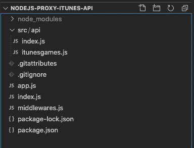

# iTunes 的 NodeJS 代理 api

> 原文：<https://medium.com/nerd-for-tech/nodejs-proxy-api-for-itunes-c15c2c09ed1c?source=collection_archive---------2----------------------->


对公共 API 的 NodeJS 代理 API 感兴趣吗？在本文中，我们将使用 [iTunes](http://rss.itunes.apple.com/en-us) API 来展示代理 API 的用例。

代理 API 是位于您的前端(客户端)和一个或多个后端服务(API)之间的中间应用程序进程。最佳做法始终是让客户端与代理 api 对话，代理 API 又调用公共 API，而不是在以下情况下从客户端调用公共 API:

## 用例

*   控制调用公共 API 的次数
*   缓存最小阈值的 API 响应
*   限制在给定时间内调用公共 API 的速率并降低其速度
*   仅转发有权访问服务的请求
*   记录每个请求都将被发送到一个公共 API 服务

## 示例项目

对于这个项目，我将使用 NodeJS Express 框架来创建代理 API，在这里，我将使用 iTunes API 作为我的公共 API 来获取 iTunes store 中的新游戏。我将在本文中解释几个与缓存、速率限制和减速相关的用例。

如果你想直接进入代码，可以看看下面这个关于 Github 的回购

## 步骤 1:创建项目文件夹

`mkdir nodejs-proxy-api-itunes && cd nodejs-proxy-api-itunes`

## 步骤 2:初始化节点项目

使用 init 命令初始化节点项目。在此之后，您将看到一系列问题，并选择默认选项。

`npm init`

## 步骤 3:安装所需的 npm 软件包

`npm install express body-parser dotenv helmet morgan cors axios`

请在此搜索[以获得每个包的详细解释。](https://www.npmjs.com/)

## 步骤 4:创建项目文件夹结构

此时，您可以创建下面提到的文件夹结构，以便更容易地参考本文。



## 步骤 5:了解应用程序流

**index.js** 是应用的入口点，与 **app.js** 一起负责创建 express app，对 app 实例进行配置，使 app 监听特定端口上的请求，并使用**middleware . js**为应用配置中间件

**Index.js**

**App.js**

**middle ware . js**

***src/api*** :该文件夹将包含不同 api 的代码

***src/api/index . js***:这是 API 的入口点，请求会从这个文件路由到不同的处理程序。

`router.use('/itunes', itunesGames)`

上面的代码基本上告诉路由器，如果请求 url 包含'/itunes '，则将请求重定向到 src/api/itunesgames.js 内的 api 处理程序

现在让我们来看一下***src/api/iTunes games . js .***在这种情况下，它负责进行公共 API 调用(iTunes API)以从 iTunes store 获取新游戏，并负责对重复请求进行缓存、速率限制和延迟 API 调用。

这就是你如何设置一个快速代理，它将调用 iTunes API 来获取数据，并让我们进入代码:)

在这里，我添加了两个 npm 包，分别叫做[快速限速](https://www.npmjs.com/package/express-rate-limit)和[快速减速](https://www.npmjs.com/package/express-slow-down)

`npm install express-rate-limit express-slow-down`

*   [express-rate-limit](https://www.npmjs.com/package/express-rate-limit) 是 express 的速率限制中间件，用于限制对公共 API 的重复请求。

```
const limiter **=** rateLimit({windowMs**:** 15 ***** 60 ***** 1000, *// 15 minutes*max**:** 100 *// limit each IP to 100 requests per windowMs*});
```

*   [express-slow-down](https://www.npmjs.com/package/express-slow-down) 是 express 的一个基本限速中间件，它减慢响应速度，而不是完全阻止响应。用于限制对公共 API 的重复请求。

```
const speedLimiter = slowDown({
  windowMs: 15 * 60 * 1000, // 15 minutes
  delayAfter: 100, // allow 100 requests per 15 minutes, then...
  delayMs: 500 // begin adding 500ms of delay per request above 100:
  // request # 101 is delayed by  500ms
  // request # 102 is delayed by 1000ms
  // request # 103 is delayed by 1500ms
  // etc.
});
```

## iTunes API

我们可以使用 iTunes API 来获取各种数据，如 iTunes 音乐、IOS 应用程序和各种提要，如“顶级免费应用程序”、“顶级付费应用程序”等等..

在这篇文章中，我将使用 iTunes RSS 提要生成器来获得这个例子的端点，你可以参考这里的链接

此外，如果你有兴趣看看苹果音乐 api，请参考下面的链接[这里](https://developer.apple.com/app-store-connect/api/)

这是从 iTunes feed generator 获取前 25 名 IOS 应用程序“我们喜爱的新游戏”的端点，我们将在示例中使用它

**API 端点 URL**:[https://RSS . itunes . apple . com/API/v1/us/IOs-apps/new-games-we-love/all/25/explicit . JSON](https://rss.itunes.apple.com/api/v1/us/ios-apps/new-games-we-love/all/25/explicit.json)

*   在上面的例子中，我使用内存来缓存在 60 秒内被重复调用的数据。这是缓存数据的基本方法，但是对于大中型项目，我们可以使用更好的机制来缓存数据。我将在另一篇文章中公布这个过程:)
*   在这个过程中，我向我的响应数据对象添加了 cacheTime 属性。这也是拥有代理 API 的好处之一，我们需要在其中添加、修改任何数据属性，以使我们的应用程序正常工作。
*   下一步，它使用 axios 调用 iTunes API，并在代理 API 上发回响应以及添加的数据属性，即缓存时间。

## 要寻找的东西:

希望您喜欢这篇关于设置 nodejs 代理 API、缓存数据、速率限制、降低重复请求的响应速度以及向响应对象添加新数据属性以支持应用程序需求的过程的文章。

请关注我未来几周的更多文章:

*   向 API 调用添加授权
*   使用无服务器将此 NodeJS 代理 API 部署到 AWS lambda
*   验证代理 API 的自动化测试
*   使用 GITHUB 操作的无服务器配置项
*   这个代理 iTunes API 的 VueJs 客户端。