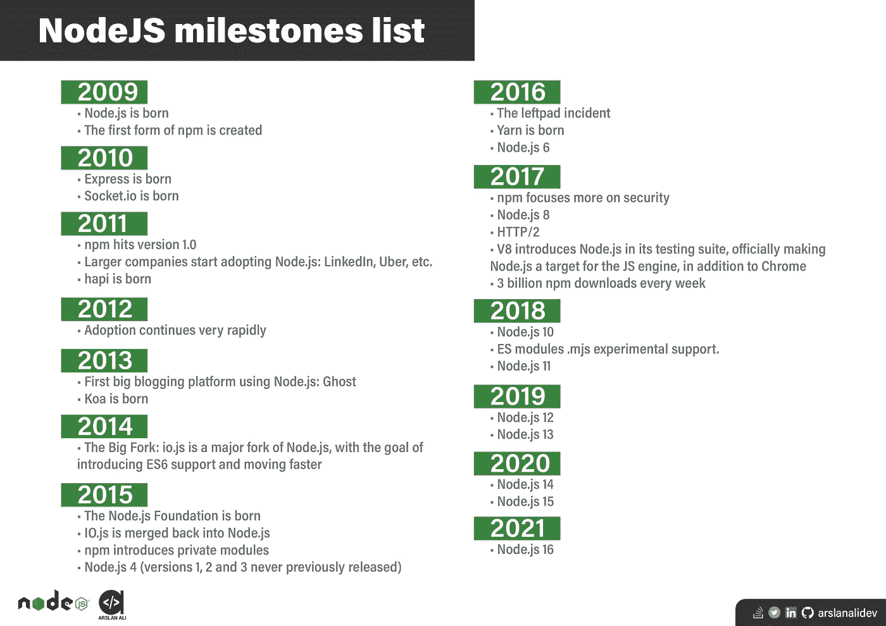

# NodeJS 简短的历史和里程碑

> 原文：<https://medium.com/nerd-for-tech/nodejs-short-history-and-milestones-b1708a0c6488?source=collection_archive---------29----------------------->

信不信由你，节点。JS 刚刚 12 岁！如果和别人比，JavaScript 26 岁，互联网才 32 岁。很久以前，网络不是交互式行为，它只是通过计算机网络协议在网络上显示文本文件。随着时间的推移，网络随着协议的 DNA HTTP 而扩展，并使用 HTML，在个人电脑和网络浏览器出现后，中产阶级更容易访问它。

1995 年,网景公司推出了一款脚本工具——网景导航器，用于在浏览器中操作网页。Netscape 的商业模型部分也包括在内，以销售 webserver，其中包括一个名为 LiveWire 的环境，它可以在服务器端使用 JavaScript 呈现动态网页。但不幸的是，LiveWire 并不太成功。

在 2009 年的**中，谷歌的一名软件工程师 Ryan Dahl 编写了 Node.JS。在第一个版本中，它只在 macOS 和 Linux 上受支持，但最终，它也支持其他操作系统。达尔领导了 Node 的开发和维护。JS，后来是 Joyent 赞助的。**

NodeJS 成功的一些关键因素如下。

- **时机**:几年前，JavaScript 开始被认为是严肃的语言，这要特别感谢像脸书、Youtube、Flickr 等 web 2.0 应用程序。)，以网站惊人的 UI 体验向世界介绍。
- **更好的浏览器支持**:0 随着时间的推移，JavaScript 引擎也变得越来越好，公司幕后的大型社区为最佳用户体验提供了更好的浏览器支持。

arslanalidev 的节点里程碑列表

对于更具互动性的演示，你可以在这里看到里程碑。