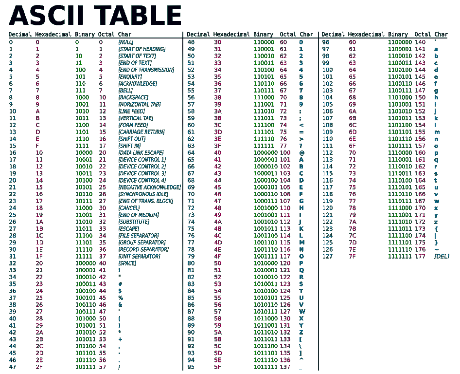
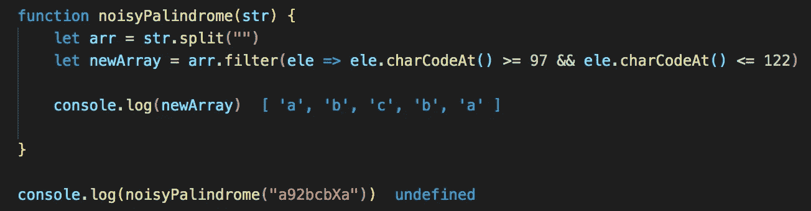
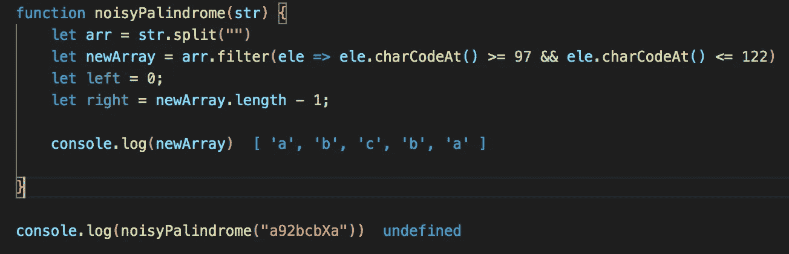
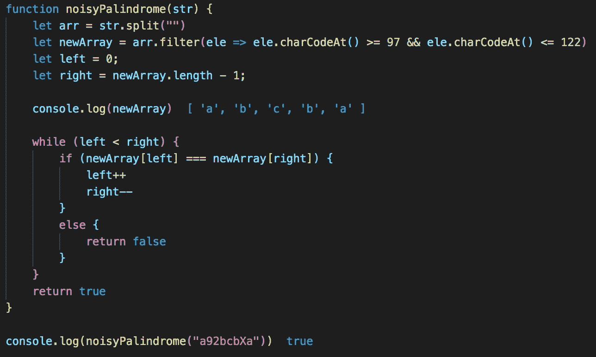

# 嘈杂的回文:使用 ASCII 过滤

> 原文：<https://medium.com/nerd-for-tech/noisy-palindrome-filtering-using-ascii-8b0535f3e550?source=collection_archive---------16----------------------->

## 因为普通的旧回文是不够的。如何在 JavaScript 中使用 ASCII 解决嘈杂的回文算法问题的演练

"一个常规的回文太简单了，对吗？"——说从来没有人。

嗯，那可能是个谎言，但你明白我的意思。如果你像我一样&在各种网站上花时间解决不同的编码练习，你很可能遇到过经典的回文问题，它问你一个字符串是否是回文。

如果你没有，不用担心！我稍后将介绍的问题只是给这个经典问题增加了一点复杂性，解决方案仍然包括我们如何在改变输入后检查一个字符串是否是回文。

提醒一下，回文是一个单词、短语、诗句或句子，前后读起来都一样。回文的例子有“夫人”和“赛车”。无论你从左到右还是从右到左，这两个单词读起来都是一样的。

那么什么是嘈杂回文呢？很高兴你问了——让我们开始吧！

# 问题是

问题陈述如下:

给你一个字符串 s，包含小写和大写字母字符以及从“0”到“9”的数字。如果我们只考虑小写字母字符，返回 s 是否是回文。

好的——那里发生了很多事情。因此，我们不仅要在输入字符串中使用字母字符，还要使用数字来混淆视听。更糟糕的是，我们还必须担心大写字母字符！嘘。

那么什么是嘈杂的回文呢？让我们看几个例子:

1.  " a92bcbXa "
2.  " 4567abcDO "

我们的第一个例子是一个回文。如果我们只看小写字母字符&去掉其他的，我们的字符串看起来会像“abcba”。向前和向后读是一样的，所以这是一个回文。

我们的第二个例子不是回文。同样，如果我们只看小写字母字符&去掉其他的，我们的字符串看起来会像“abc”。因为我们的字符串前后读起来不一样，所以它不是一个回文。

太好了！我们理解这个问题，那么我们该如何解决呢？

# 方法

和任何问题一样，我们可以采取很多不同的方法来解决这个问题。我们可以按原样处理输入字符串&提出一个条件来检查当前迭代是否是小写字符。那绝对是一个可行的解决方案。

但是，如果我们预先做好所有的工作，并尽可能保持迭代的简单性，会怎么样呢？如果我们能够以某种方式“清理”我们的输入字符串，只包含小写字母字符，我们就可以省去检查每次迭代的麻烦，因为我们的输入已经是我们所期望的了。

我们该怎么做？一种方法是使用所谓的 ASCII 表。

根据 ASCII 码的定义， **ASCII** 代表美国信息交换标准码。这是一个 7 位字符代码，每一位代表一个独特的字符。

下表显示了前 127 个数字字符的 ASCII 码。

更完整的 ASCII 表，请访问 https://www.ascii-code.com/

*如果我们更仔细地观察 ASCII 表，我们会发现所有的小写字符都方便地从 97 到 122 分组在一起。我们可以利用这一点，通过使用内置方法 charCodeAt()，设置一个条件来过滤我们的字符串，使其只包含 97 到 122 之间的 ASCII 代码。*

*我们的伪代码看起来像这样:*

1.  *把我们的字符串变成一个数组->把它设置成一个名为 arr 的变量*
2.  *过滤我们的数组，只包含小写字母字符。我们将使用过滤器、charCodeAt 和 ASCII 的组合来完成这项工作*
3.  *初始化两个指针，一个指向第零个索引并设置为 0，而第二个指向最后一个索引。我们将这分别称为左和右。*

> **记住，我们正在检查我们是否正在处理一个回文，所以我们需要从头开始&结束并向内工作。**

*4.遍历我们新过滤的数组，检查指针的值是否匹配。如果是这样，将两个指针移向中间。否则，返回 false*

*5.在函数结束时返回 true。如果我们的函数到达了末尾，我们可以得出结论，我们新过滤的数组是一个回文，因为我们完成了循环*

# *解决方案*

*我们已经打好了基础——让我们写一些代码。*

*看看我们的伪代码，我们的前几个步骤是将输入字符串转换成一个数组，然后过滤我们的数组，只包含小写字母字符。让我们现在就开始吧:*

**

*使用我们的第一个测试用例，我们可以看到，通过在我们新创建的数组上调用 filter 方法，我们可以通过元素上调用 charCodeAt()的 ASCII 代码来过滤元素。如果他们的 ASCII 码在 97 和 122 之间(这意味着他们是小写字母字符)，我们将他们保存在我们的新数组中。否则，它们将被删除。*

*接下来，我们需要初始化我们的指针，将它们设置在数组的开头和结尾。*

**

*我们现在需要以某种方式循环遍历数组&让我们的指针向数组的中间移动，同时检查每个值。在这种情况下，while 循环非常适合我们的需要，条件是它将一直循环，直到我们的左指针和右指针相遇。*

*如果我们的值匹配，我们将继续循环。如果没有，我们可以立即说没有回文&跳出循环，返回一个假布尔值。*

*我们的最终解决方案如下所示:*

**

*我们的最终解决方案！*

# *结论*

*现在你知道了！一开始是一个相当复杂的问题，结果却是相当容易解决的。通过立即处理我们的输入字符串&过滤掉我们不想要的值，我们可以避免在每次迭代中做所有的逻辑工作&保持我们的逻辑检查简单明了。*

*作为一名软件开发人员，理解 ASCII 是如何工作的是您旅途中的一个强有力的工具。在未来的编码练习和/或技术面试中记住它——你永远不知道它什么时候会变得有用。*

*下次见！*

# *来源*

*ASCII 码:ASCII 码—扩展的 ASCII 表
[https://www.ascii-code.com/](https://www.ascii-code.com/)*