# 非线性模型:高阶特征向量和核函数。

> 原文：<https://medium.com/nerd-for-tech/non-linear-models-high-order-feature-vectors-and-kernel-functions-6a8aa4e39e98?source=collection_archive---------16----------------------->

对于本文，我假设您知道感知器算法的基础。

线性模型通常可以很好地实现数据建模的目的，但有时这还不够。更具体地说，我将用一个例子来介绍这个主题:

假设我们正在处理一个简单的特征向量，它位于实直线上。换句话说:

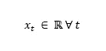

为了简单起见，让我们考虑如下描述的 3 个数据点:

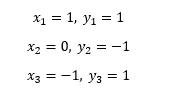

如果你试图在这些特征向量中实现一个线性分类器，你会失败，因为没有线性分类器能把这个分开。

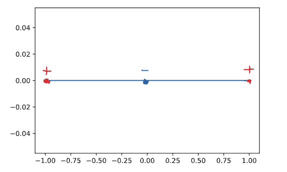

为了解决这个问题，高阶特征向量开始发挥作用。这个想法简单而优雅:如果我们建立一个函数，允许我们扩展高维空间和这个空间中的特征信息，我们使用我们已经知道的线性模型？

我这么说是什么意思？让我们更精确地说:

选一个我之前举过的例子，让我们定义一个函数，它可以在高维空间中转换这个特征向量:

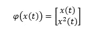

现在，让我们看看能否在变换后的空间中分离这些特征向量:

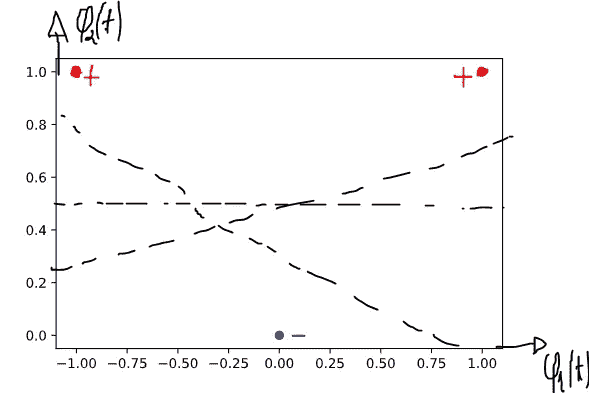

现在我们可以画出一组可能的决策边界(虚线)来分隔这些例子。我第一次看到它的时候，真是太棒了！

这太棒了，但是如果我们的特征向量存在于一个更复杂的空间呢？我有好消息也有坏消息:好消息是同样的过程可以用于更复杂的特征向量，除此之外，我们可以使用其他非 x (t)的变换。坏消息是这个过程会导致我们进行非常长的计算。让我举个例子:假设

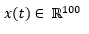

到这样的程度

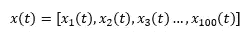

现在，如果我们用一个 2 次多项式构造一个变换的特征向量，我们有:

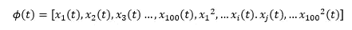

你可以看到，只使用一个 2 次多项式，我们得到了比以前更多的功能。在这种情况下，我们有 5150。更具体地说，当我们有“n”项并且我们得到“p”阶多项式时，我们的变换特征向量将具有的总项数可以计算如下:

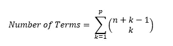

为了便于练习，让我们将多项式的次数改为 3，看看项数会发生什么变化:

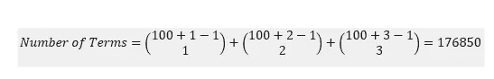

哇！它迅速扩展。看到这里，我就想:瓶颈来了。我们能做得更好吗？答案是肯定的！

到目前为止，这篇文章激发了接下来的内容:内核函数。

什么是内核函数？

核函数是使用两个向量之间的点积将“n”维向量映射到“m”维向量的函数。

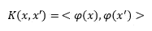

核函数的精髓如下:我们选择一个性能良好的核函数(简单且易于计算点积),并且我们不明确定义我们使用什么特征变换，而是根据核来定义。

好吧…但是为什么有用呢？答案是:我们可以模拟一个无限次多项式(并将这种复杂程度添加到模型中)，而不需要计算我们在不使用核函数的情况下看到的所有项。什么？？？是的。你没听错。让我们看看最初的感知器是如何工作的，以及我们如何修改最初的算法来处理内核。

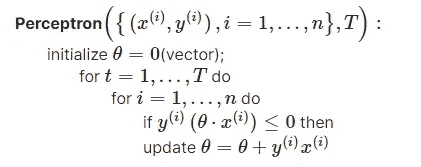

为了修改这个算法，我们将使用

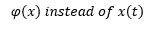

得到这个表格:

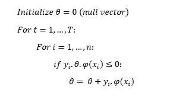

好的……如果我们考虑一下，我们会意识到最终的θ是这样的:

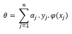

其中α是“j”数据点所犯错误的数量。如果我们将两边乘以应用于 x_i 的特征变换，我们得到:

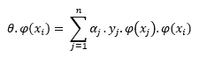

现在魔法开始了:这个等式和…

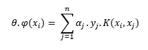

好的内核…现在你引起了我的注意！

所以…如果我们再次修改算法，使其适用于α而不是θ，我们会得到:

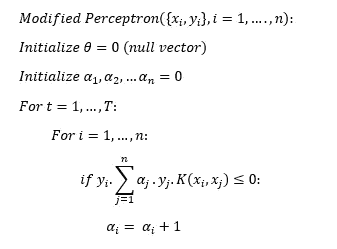

请注意，alphas 的更新与 thetas 的更新是一样的。(试证明一下。)提示:展开这个等式。

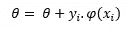

好了……现在我们有了一个基于 alphas 和核函数的算法，可以处理感知器算法，但是我们仍然需要选择一些方便的核函数来处理。让我们看一个展示内核威力的例子:

让我们把这个核定义为径向基核。

如果你还记得傅立叶，你可能还记得指数函数可以用无穷次多项式来描述，通过调用这个核，我们隐式地向表中添加了一个任意强大的模型，最好的部分是:我们甚至没有定义我们使用什么变换函数，这一点都不重要，我们需要的只是这个行为良好的核。厉害！！

概括地说，使用这种方法，我们通过巧妙使用核函数，在变换空间上间接使用线性方法，解决了原始空间中的非线性问题(获得非线性决策边界)。

一些警告:

1.  我们有一些规则来构造新的内核函数:

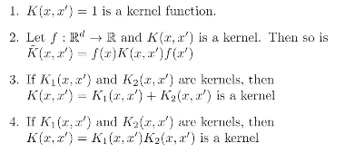

来源:麻省理工学院-机器学习课程

2.还有其他几个内核函数可以使用。

希望你和我一样喜欢这个主题=)