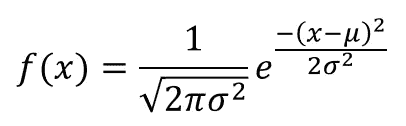
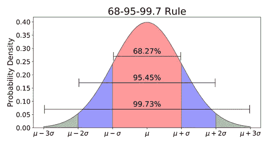
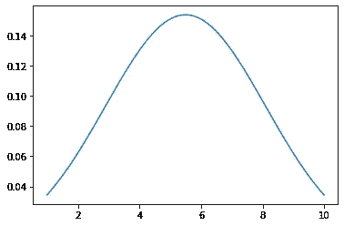

# 正态分布

> 原文：<https://medium.com/nerd-for-tech/normal-distribution-a86790e86406?source=collection_archive---------5----------------------->

一条**正态分布**也被称为**高斯分布**或**钟形曲线。**它是统计和概率领域中最常用的分布之一。

它有一些基本性质:-
1。它是一个连续的概率分布。
2。正态分布可以有任何均值和标准差，但是均值和标准差单位为 0 的正态分布称为**标准正态分布**。
3。平均值、众数和中位数是相同的。
4。曲线下的总面积值为 1。
5。曲线围绕中心对称，这就是为什么它也被称为**钟形曲线**。
6。大约 **68.2%** 的数据出现在平均值的 **1 标准差**内。7。在**附近，95%** 的数据落在平均值的两个标准偏差内。8。在**附近，99.7%** 的数据落在平均值的三个标准偏差内。9。增大平均值会使曲线向右移动，而减小平均值会使曲线向左移动。10。小的标准差导致窄的曲线，而大的标准差导致更宽的曲线。

> 正态分布有 2 个基本参数用于计算**概率密度函数** (pdf)。它的公式是:-



正态分布的 pdf

正态分布曲线如下



正态分布曲线

正态分布基本上适用于**中心极限定理**。它说如果我们从替换总体中抽取大样本，那么样本的分布将遵循**正态分布曲线**。

> 按照惯例，计数 30 或更多的样本量被认为是大的。

要将正态分布转换为标准正态分布，必须将数据点标准化，使其平均值变为 0，标准差变为 1。它的公式是:-


标准化(Z 值)

让我们看看如何使用 Python 库计算正态分布。我们将涉及一些场景，如计算特定数据出现的概率或给定范围内值的百分比。

## 导入库

```
from scipy.stats import norm
import numpy as np
import matplotlib.pyplot as plt
import seaborn as sns
```

**绘制正态分布曲线**

```
## plotting a normal standard distribution curvex = np.arange(1,10, 0.01)
mean = np.mean(x)
sd = np.std(x)pdf = norm.pdf(x, loc = mean, scale = sd)
sns.lineplot(x=x, y=pdf)
plt.show()
```

在上面的代码中，我们列出了 1 到 10 之间的数据，步长为 0.01。之后，我们计算列表的平均值和标准偏差，并将其作为参数与数据一起传递给**norm.pdf**函数，以获得数据的**概率密度函数**。这里的**刻度**指的是标准偏差 **loc** 指的是数据的平均值。



正态分布曲线

现在让我们看看如何通过 python 代码获得特定数据点的概率。

考虑这种情况，您想知道 SAT 分数低于 1250 的概率，并且您知道分数是正态分布的，分数的样本均值是 1120，标准差是 140。

```
from scipy.stats import normmean = 1120
sd = 140prob = norm(loc = mean, scale = sd).cdf(1250)
print(round(prob * 100,2))
```

你的 SAT 分数低于 1250 分的概率是 82.34%。
从技术上讲，我们正在计算曲线下的面积，直到 1250 年。它只是极限等于-∞到 1250 的密度函数的积分。

再考虑一个场景，你想知道 SAT 成绩在 1100 到 1250 之间的概率。

```
from scipy.stats import normmean = 1120
sd = 140upper_prob = norm(loc = mean, scale = sd).cdf(1250)
lower_prob = norm(loc = mean, scale = sd).cdf(1100)prob = upper_prob - lower_prob
print(round(prob * 100,2))
```

分数在 1100 到 1250 之间的概率是 **38.02%** 。

再考虑一个场景，您希望找到给定分布中数据的百分比。考虑到上面提到的同样的数据，我们来计算一下给定分布的 **82.34** 百分位。有两种方法可以做到这一点。

```
## method 1val1 = norm.ppf(q = .8234, loc = mean, scale = sd) print(round(val1,1))## method 2val2 = ( norm.ppf(.8234) * sd ) + mean
print(round(val2,1))
```

在方法 1 中，定义一个标准的 **ppf** 函数，并将所有细节作为百分位数、平均值和标准偏差传递，这将直接给出数据的值，即 1250.0
第二种方法是制作一个百分位数的 **ppf** 函数，将其乘以标准偏差，然后将其添加到分布的平均值，这将给出相同的结果，即 1250.0

> norm.ppf(.9)

该函数给出第 90 百分位的 z 值**和**。

如果你喜欢并欣赏这本书，👏👏鼓掌，分享。

你可以在这里找到代码[](https://github.com/pranavgarg1506/statistics/blob/main/Normal_Distribution.ipynb) **你可以在 [**Linkedin**](https://www.linkedin.com/in/pranavgarg1506/) 上联系我**