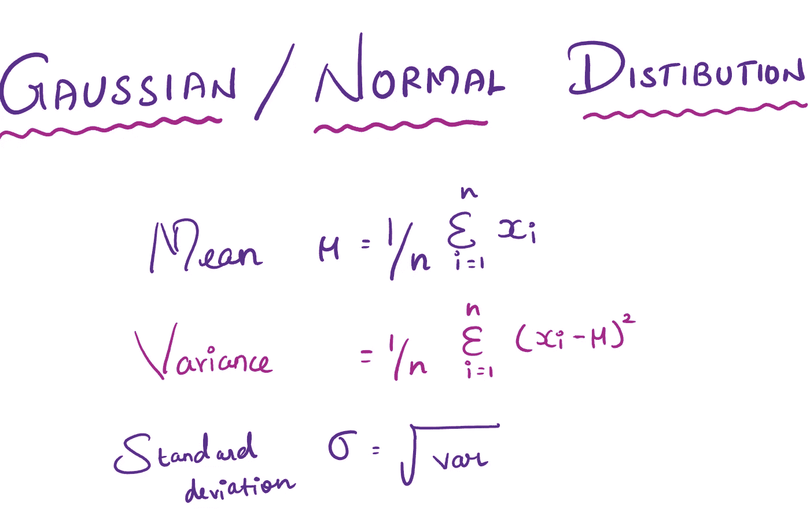
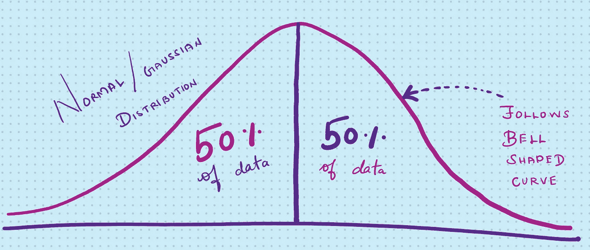
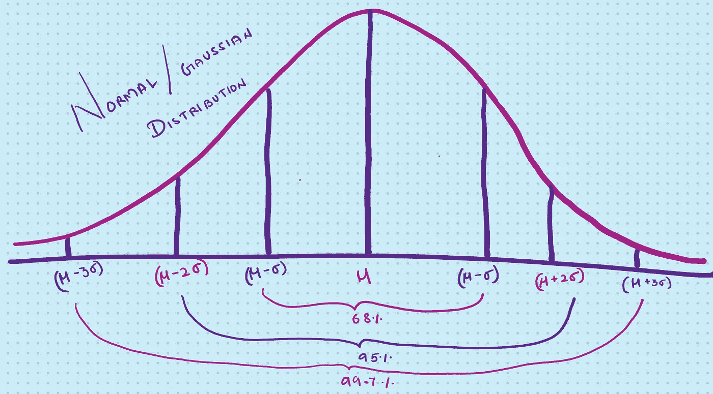
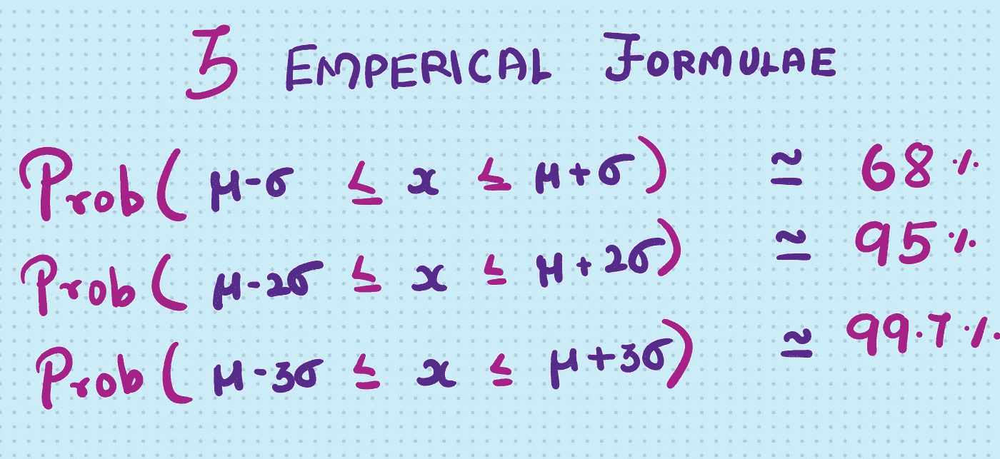

# 正态或高斯分布

> 原文：<https://medium.com/nerd-for-tech/normal-or-gaussian-distribution-c25d500818ad?source=collection_archive---------25----------------------->

正态分布又称高斯分布，是卡尔·弗里德里希·高斯**发现的。**

它是统计学中最重要的概率分布，因为它符合许多自然现象，如遵循**正态分布的身高、血压、测量误差和智商分数。**

这是一种关于平均值对称的概率分布

均值=中位数=众数

围绕中心对称

形成钟形曲线，在曲线下=1

考虑一个属于正态/高斯分布的变量 x，其均值、方差和标准分布如下:

那么它的值必须围绕中心对称。这意味着 50%的值必须在中心的左边，剩下的 50%在右边。

就均值和标准差而言，正态分布可以表示为

遵循正态分布的变量必须满足以下三个公式:

以上就是关于正态/高斯分布的全部内容。希望这个博客有用。