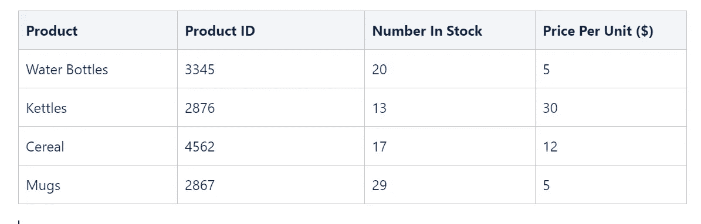
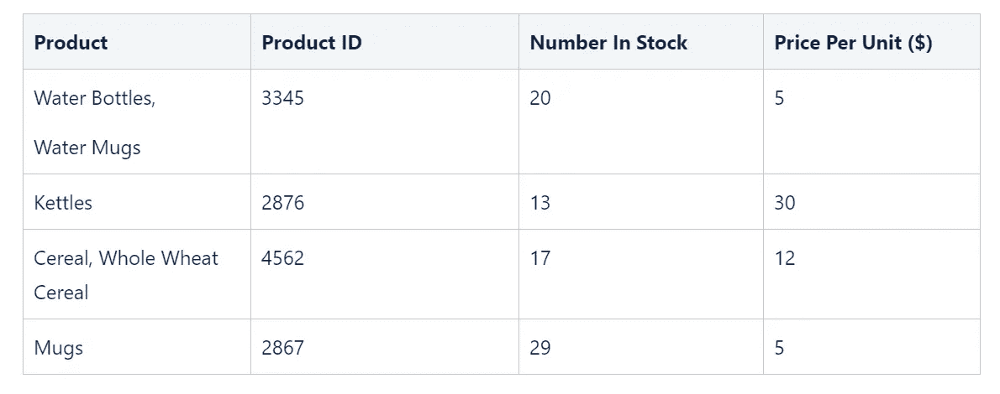
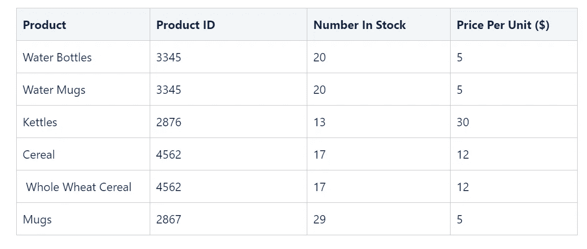
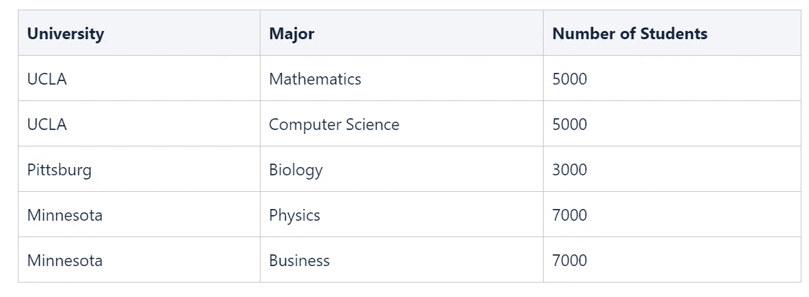
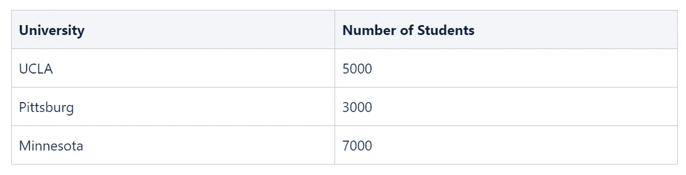
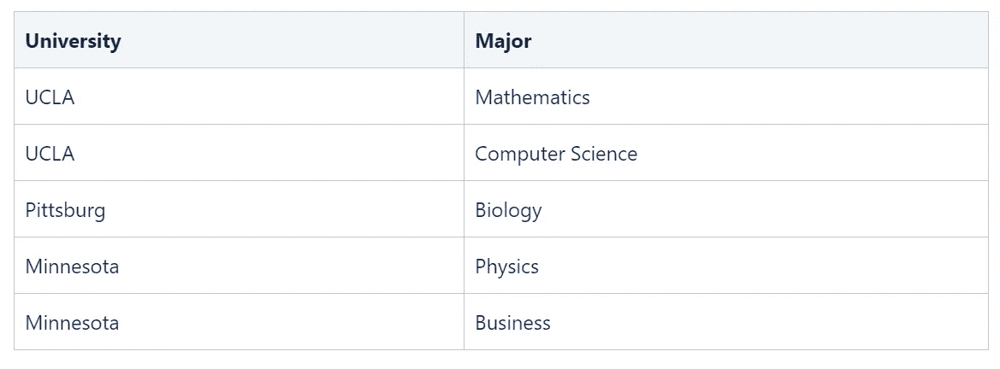

# 数据库规范化

> 原文：<https://medium.com/nerd-for-tech/normalization-in-databases-3d786216f189?source=collection_archive---------25----------------------->

数据库设计的目标之一是试图消除关系模型中的冗余。这种冗余可能无法完全消除，但适当的设计可以减少冗余的情况。

在一些更常见的查询操作中，如更新、插入和删除，可能会引入冗余。请注意，上述查询会导致新数据被引入数据库，或者先前在数据库中的数据被删除。数据规范化方法有:第一范式、第二范式、第三范式、Boyce Codd 范式、第四范式、第五范式

**第一范式—** 如果关系包含原子值，则它被认为是第一范式。原子值意味着表的特定属性不能包含一个以上的值

上表代表第一个范式符合性设计，其中每个属性只能有一个值。

作为将表转换成第一范式的一种方法，我们可以将共享属性分解成它们自己的行。这个过程叫做分解。我将提供一个简单的分解的例子，但是这是一个扩展的主题，我希望在以后的日子里讨论。

让我们以下表为例:

请注意，在上表中，关键属性是产品 Id，我们的一些产品具有相同的产品 ID。分解上表将导致每个产品都有自己的指定行。

**第二范式—** 第二范式试图解决删除特征中存在的重复的概念。对于处于第二范式的表，它必须符合第一范式规则。所有多集数据行都被分离出来，放在一个单独的表中，并使用外键来建立两个表之间的关系。

执行上述过程确保了表中的部分/功能依赖关系被移除。

让我们看一个例子:

从上面的描述我们可以看出，上面的描述不满足第二范式参数。为了获得第二范式，我们将上面的表分解成两个表。

“学生数量”列表示大学的学生数量，正如您所知，该属性依赖于大学。

我们的分解将如下处理这种依赖性:

**第三范式—** 第三范式是第二范式的升级，它进一步满足了第二范式的所有要求，并删除了所有依赖于主键的列。在这种情况下，我们的目标是移除表中的传递依赖性。

当非主键属性依赖于其他非主键属性时，会出现传递依赖关系。

移除传递依赖关系有助于我们确保抑制高水平的数据重复。

开始时，规范化的主题可能有点复杂，但是在研究规范化之前，熟悉数据库关系的基础知识将会非常有帮助。