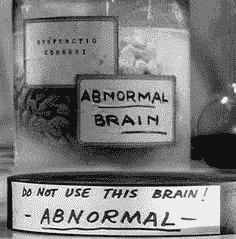
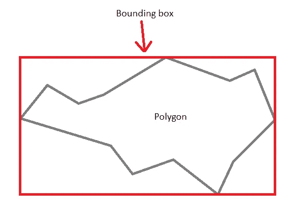

# 使用三次贝塞尔转换规范化绝对 SVG 路径

> 原文：<https://medium.com/nerd-for-tech/normalizing-absolute-svg-paths-with-cubic-b%C3%A9zier-conversions-ed3920d65423?source=collection_archive---------3----------------------->



图片来源:20 世纪福克斯

这篇博客文章是[中的第 3 部分，它很快成为关于我最喜欢的主题之一的系列](/geekculture/june-17-calculating-svg-bézier-curve-intersections-without-snap-adff3fc6aae7):**矢量图形——一种可耻的未被充分利用的方式，用相对较少的努力将你的应用从“meh”变成“wow”。**矢量轻便、快速且用途广泛，由于本系列文章的主题`**<path>**` **s(直线和曲线的序列),对它们进行操作/制作动画很容易。**

在今天的节目中，我将重温一个月前[的一段代码](https://javascript.plainenglish.io/june-3-parsing-and-validating-svg-paths-with-regex-7bd0e245115)，我称之为`PathParser`。在那篇文章中，我解释了路径是用标准语法中的字符串定义的；我编写了一个类，将这些语法字符串解析成坐标数组，大家都玩得很开心。我们今天将添加代码，所以如果你想回顾它或者跟随你自己进入一个新的分支，那么[派生并克隆库](https://github.com/josh-frank/path-normalizer)。

> 如果今天的博客帖子比平时更不连贯或更有错别字，我归咎于一种可怕的鼻窦感染，目前正在用工业级苯海拉明、异丙嗪和 [Chum-churum](https://drizly.com/liquor/soju/chum-churum-original-soju/p22242) 治疗。不过谢天谢地，至少不是 COVID！谢谢，莫德娜！

# 背景:新常态

在我之前关于 SVG 路径的讨论中，我解释过`<path>`标签可以替换所有其他的形状标签，并且在`<path>`标签中，贝塞尔`C`和`c`命令可以替换所有其他的命令，除了最初的`M` / `m`。以下两个形状具有相同的点，并且看起来相同:

```
const sameShape = [
  "M 25 25 L 75 25 L 75 75 L 25 75 Z",
  "M 25 25 C 25 25 75 25 75 25 C 75 25 75 75 75 75 C 75 75 25 75 25 75 Z"
];PathParser.parse( sameShape[ 0 ] )
  -> [ [ 25, 25 ], [ 75, 25 ], [ 75, 75 ], [ 25, 75 ], [] ]
PathParser.parse( sameShape[ 1 ] )
  -> [ [ 25, 25 ], [ 75, 25 ], [ 75, 75 ], [ 25, 75 ], [] ]
```

**在一个** **规格化的 SVG 路径中，所有命令，除了第一个** `**m**` **/** `**M**` **命令外，都被转换成等价的**`**C**`/**/**`**c**`**命令。路径规范化是常见的和常规的，因为它使各种路径操作变得容易得多。这是因为，当路径被规范化时，每个命令的凹度(曲线延伸超出其点多远)可以被计算，而无需针对不同的命令类型进行分支。**

# 减少，重复使用…

让我们调用我们的`class NormalizedPath()`，并用一个`constructor`和一个在初始化时被调用的方法`parse()`填充它:

```
class NormalizedPath { constructor( descriptor ) {
    this.parse( descriptor );
  } parse( descriptor ) {
    ...
  }}
```

不同的命令被不同地规范化，就像不同的命令在`PathParser`中被不同地解析一样。我们在`PathParser`中使用了**语法**来执行正确的操作以解析路径；这一次，我们将使用`reduce()`和一个大的`switch() { case: }`来处理所有的事情，而不是使用`normalizerGrammar`来做正确的数学运算来正常化一个命令。(后面多讲一点为什么。)

如果你仔细观察上面的`sameShape`，你会清楚地看到**路径的规范化版本中的每个点都依赖于它前面的点。对于我们需要使用的方法，这应该是一个巨大的线索！每次我们分析一个命令时，我们都需要跟踪它，这样我们就知道它的`previous`命令用于下一个`command`命令:**

```
parse( descriptor ) {
  let previous = [ 0, 0 ];
  this.parsedCommands = PathParser.parseRaw( descriptor ).reduce( ( result, command, index ) => {
    switch( command[ 0 ].toLowerCase() ) {
      ...
    }
  }, [] );
}
```

`**reduce()**` **是我最喜欢的 JavaScript 王牌**之一——这就是为什么它是如此的罪恶，以至于在编程教程或编码训练营中很少被强调。当在数组上调用时，它需要两个参数，一个回调和一个对象/数组，就像这样:`reduce( ( result, element ) => {}, [] )`。它执行回调中指定的逻辑，回调将参数 a `result`和被迭代的特定元素(在本例中，是单个的`command`)作为参数。然后，它收集该逻辑的结果，将其粘贴到在`reduce`的第二个参数中指定的结果对象/数组中，并返回它。

看看下面的代码，自己看看那个大 ol' `switch() { case: }`。请注意，为了我现在的理智，由于我的鼻窦爆炸，**这个类现在只解析绝对路径:**

```
parse( descriptor ) {
  let quadX, quadY, bezierX, bezierY, previousCommand = "", previousPoint = [ 0, 0 ];
  const isRelative = command => command[ 0 ] === command[ 0 ].toLowerCase(); const updatePrevious = command => {
    previousCommand = command[ 0 ];
    if ( command[ 0 ].toLowerCase () === "h" ) previousPoint[ 0 ] = isRelative( command ) ? previousPoint[ 0 ] + command[ 1 ] : command[ 1 ];
    else if ( command[ 0 ].toLowerCase () === "v" ) previousPoint[ 1 ] = isRelative( command ) ? previousPoint[ 1 ] + command[ 1 ] : command[ 1 ];
    else {
      previousPoint = isRelative( command ) ? [ previousPoint[ 0 ] + command[ command.length - 2 ], previousPoint[ 1 ] + command[ command.length - 1 ] ] : command.slice( command.length - 2 );
    }
  }; this.parsedCommands = PathParser.parseRaw( descriptor ).reduce( ( result, command, index ) => {
    let normalizedCommand;
    switch ( command[ 0 ] ) {
      case "M":
        if ( !index ) normalizedCommand = command;
        else normalizedCommand = [ "C", ...previousPoint, ...command.slice( 1 ), ...command.slice( 1 ) ];
        break;
      case "H":
        normalizedCommand = [ "C", ...previousPoint, command[ 1 ], previousPoint[ 1 ], command[ 1 ], previousPoint[ 1 ] ];
        break;
      case "V":
        normalizedCommand = [ "C", ...previousPoint, 0, command[ 1 ], 0, command[ 1 ] ];
        break;
      case "L":
        normalizedCommand = [ "C", ...previousPoint, ...command.slice( 1 ), ...command.slice( 1 ) ];
        break;
      case "S":
        let [ cx, cy ] = previousPoint;
        if ( [ "c", "s" ].includes( previousCommand.toLowerCase() ) ) {
          cx += cx - bezierX;
          cy += cy - bezierY;
        }
        normalizedCommand = [ "C", cx, cy, command[ 1 ], command[ 2 ], command[ 3 ], command[ 4 ] ];
        break;
      case "Q":
        quadX = command[ 1 ];
        quadY = command[ 2 ];
        normalizedCommand = [ "C",
          previousPoint[ 0 ] / 3 + ( 2 / 3 ) * command[ 1 ],
          previousPoint[ 1 ] / 3 + ( 2 / 3 ) * command[ 2 ],
          command[ 3 ] / 3 + ( 2 / 3 ) * command[ 1 ],
          command[ 4 ] / 3 + ( 2 / 3 ) * command[ 2 ],
          command[ 3 ],
          command[ 4 ]
        ];
        break;
      case "T":
        if ( [ "q", "t" ].includes( command[ 0 ].toLowerCase() ) ) {
          quadX = previousPoint[ 0 ] * 2 - quadX;
          quadY = previousPoint[ 1 ] * 2 - quadY;
        } else {
          quadX = previousPoint[ 0 ];
          quadY = previousPoint[ 1 ];
        }
        normalizedCommand = [ "C",
          previousPoint[ 0 ] / 3 + ( 2 / 3 ) * quadX,
          previousPoint[ 1 ] / 3 + ( 2 / 3 ) * quadY,
          command[ 1 ] / 3 + ( 2 / 3 ) * quadX,
          command[ 2 ] / 3 + ( 2 / 3 ) * quadY,
          command[ 1 ],
          command[ 2 ]
        ];
        break;
      case "A":
        normalizedCommand = [ "C", ...arcToCubicBeziers( previousPoint, command.slice( 1 ) ) ];
        break;
      case "C":
        normalizedCommand = command;
        break;
      case "Z":
        normalizedCommand = [ "Z" ];
        break;
      default: break;
    } [ bezierX, bezierY ] = command.length > 4 ? [ command[ command.length - 4 ], command[ command.length - 3 ] ] : [ previousPoint[ 0 ], previousPoint[ 1 ] ];
    updatePrevious( command );
    return [ ...result, normalizedCommand ];
  }, [] );}
```

分解这个怪物的几个要点，不分先后:

*   你可以马上看到我们开始定义一大堆计数器:`quadX`、`quadY`、`bezierX`、`bezierY`、`previousCommand`字母和`previousPoint`。这是为了跟踪我们在哪个点上，以及它的曲线控制点(如果/如果适用的话)。
*   `parse()`在其闭包中包含两个实用函数——主要是为了避免重复代码。在顶部附近，我们定义了一个快速函数`isRelative`，它告诉我们一个命令是相对的还是绝对的——这对正确更新`previousPoint`很重要。在`reduce`内部，在定义一个盒子来存放我们的`previousPoint`之后，我们还定义了一个与`parse()`到`updatePrevious()`作用域相同的函数，这取决于命令是绝对的还是相对的。
*   在我们的`reduce`中的`switch()`内，我们编写了将移动或直线命令解析成曲线的逻辑，这取决于`previousPoint`是什么。记得我在上面提到过，在规范化路径中，除了第一个移动命令之外的所有命令*都已经被解析了——这就是为什么我们不处理`M`命令`if ( !index )`——也就是说，如果我们在第一个命令上。*
*   像`Q`、`T`、`S`和`A`这样的曲线是特例——我们需要更多的信息来解析这些曲线，而不仅仅是`previousPoint`坐标。这就是为什么有这些`quadX` / `quadY`和`bezierX` / `bezierY`计数器，这也是为什么我决定使用反语法——语法的全部目的是简化事情，但是为每个命令将这些参数传递给我们的语法有点麻烦。
*   最后，我们用迄今为止的`...result`和新近的`normalizedCommand`来`updatePrevious`和`return`一个数组。

# 盟约之弧

如果你仔细看了上面的代码，你需要精神病学的帮助(或者在 NSA 的工作)…你可能注意到`A`命令的`case`短得可疑:

```
case "A":
  normalizedCommand = [ "C", **...arcToCubicBeziers( previousPoint, command.slice( 1 ) )** ];
        break;
```

事实是， [**没有简单的方法将圆弧转换成三次贝塞尔曲线**](https://stackoverflow.com/a/30279817/14834132) **。从数学上讲，不可能创建一个看起来与弧线完全相同的贝塞尔曲线，解释原因超出了本文的范围或我的能力范围(即使没有苯那君)。**

然而，*有可能用多条贝塞尔曲线复制一个圆弧。这正是像 [Snap](http://snapsvg.io/) 和 [Paper](http://paperjs.org/) 这样的库所做的……但是像那样导入一个完整的库仅仅是为了改变曲线，用 *Monty Python、* [的话说就是愚蠢，非常愚蠢](https://www.youtube.com/watch?v=B7jLmZhhWRQ)。所以，我使用的代码是我从科林·梅克的工作中改编/精简的；我之前在这个博客上讨论的另一个项目 [中使用过它。这种方法计算一个弧的中心，然后用一些非常不愉快的数学方法将它分割成向量。](https://javascript.plainenglish.io/july-7-triggering-file-uploads-downloads-without-a-back-end-in-react-6438cb77859?source=your_stories_page-------------------------------------)[在仓库里自己检查](https://github.com/josh-frank/path-normalizer/blob/master/arcToCubicBeziers.js)；留下评论，当我不那么难受的时候，我可能会更深入地研究弧到立方的转换。*

# 结论

你可能会发现自己想知道所有这些工作的意义是什么:

*   在矢量动画中，规格化使得计算关键帧之间的过渡(或“补间”)更加容易和平滑
*   在视频游戏中，归一化使得计算**交点**变得更加容易
*   在计算机图形学和机器学习应用中，归一化使得计算形状的**边界框** — *完全包围形状的最小可能右垂直矩形*变得更容易，如下所示:



边界框很吸引人——留下评论，我可能会在未来的博客文章中涉及它们。(图片鸣谢:StackOverflow 上的 Solo)

最后，稍微不同的一点是，我不得不提到我是多么感激接种了新型冠状病毒疫苗，这种病毒导致了新冠肺炎！如果我没有免疫力，我现在会病得更重！这个世界上有如此多的人迫切需要疫苗，如果你像我一样幸运地生活在发达国家，疫苗很可能是免费的。再也没有借口了！如果你还没有，请:如果可以的话，拍下来，拯救一条生命——也许是你自己！