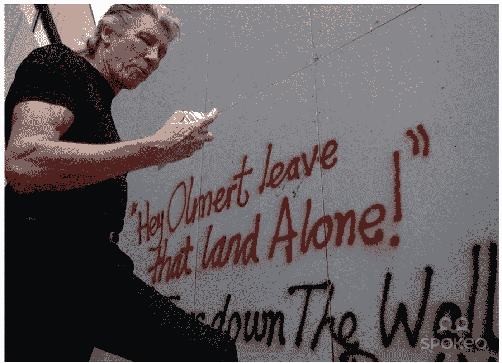

# 不仅仅是“墙上的另一块砖”🤘🏻

> 原文：<https://medium.com/nerd-for-tech/not-just-another-brick-in-the-wall-c2b5707ed973?source=collection_archive---------23----------------------->

我们写了一份关于音乐及其背后的商业和技术的每日时事通讯。如果您想直接在您的收件箱中获得它，请立即订阅 [***！***](https://incentify.substack.com)

周五快乐！

本周早些时候，**前平克·弗洛伊德主唱兼主唱罗格·沃特斯**出现在人民论坛最近在纽约举行的一次活动中，呼吁释放被关押在伦敦的维基解密创始人 [**朱利安·阿桑奇**](https://www.latimes.com/world-nation/story/2021-01-06/wikileaks-founder-julian-assange-denied-bail-uk) 。

在台上，沃特斯出示了一份打印出来的信息，他说他是那天早上从**脸书创始人兼首席执行官马克·扎克伯格那里“在互联网上”收到的。**为了进一步澄清，沃特斯说👇🏻

> “我要求在一部电影的制作中使用我的歌曲《墙中的另一块砖 2》的权利，以推广 Instagram。 “所以这是马克·扎克伯格写给我的一封信，对吗？今天早上来了，给了我一大笔钱。
> 
> 答案是“去你的！”人群欢呼时，他补充道。“没门儿！”“我只提到这一点，因为这是他们接管绝对一切的阴险运动。
> 
> 所以我们中有任何权力的人，我也有一点——无论如何，在控制我的歌曲出版方面，我有，所以我不会参与这种胡说八道，扎克伯格。"

点击这里，查看沃特斯攻击脸书创始人兼首席执行官的令人毛骨悚然的视频👇🏻

[https://youtu.be/KBEzIlsq0KE](https://youtu.be/KBEzIlsq0KE)

在不到 20 年的时间里，**脸书从大学宿舍的社交网络到评价女性，再到控制和支配信息和媒体在互联网上传播的规则的大型科技平台**，以及政府监管者和政治活动家最喜欢的替罪羊，这仍然让我感到惊讶。

在谈到扎克伯格请求的内容时，沃特斯继续说道:

我们要感谢你考虑这个项目。我们觉得这首歌的核心情感在今天仍然如此流行和必要，这说明了一部作品是多么永恒…，'

他明显对扎克伯格的浅薄言辞感到愤怒，他说:

> “然而他们想利用它让脸书和 Instagram 变得比现在更大更强大，这样它就可以继续审查这个房间里的所有人，阻止这个关于朱利安·阿桑奇的故事被公之于众，这样公众就会问，‘什么？！什么？“不，不要了，”

扎克伯格在反对脸书的国会听证会上

*如果你做到了这一步，似乎你在挖掘我们的内容！为什么不与人分享并帮助支持我们呢？:)*

我可以继续分享他在那次活动中引用的话，但是你们明白了。

**他真的很讨厌脸书**，也是激烈反对其决定平台审查的中央集权机制的知名人士之一。

然而，这并不是沃特斯第一次为某个特定的事业大声疾呼。

无论是他有争议地支持对以色列的文化抵制以回应巴以冲突，还是叫嚣着反对川普和英国退出欧盟，沃特斯从不回避放弃他的声望来表达他的观点。

沃特斯持有一种有争议的观点，即“抵制以色列”

他最大的行动主义行动？

1989 年 11 月**、**、**、**、[、**柏林墙**、](https://en.wikipedia.org/wiki/Berlin_Wall)、**、**倒下了，1990 年 7 月**、**水域上演了一场**历史上规模最大、最精心制作的摇滚音乐会、**、**、 *The Wall —现场直播柏林*、**，在波茨坦广场和勃兰登堡门之间的空地上。

据报道，该节目有 20 万人参加，尽管一些估计是这个数字的两倍，大约有 10 亿电视观众🤯

看看这里👇🏻

[https://youtu.be/ohrFzuuUyi0](https://youtu.be/ohrFzuuUyi0)

沃特斯使用了东德交响乐团和合唱团、苏联军乐队以及美国第七空降指挥和控制中队的两架直升机。

音乐会中的“墙”高 25 米，长 170 米，横跨整个场景，斯卡夫的充气木偶被放大再现。

这真的标志着全球化新时代的开始，沃特斯必须在那里标志着它🏁

如果有人肯定不只是“墙上的另一块砖”，那一定是罗格·沃特斯。

**独一无二的🤘🏻**

*最初发表于*[*【https://incentify.substack.com】*](https://incentify.substack.com/p/not-just-another-brick-in-the-wall)*。*