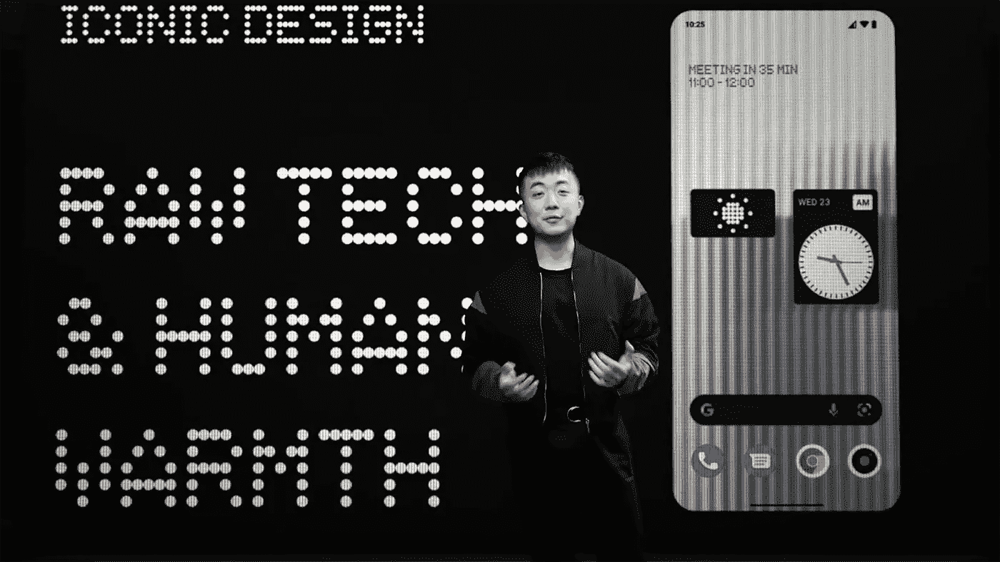
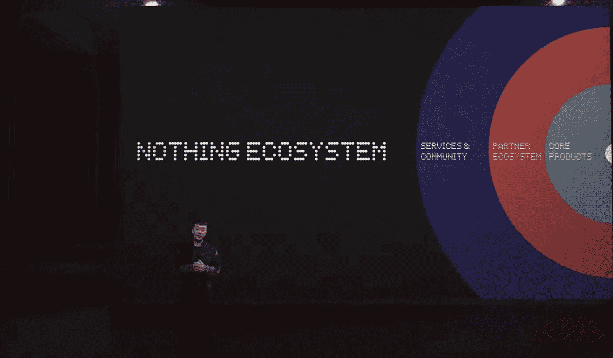
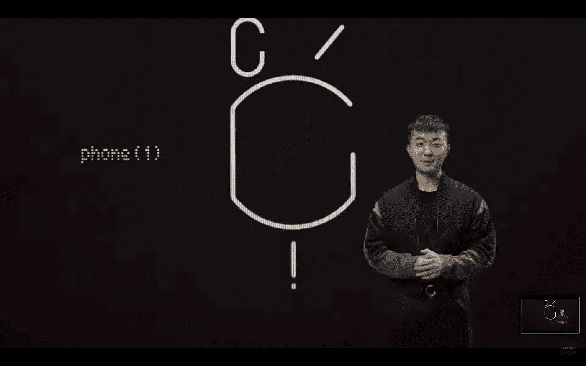
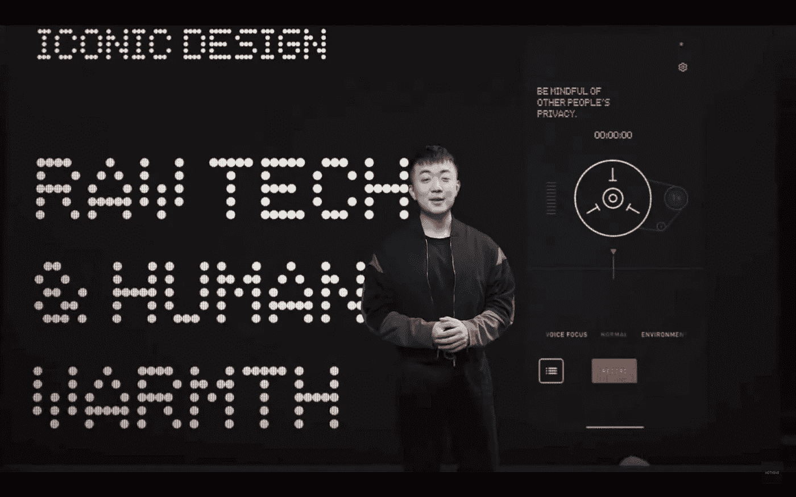

# 无手机(1)——一种精巧的制造装置。！

> 原文：<https://medium.com/nerd-for-tech/nothing-phone-1-subtle-device-in-making-of-a-kind-4df72cb6a771?source=collection_archive---------5----------------------->

> “我们希望将这种人性化的温暖元素重新融入我们的产品中”——Carl Pei

没事电话(1)——[ENGADGET](https://s.yimg.com/os/creatr-uploaded-images/2022-03/aada68a0-ab4b-11ec-babd-297d99924771)

这是 2022 年夏季最受期待和期待的产品之一。可能市场上已经建立的预期太多了。很明显，卡尔·裴的名字会让人产生很高的期望。他是 Oneplus 的联合创始人之一，也是进军科技行业的先驱。离开 Oneplus 后，他创办了自己的公司 Nothing。去年，第一个从无到有的产品是蓝牙耳机 nothing ear(1)。

虚无生态系统— [虚无](https://in.nothing.tech/)

Nothing 的设计和命名是近一段时间以来其生态系统所独有的。通过打破常规和枯燥的市场名称，他们想让消费者感到新鲜和刺激。卡尔在上周举行的电话活动中谈到了一些令人兴奋的事情。他们的目标是创造一个像苹果那样的生态系统。我很欣赏让消费者专注于一个品牌的想法，这样他们就可以更无缝、更可靠地体验产品。我们可能看不到任何平板电脑、标签、笔记本、手表等等。然而，公司必须对消费者忠诚和诚实，为他们提供有价值的产品。

电话(1)——[没事](https://in.nothing.tech/)

现在让我们通过电话(1)了解一下期望。最令人兴奋的一个方面是他们将他们的操作系统 Nothing OS 推向市场。这对一家智能手机公司在当前市场留下印记意义重大。通过使用他们的操作系统，他们拥有了快速可靠的软件。卡尔宣布，这款手机预装的垃圾应用将减少 40%。根据他的说法，从性能上来说，发射器将在设备上流畅快速。这个月什么都没有推出。它将在一些即将发布的设备上提供。现在，我们可以从发射器的主屏幕上看到一个点阵设计。

人类的感觉— [什么都没有](https://in.nothing.tech/)

将人性的一面引入科技的想法激起了我的兴趣，尤其是在一无所有的手机上使用应用程序的时候。希望它来到生活的方式超级酷。没有什么承诺三年的软件升级和四年的安全补丁。当一家公司在产品售出后支持他们的客户时，我很高兴看到他们保留了社区，并且在产品售出后不会离开。伟大的公司专注于留住他们的客户，并通过在产品售出后提供支持来让他们开心。据传，它采用了透明的背部设计，这使它有别于市场上的其他智能手机。

最后，我喜欢 Carl Pei 的说法"
没有什么产品可以与其他世界领先品牌的产品无缝集成和协作。 ***我们会与其他设备合作，而不是对抗它们。*** “移动行业急切地等着看 2022 年夏天手机(1)从无到有增加了多少热度。

> 感谢我所有亲爱的读者，请随时留下反馈或建议&虚拟鼓掌不会让你筋疲力尽😇纳伦德拉·贾纳帕提