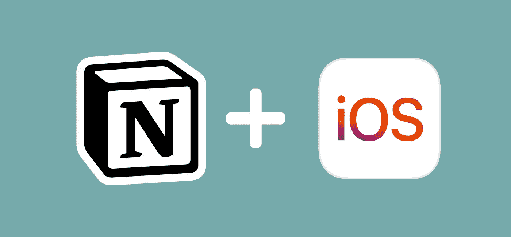
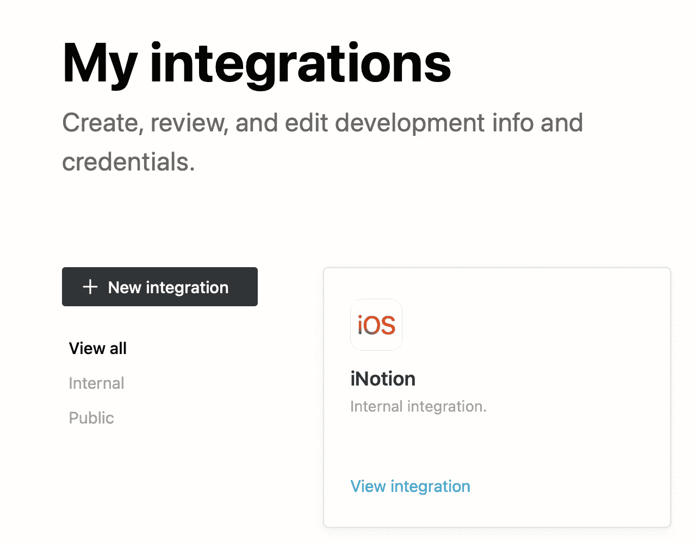
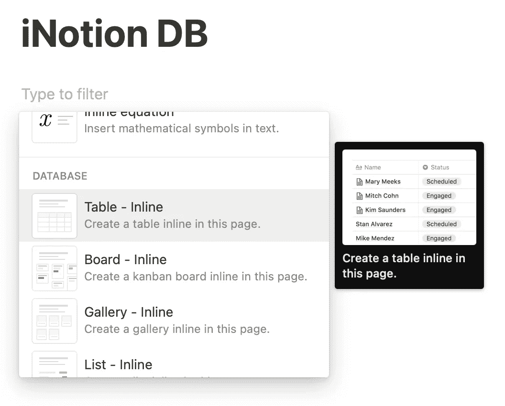
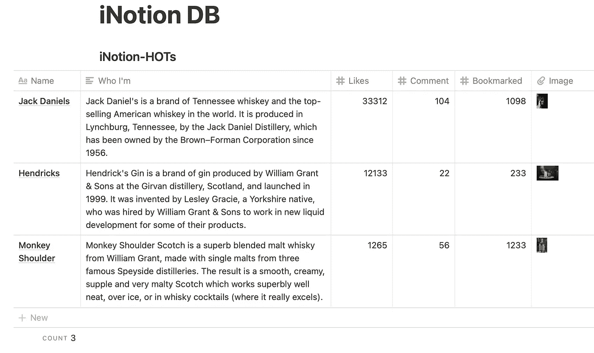
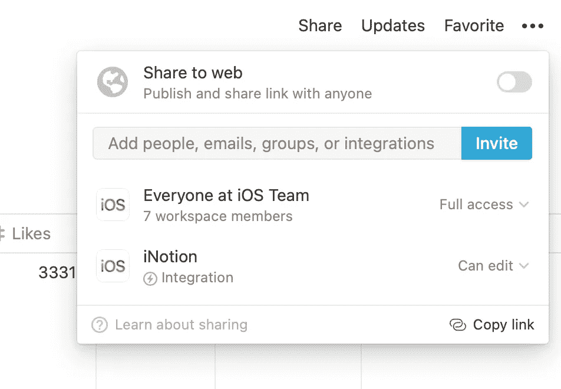
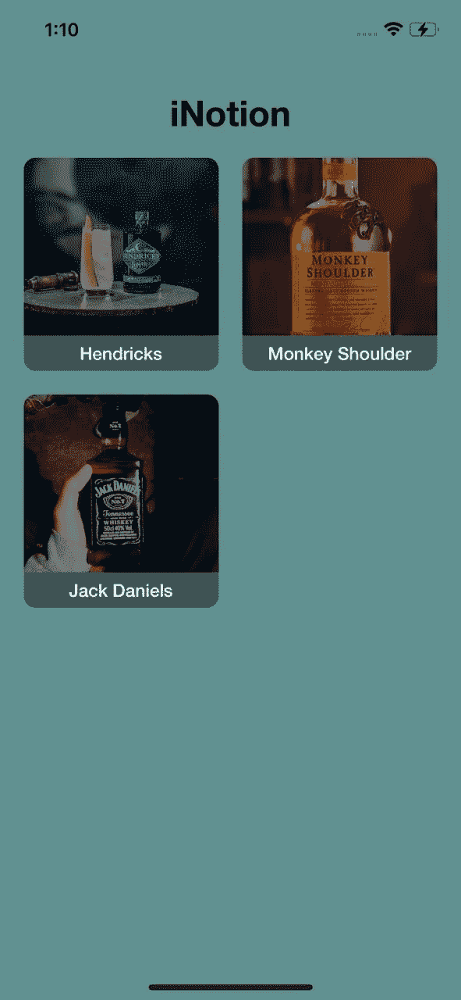

# 概念数据库+ iOS

> 原文：<https://medium.com/nerd-for-tech/notion-database-ios-d3c7835c3a53?source=collection_archive---------7----------------------->

我想到了一个有趣的话题。现在，我们可以将概念数据库集成到 iOS 应用程序中。概念有很棒的文档，可以帮助你开始跨所有平台的概念 API 集成。每个概念 API 都处于测试阶段。所以，我只是打算探索它是什么。我不会给你详细解释。此处请参考[。](https://developers.notion.com/docs/getting-started)



观念+ iOS

在本教程中，我们将在 iOS 应用程序中列出概念数据库的值。希望每个人都有自己的工作空间。如果没有，请从[这里](https://www.notion.so/notion/Create-join-switch-workspaces-3b9be78982a940a7a27ce712ca6bdcf5#9332861c775543d0965f918924448a6d)创建。

我们将重点关注以下内容:

1.  概念整合
2.  概念数据库创建
3.  将概念数据库共享给集成
4.  iOS 的概念 API SDK
5.  示例 iOS 应用程序

**观念整合:**

集成不过是我们获取秘密令牌来访问概念 API、数据库、页面等的地方。

首先，我们需要创建概念整合。有两种类型的集成:

1.  内部—用于单一工作空间
2.  Public 使用 OAuth 的多个工作空间的用户

现在，我们只关注内部集成创建。您可以在[这里](https://www.notion.com/my-integrations)输入名称、徽标和工作空间，然后点击提交来创建您的集成。

现在集成创建完成了。它看起来会像这样。



集成

## 概念数据库创建:

创建新页面并命名为“iNotionDB”。在页面内部，您需要创建数据库—表内联。



创建您的数据库

我添加了一些包含热饮列表的示例数据。



将数据添加到表格中

## 将概念数据库共享到集成:

要共享概念数据库，点击右上角的共享图标，然后点击邀请按钮。在那里你可以看到你的整合。选择并点击邀请按钮。最后，您已经为数据库添加了集成。



## iOS 的概念 API SDK:

你可以从[这里](https://github.com/DavidDeBels/NotionClient)下载 iOS 版的概念 API SDK，并将其添加到你的 xcode 项目中。或者，您可以从 pod 安装它。

```
pod 'NotionClient', '0.0.1'
```

现在，SDK 被添加到您的 xcode 项目中。我使用下面的概念 API 来获取我的数据库值。

```
let client = NotionClient.init(token: "**NOTION_INTEGRATION_SECRET_TOKEN**")client.queryDatabase(withId: "**NOTION_DATABASE_ID**") { (data, error) inprint(data)}
```

要收集“概念 _ 集成 _ 秘密 _ 令牌”，您需要检查您在第一步中创建的集成设置。

你可以看到数据库 ID 的概念，

进入概念数据库->点击打开页面->检查网址

```
https://www.notion.so/**NOTION-DATABASE-ID**?v=randomid
```

在概念客户端 API 响应中，您将获得您的数据库值。

就这样，构建我们的应用程序的一切都准备好了💪。

## 示例 iOS 应用程序:



你可以在我的 github [repo](https://github.com/ashok08/iNotion) 里查看整个作品。

所有的概念 API 都处于测试阶段。当前 API iOS SDK 的概念只有获取数据库页面列表的 API。我需要在应用程序中添加页面细节。我在本地处理页面列表的图像。我打算在我的下一篇文章中继续这个话题。敬请期待！干杯🍻

跟着我:[林克宁](https://www.linkedin.com/in/ashok1208/)