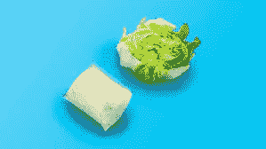
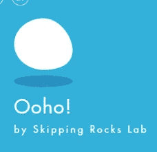

# Notpla 海草包装

> 原文：<https://medium.com/nerd-for-tech/notpla-sea-weed-packaging-f14064b43ff4?source=collection_archive---------1----------------------->

# 介绍

Notpla 海草包装已经提出了在食品和饮料包装一次性塑料的替代品。它创造了由海藻和植物制成的可食用、可生物降解的包装。Notpla 代表非塑料的名称。

在这篇文章中，我们将了解生物降解塑料，其要求，而不是 pla 海草包装。

# 描述

# 非生物降解塑料

*   传统的化石塑料是不可生物降解的。最好通过回收和填埋来处理。
*   许多生物塑料也不可生物降解。
*   不可生物降解的常规塑料，通常用作:
*   聚对苯二甲酸乙二醇酯(PETE 或 PET)，[高密度聚乙烯(HDPE)，聚氯乙烯(PVC)，](https://www.technologiesinindustry4.com/2021/12/industry-4-0-for-small-and-medium-enterprise.html)低密度聚乙烯(LDPE)，聚丙烯(PP)，聚苯乙烯或聚苯乙烯泡沫塑料(PS)

# 生物降解塑料

*   可生物降解的聚合物是那些被微生物如细菌、真菌和藻类分解或分解的聚合物。
*   这些自然是相对快速的副产品，例如气体 CO2、N2、生物质等。
*   生物降解塑料含有添加剂，可以让它们分解得更快。

# 生物降解塑料的必要性

*   每年，800 万吨塑料被丢弃在海洋中。
*   当谈到一次性塑料时，世界的行为需要改变。
*   在世界范围内，我们每分钟使用大约 200 万个塑料袋。并在平均使用 20 分钟后扔掉。
*   [普通塑料含有碳。](https://www.technologiesinindustry4.com/2021/12/industry-4-0-for-small-and-medium-enterprise.html)当塑料被处理并开始分解时，碳被释放到大气中。
*   通常，标准塑料袋是由石油制成的。然而，生物降解袋是由植物或有机材料制成的。
*   它们会分解得更快。

# 生物降解塑料有益于环境

**生物降解塑料节省不可再生能源。**

*   他们支持节约石油供应。
*   生物塑料来自自然资源，包括玉米和柳枝稷等作物
*   这为他们保存不可再生能源如石油做好了准备。

**减少碳排放**

*   制造过程中碳排放量的大幅减少。
*   用于制造可生物降解塑料的材料是以植物为基础的，在堆肥过程中排放的碳最少。

**消耗更少的能量**

*   生物降解塑料的制造过程需要很少的能源。
*   它们不需要回收化石燃料。
*   能源需求减少，污染和环境影响显著降低。

**提供环保解决方案**

*   可生物降解的塑料产品会自动减少废物量。
*   这些废物将被送往垃圾填埋场进行处理。
*   这些土地可用于农业、住宅或工业用途，而不是将其转化为垃圾填埋场。

# NOTPLA 海草包装

消费后塑料由于其稳定和不可生物降解的性质，被转化为对环境的威胁。Notpla 是一家初创公司，致力于制造我们所理解的自然消失的包装。[根据 Notpla 的设计师的描述，](https://www.technologiesinindustry4.com/2021/12/industry-4-0-for-small-and-medium-enterprise.html)“这种材料是完全可生物降解和可食用的。它可能会在四到六周内在家里堆肥。

**历史**

*   该公司于 2014 年开始推出 Ooho 产品。
*   那时候我们的食用泡水是手工制作的。
*   在过去的六年里，该公司开发了制造这些产品的技术，并开发了家庭可堆肥涂料和薄膜。
*   Ooho 是一种简单的液体包装，容量范围从 10 毫升到 100 毫升不等。
*   它由海藻和植物的提取物制成。

# Ooho 是由什么制成的？

*   Ooho 是一种 100%由海藻和植物制成的包装材料。
*   它是专门为像水、果汁和调味汁这样的可消费液体而设计的。
*   任何液体产品都被密封在海藻制成的凝胶状薄膜中。
*   它是通过将褐藻中的海藻酸钠和氯化钙一起应用于混凝土而开发的。
*   [该产品可在使用期间或之后食用。](https://www.technologiesinindustry4.com/2021/12/industry-4-0-for-small-and-medium-enterprise.html)
*   类似地，Skipping Rocks Lab 正在开发一种商业机器，旨在快速生产这种产品。

# 来自跳绳实验室的想法

*   跳石实验室是一家位于伦敦的现代可持续包装公司。
*   他们首先使用从植物和海藻中提取的天然材料来制造对环境影响小的容器。
*   该公司使用了一种称为球形化的方法将水引入球体。
*   褐藻提取物和氯化钙形成凝胶状结构。
*   起到弹性膜的作用，将水分保留在里面。
*   该公司使用了第二层薄膜作为卫生容器来保护它。
*   我们只需要把它拿掉，剩下的球是 100%可食用的。
*   我们可以把它放在嘴里，或者小心地咬一口，喝下里面的液体。

# 球形化技术

*   在球形化球体中，球几乎是由任何类型的液体形成的。
*   当创建小球时，整个球可能是实心的、凝胶状的。
*   当创造更大的球体时，外部趋向于凝固，而内部仍然是液体。
*   [这是吃饭时很神奇的一部分。](https://www.technologiesinindustry4.com/2021/12/industry-4-0-for-small-and-medium-enterprise.html)
*   球体在口中裂开。

# 藻酸盐和钙离子

*   制作壮观球体的方法之一是使用海藻酸盐和钙。
*   钙是一种离子 Ca2+。
*   藻酸盐是一种复杂的长分子，从海藻中提取。
*   外层必须是凝胶，这样球体才能足够坚固。
*   使凝胶成为一个大的复杂分子通常会形成一个大的网络将液体结合在一起。
*   藻酸盐是由长链甘露糖醛酸和古洛糖醛酸组成的大多糖。
*   这种长链分子本身不能形成凝胶。
*   不过，它需要某种东西来构造它们，使其能够保持液体。
*   这是钙离子进入的地方。
*   这些钙离子可能位于两条藻酸盐分子链之间，稳定它们，见下图。

*   藻酸盐和钙的工作机理与双组分胶相同。
*   只有当两种成分相遇时，胶水才会起作用。
*   只要他们分开，什么都不会发生。

# 双组分胶水

*   我们现在明白了，我们需要两种成分来形成我们的球体。
*   技术是让他们保持孤立，直到我们需要他们走到一起。
*   这是通过将组分溶解在水相中实现的。
*   一个将被溶解在我们想要制造球体的产品中，另一个被溶解在水中，制造一个水浴。
*   球体是通过将必须制成球体的液体滴到水浴中而形成的。
*   位于液体外层的藻酸盐和钙离子将与水浴中的那些相互作用。
*   这将导致它们在球体周围形成一层凝胶。

# 基本和反向球形化

海藻酸盐和钙在真正形成球体之前不应该相遇。

*   如果我们的产品富含钙，我们就不想在混合物中加入藻酸盐。[这将启动球形化过程。](https://www.technologiesinindustry4.com/2021/12/industry-4-0-for-small-and-medium-enterprise.html)
*   我们还应该考虑我们要找的球体的类型。
*   藻酸盐是形成凝胶层的分子。
*   含有藻酸盐的相将形成凝胶。
*   如果海藻酸盐在水浴中溶解，凝胶层将在配料周围形成。这被称为反向球形化。

更多详情请访问:[https://www . technologiesinindustry 4 . com/2021/12/not PLA-sea-weed-packaging . html](https://www.technologiesinindustry4.com/2021/12/notpla-sea-weed-packaging.html)