# Notter :-跨平台笔记渐进式 Web 应用程序，带有硬件提醒显示

> 原文：<https://medium.com/nerd-for-tech/notter-cross-platform-note-taking-progressive-web-app-with-hardware-reminder-display-b087f3eb9052?source=collection_archive---------8----------------------->

大家好，提前感谢你们阅读这篇文章。

*所以，我做了另一个基于 JavaScript 的应用程序，这次做了一点改动。这是一个 PWA ,(粗略地说)是一种可安装的网站(将在文章后面解释)。但这还不是全部……*

*该应用连接到一个* ***硬件显示器*** *上，以显示来自该便签应用的* ***提醒通知*** *。*

# 诺特:

***带有“持久通知”和提醒专用显示屏的笔记应用。***

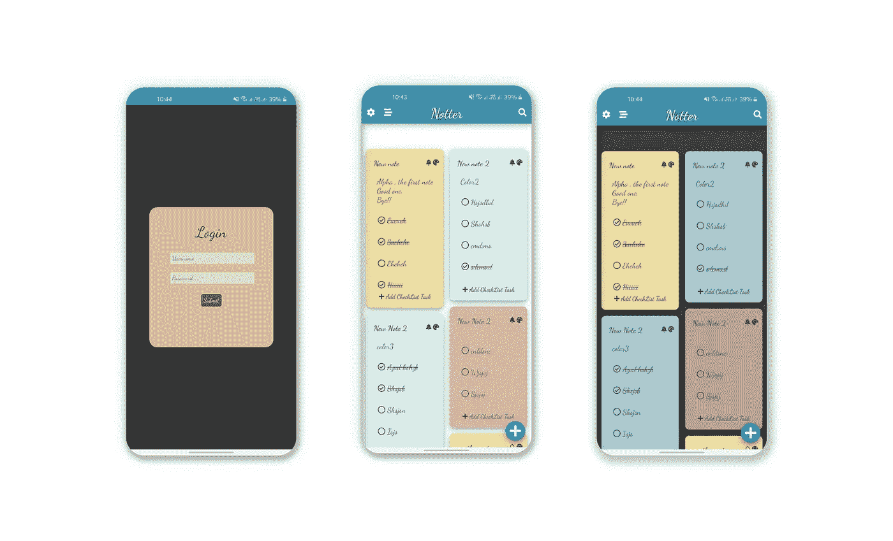

该应用程序是一个 PWA(渐进式 Web 应用程序)，这基本上意味着它是一个可以像任何其他本机应用程序一样安装的网站。最棒的是，它是用普通的 HTML、CSS 和 JavaScript(又名香草 JavaScript)制作的，这三者如此强大却又经常被破坏。另一个好处是，它可以安装在任何平台上，无论是 Android，iOS，Windows，Linux 等。

基本上任何支持现代浏览器的操作系统，因为它只是一个由现代适应性浏览器封装的网站，可以访问您设备的硬件。该网络应用在浏览器中使用 API，帮助它访问和控制设备的硬件，从而提供更好的用户体验。

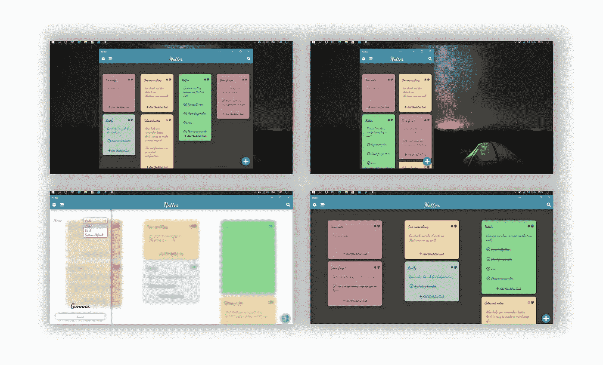

这个应用程序背后的想法是能够制作一个应用程序，确保我的懒驴在一次又一次被提醒后会做一些事情。因此，显而易见的选择是做一些完全一样的事情，确保提醒我去做，即使在我一次又一次地拒绝它之后。

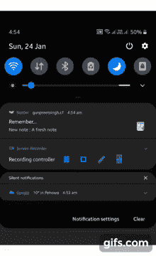

该应用程序通过确保您的提醒在您解除它们时一次又一次地提醒您来做完全相同的事情。该功能与持续通知有些相似，不同之处在于，除非应用程序关闭，否则无法关闭持续通知，并且在通知栏中占用最小的空间，而如果您关闭它们，这些通知会一次又一次地重复。让你更讨厌忽略通知，而实际去做那个任务/提醒。

# 仍然认为你可以忽略它，那么你应该尝试显示提醒…

这些和你在手机上收到的通知一样，只是更大、更粗、更响亮，而且显示在不可变的单独显示屏上。如果可以的话，忽略它。可以吗？

简单回答， ***你不能*** 。因为它是在牢记目的本身的情况下产生的。

显示器连接到您的家庭 Wi-Fi，并不断检查服务器上的任何提醒通知。

一旦收到通知，其中的蜂鸣器开始鸣响，并且要提醒的消息({注释名称}:{注释的第一行})显示在屏幕上。

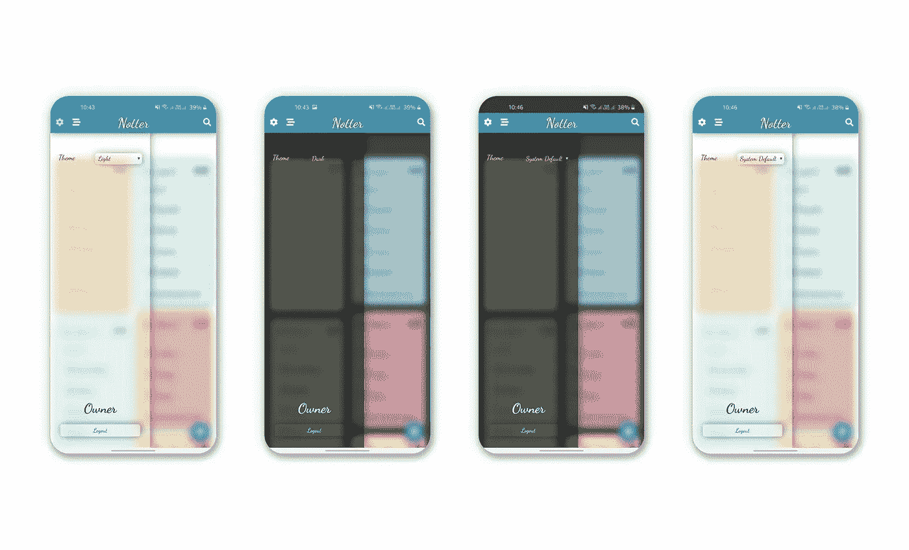

应用程序本身是一个美丽的艺术作品，我不会称自己是一个好艺术家，但是的某种艺术家…

用户界面设计是我一直喜欢的东西，但是我从来没有真正地使用它。制作这样的应用程序让我真正进入其中并了解更多。因此，我决定使用 UI 设计中的一些最新趋势，比如“T0”glass morphism”和“T2”暗黑模式”，制作这个应用程序只是让我感觉很棒，因为我从来没有想过会看到这样的结果。我知道这并不完美，但首先它是有意义的。

> *使用该应用程序应该是轻而易举、快速且让您感觉良好的。*

使用应用程序是小菜一碟，但为了清晰起见，我也制作了一个视频链接在文章的最后。此外，我还将简要解释其特点和功能。

因此，当您第一次打开应用程序时，您需要打开网站，因为它在任何应用程序商店都找不到。因为它不需要作为应用程序安装，所以它不会占用太多空间，您也不必损害您的设备和其他资源。

一旦您打开网站(或更好地扫描下面的二维码)，您将被重定向到登录页面。登录后，您将在一个地方看到所有笔记。

要创建新便笺，请单击右下角的加号图标，为便笺命名。写下你想被提醒的事情并保存笔记。

> *记住笔记名称应该足够短，因为它会出现在通知和提醒显示中以及您笔记的第一行。*

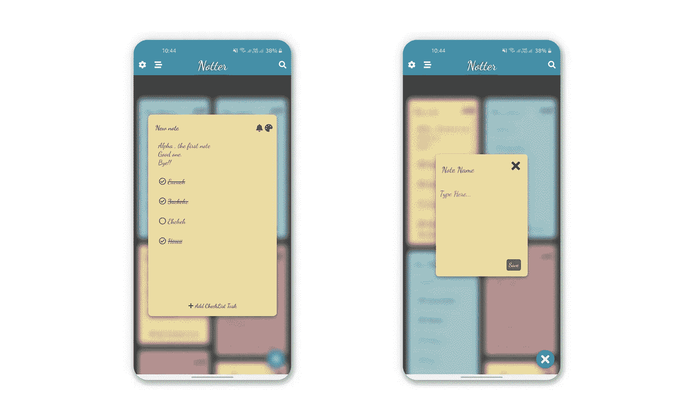

要编辑笔记，单击它以展开模式打开并编辑。要添加清单，请单击“添加清单任务”按钮，输入任务名称并添加。

现在您的任务已经创建，您可以单击小圆形复选框来检查任务是否完成。*或者*如果您在一个有触摸屏的设备上，您也可以 ***从检查圆圈向右滑动*** 来标记完成。根据您的设备，您应该会收到同样操作的触觉反馈(相信我，这非常令人满意……)。

# 不喜欢默认的音符颜色？还是想用颜色来组织它们？

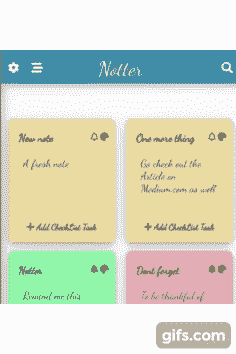

*点击便笺右上角的调色板图标，从其他四种颜色中选择(很快将添加自定义颜色)。*

## 现在是主要问题了，

# 设置提醒:

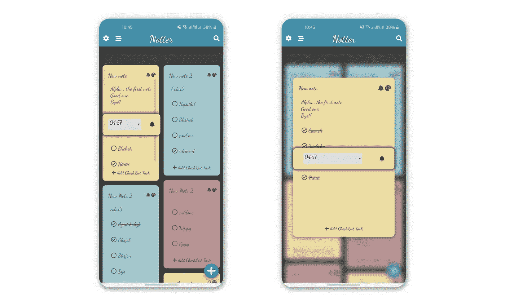

单击笔记左上角的钟形图标(就在调色板图标之前)。在弹出的时间框中选择提醒的时间，然后点击旁边的空铃图标。现在应该是活动的。

# 删除注释:

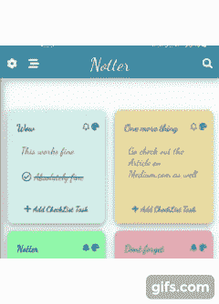

*要删除触摸屏设备上的笔记，只需长按笔记，它应该会开始颤抖(可能是担心他的生命)，按下顶部出现的删除(叉)按钮，笔记应该会被删除。在带有指针的设备上，只需右击音符，使其摇动。*

***其实很容易……***

# 搜索便笺:

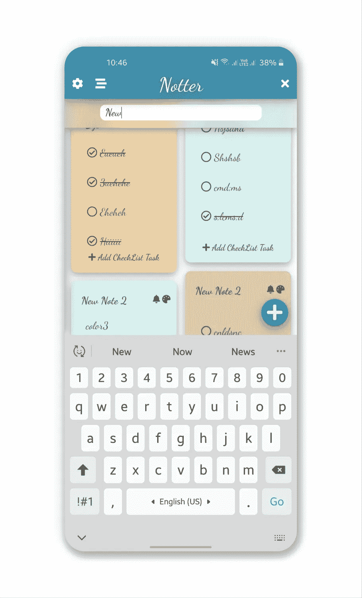

*要搜索笔记，只需点击应用程序右上角标题旁边的搜索图标。*

*开始输入笔记的名称，结果将开始填充。*

*关闭搜索将返回所有笔记。*

***“注意”:仅使用标题进行索引，这意味着搜索将仅在标题中查找内容。***

*(将很快添加对体内搜索的支持)*

# 改变主题:

要更改主题，请单击左上角的齿轮/设置图标打开侧边栏。在工具条中选择主题选项从**或者 ***系统默认。*****

> *****系统默认*** *将使用当前主题的* ***操作系统*****

**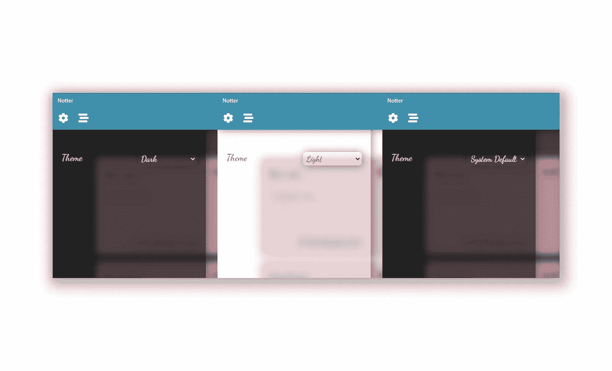**

# **任务列表:**

**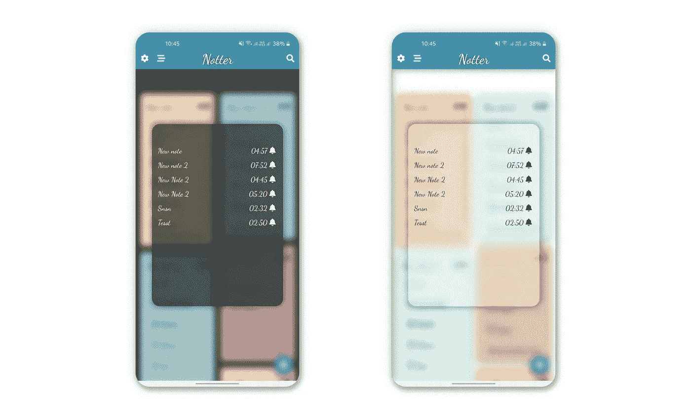**

**设置图标旁边的图标会弹出一个带有时间的提醒列表。**

> ***现在是表演时间……***

# **显示器:**

**要连接到显示器，请转到显示器上显示的 URL，并使用您的凭据登录。如果显示屏显示“以[您的用户名]登录”，您就可以开始了。**

****

**现在，每当提醒注意的时候，显示器将发出报警声，并显示一分钟的注意事项。**

> ***“注意”:“持续提醒”和“显示提醒”的持续时间都是一分钟，即设置为提醒的那一分钟。***

# **这总结了一切…**

**下面是应用程序的工作视频:**

**下面还有一些安装在桌面上的应用程序的截图。安装的界面和过程与移动设备相同(当然滑动除外)。**

**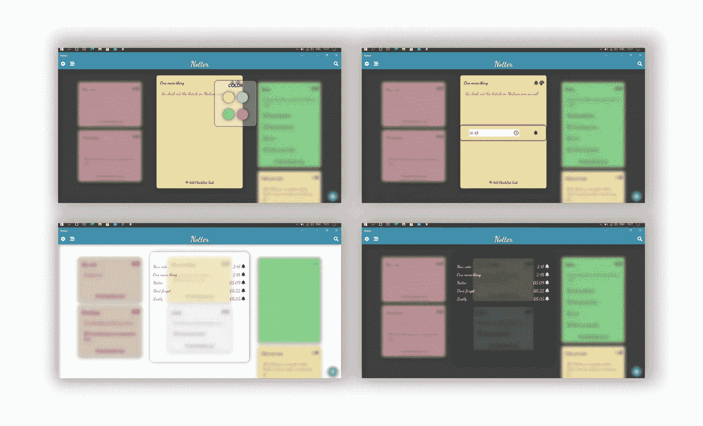****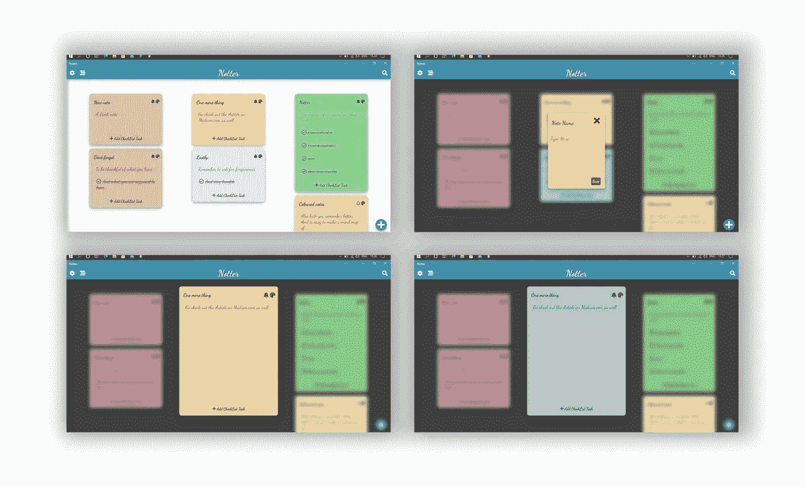********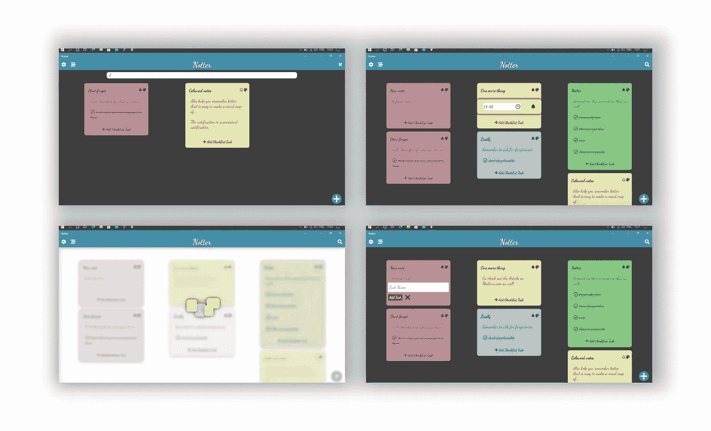**

# **把一切都包起来**

**这是另一个有趣的项目。制作这个花了我几个月的时间，因为我一直在学习如何制作它。另外，由于我现在轮班工作时间为 9-9.5 小时，时间管理成为了另一个巨大的挑战。因此，我花了所有那些深夜和周末来完成这个项目。但现在终于结束了，我喜欢原来的样子。希望你们也会喜欢。请让我知道，很想听听你的想法…**

> ***阅读* **上的文章*领英*上的文章****

** [## Notter :-跨平台笔记渐进式 Web 应用程序，带有硬件提醒显示

### 嘿，大家好，提前感谢你们阅读这篇文章。所以，我做了另一个基于 JavaScript 的应用程序…

www.linkedin.com](https://www.linkedin.com/pulse/notter-cross-platform-note-taking-progressive-web-app-singh/) 

> 如果你还在，感谢你阅读这篇文章。我希望听到您的反馈和/或建设性的批评。所以请随时和我联系[*LinkedIn*](http://www.linkedin.com/in/singhgunpreet82)*。此外，我很想听听你对如何提供更好的用户体验的想法。*

# ***谢谢***

> 作者:[冈普雷特·辛格](http://www.linkedin.com/in/singhgunpreet82)**