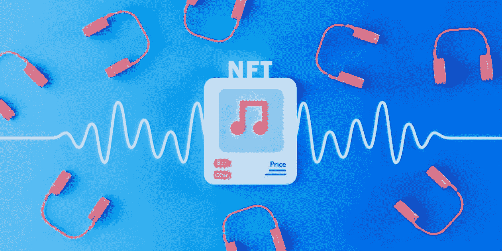
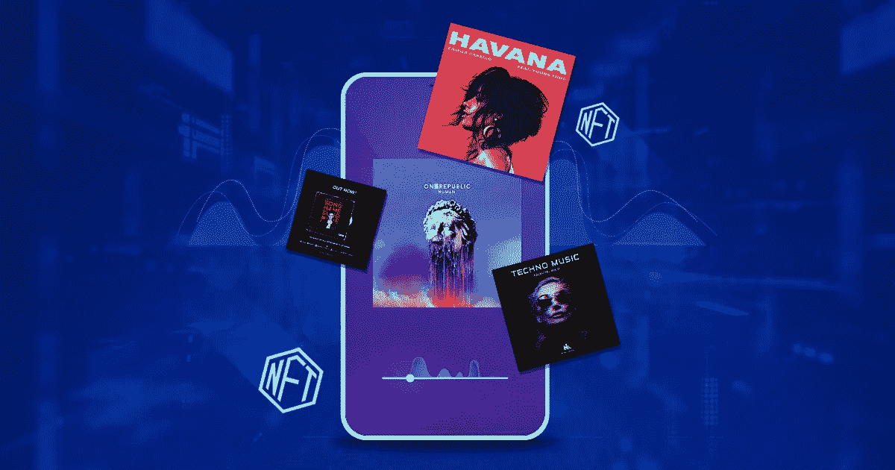

# 现在是时候开始你自己的 NFT 音乐市场了！

> 原文：<https://medium.com/nerd-for-tech/now-is-the-time-to-start-your-own-nft-marketplace-for-music-24c6004bbba2?source=collection_archive---------5----------------------->

当今世界正受到广泛的数字发明的高度影响。最令人印象深刻的是影响巨大的 [NFT 音乐市场平台](https://bit.ly/3Ni1jWM)。这是在非常特定的水平上设计的，其中 NFT 是本发明的主要核心。NFT 是数字资产，可以保护其所有权，并使其对任何拥有者合法。

眼下，一切都是数字化的，让它从电子商务服务到玩体育，一切都是数字化的，一切都在计算机和互联网的帮助下访问。随着技术领域的这种转变，NFT 很快就在数字发明的行列中崛起。

这种上升是非常巨大的，并且在 NFT 当中出现了各种各样的类别，最突出的一个是 NFT 音乐平台。这现在是数字世界中一个伟大的趋势业务，创造 NFT 音乐作为一个商业实体是在 NFT 领域开始坚实的商业生涯的最佳方式。

**NFT 音乐-简要说明**

音乐产业是娱乐世界的领导者之一。这是最令人鼓舞的行业之一，也创造了世界上巨大的商业模式。每个人都喜欢音乐，这是音乐行业获得巨大成功和利润的关键卖点。

目前，音乐行业正在采用数字化的趋势现象，并将每个人的数字音乐世界提升到一个新的水平。通过这种方式，每个人都可以体验到一种新的方式来拥有和珍惜令人印象深刻的因素。

在音乐企业与 NFTs 和区块链技术打交道之前，音乐世界完全是为乐迷服务的。音乐创作者体验到了利润，但也就一次，以后也没有歌曲发行的那么多。有了 NFTs 和区块链，这些歌曲是安全的，它们不会被伪造和非法下载到互联网上的各种网站上。当一首歌被创作出来，并与区块链网络连接，这首歌就成了一首 NFT，不管用什么方法，它都被当作一首。

这个 NFT 音乐收藏品将归这位音乐家所有。当它们在市场上交易时，音乐人将获得被动收入，因为这些歌曲在未来会被多次交易。这涉及到音乐家和购买者之间直接联系的概念。因此，消除了对中间人的需要，因为我们知道，如果涉及到区块链网络，智能合约将取代中间人，并以其条款和条件来决定交易。

**NFT 音乐市场**

如今，NFT 音乐收藏品正成为拥有和聆听歌曲的最佳方式。它消除了世界上使用音乐收藏品的所有负面影响。随着数字空间中音乐 NFTs 的兴起，发展了广泛的 NFT 音乐市场开发。

这种类型的 NFT 市场属于专属 NFT 市场的范畴。这些类型的 NFT 市场只交易 NFT 音乐收藏品。由于它只处理像 NFT 音乐资产这样的独家收藏品，NFT 音乐收藏品的种类和可用性在 NFT 音乐平台上是巨大的。

因此，为音乐非功能性交易创建一个 NFT 市场是在数字世界开展稳固业务的一个好方法。为了创建最好的 NFT 市场音乐平台，有必要从 NFT 市场发展公司开始。从开发用户界面/UX 到推出 NFT 音乐平台，一切都由 NFT 市场开发公司完成。

一些公司甚至提供顶级的 NFT 营销解决方案。借助 NFT 营销解决方案，商业平台将为平台带来广泛的牵引力。此外，让数字业务立即成为投资前沿。

**最后的想法，**

NFT 市场发展模式正在成为立即开始赚钱的最佳方式之一。随着加密货币和 NFT 的兴起，采用 NFT 市场的发展将是开始稳定业务的明智方式。如上所述，为音乐开发公司雇佣一个顶级的 NFT 市场是一切的关键。

NFT 发展公司是发展进程的基石。他们将根据业务平台的需求作为启动平台的主要核心。现在是时候了！因此，在数字市场进行彻底的研究，以获得最佳的 NFT 音乐市场发展，并在短时间内创建一个坚实的商业模式。