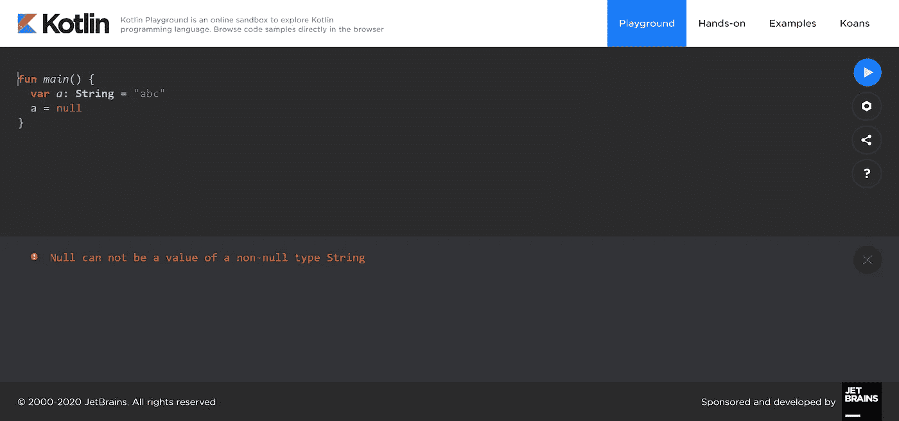
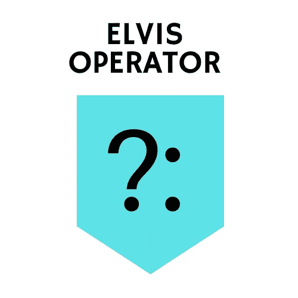
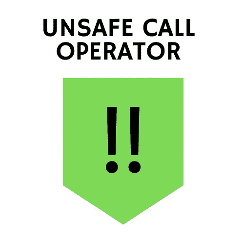

# 科特林的零安全

> 原文：<https://medium.com/nerd-for-tech/null-safety-in-kotlin-e5abad84280e?source=collection_archive---------0----------------------->



在 Kotlin 中，默认情况下，数据类型是不可空的类型，也就是说，试图将一个值赋为空会导致错误。这样做是为了消除代码中的 NullPointerException 错误，这种错误在 Java 等其他编程语言中很常见。

在 Kotlin 中，像 string 这样的普通数据类型不能存储空值，试图这样做将会导致错误。

要允许空值，我们必须将变量声明为可空字符串，这可以通过添加“？”来实现转换为数据类型，即“字符串”。某些类型 A 的可空对应物被表示为。

```
var a: String? = "abc" // this is a nullable string
b = null // value is set to null
print(a) // null printed
```

但是在这种情况下，当访问一个方法或属性时，有可能出现 NPE 错误。比如 b.length 在这里会导致错误。为了避免这个错误，我们必须检查 b 是否为空，并分别处理两种情况。

```
var a: String? = "abc" // can be set null
a = null // value set to null
val l = if (a != null) a.length else -1 // condition handled
print(l) // -1 printed
```


解决这个问题的另一种方法是使用安全调用。



```
val a: String? = null
print(a?.length) 
```

如果 a 为 null，那么它将打印 null，否则它将打印字符串 b 的长度。

当处理可空数据时，您通常希望定义在对象为空时应该使用的默认值。在这种情况下，使用 Elvis 运算符。

```
val a: String? = null  
val l = a?.length ?: -1  
print(l) // - 1 printed
```

如果被访问的值为 null，那么放在它右边的任何东西都会被执行，所以另一个典型的情况是抛出一个异常。

```
val input: String? = null
val userInput = input ?: throw IllegalArgumentException("Input must not be null.")
```



它也被称为非空断言操作符。这样，你就告诉编译器，你试图访问的对象在代码中的这个特定位置不能为空。Kotlin 将访问该值，而无需进一步的安全检查。所以如果你错了，你会得到一个空指针异常。

```
val input: String? = null
val output = input!!.toUpperCase() //Error
```

为了进一步参考，你可以看看这个。

# 总结词

> *这就是我的观点，希望这篇文章对你有用😊。*

> *如果你想和我取得* ***连接*** *，请点击这些链接*
> 
> *Github-*[*https://github.com/Sapna2001*](https://github.com/Sapna2001)
> 
> *LinkedIn-*[【https://www.linkedin.com/in/sapna2001/】T21](https://www.linkedin.com/in/sapna2001/)
> 
> *网站-*[*https://sapna2001.github.io/Portfolio/*](https://sapna2001.github.io/Portfolio/)
> 
> *Quora-*[https://www.quora.com/profile/Sapna-191](https://www.quora.com/profile/Sapna-191)

**如果你有任何建议，请随时通过**[**LinkedIn**](https://www.linkedin.com/in/sapna2001/)**&与我联系，评论区也是你的。**

如果你喜欢这个故事，请点击拍手按钮，因为它激励我写得更多更好。

***感谢阅读！！！！***