# 电脑显示的数字

> 原文：<https://medium.com/nerd-for-tech/numbers-according-to-computers-7c64de47348e?source=collection_archive---------5----------------------->

**图片由** [**格尔德**](https://pixabay.com/users/geralt-9301/?utm_source=link-attribution&utm_medium=referral&utm_campaign=image&utm_content=1327493) **转自** [**Pixabay**](https://pixabay.com/?utm_source=link-attribution&utm_medium=referral&utm_campaign=image&utm_content=1327493)

**目标受众:**初级到中级开发者。

# 介绍

如果你想成为一名熟练的 web 开发人员/设计人员，许多人可能会认为这篇文章的主题是多余的，不值得进行冗长的研究。

我发现，在学术界，以及在很大程度上，在初露头角的开发人员中，除了与软件开发密切相关的其他数学概念之外，理解计算机上出现的数字的重要性遭到了一种轻率的拒绝——一种评估认为，要成为一名优秀的软件工程师，它们并不是真正必要的。

我认为这些基本概念不仅值得回顾，而且在全栈 web 开发/设计领域越来越重要。

> 那么为什么要在计算机科学如此无聊的方面花费时间呢？它与 web 开发人员/设计人员或编程学生有什么关系？这听起来更像是计算机工程师需要理解的东西。

是的，计算机工程师肯定必须理解二进制数，因为微处理器在机器语言层面上利用二进制数来表示它们接收到的数据和指令。

计算机中数字表示的主题对开发人员来说也是非常重要的，并且在任何编程语言中都有重要的影响。考虑一下在高级编程语言(如 Java、JavaScript 或 Python)和低级语言(如汇编代码或机器语言)中用来表示数字的速记。

当然，计算机并不真正知道 10、100、35 或 70 之间的区别。他们甚至不知道数字是什么。在机器语言的层面上——计算机能够使用的唯一语言——当电路闭合或断开时，微处理器所能理解的只是电流或电流的缺乏。

在直接与微处理器通信的机器语言层面上， **0** 代表一个**开路**，或者一个电流被中断的电路。 **1** 另一方面，代表一个闭合电路，通过它电流不会受到阻碍。

# 微处理器的微观探索

在典型的微处理器中，有数十亿个采用硅半导体元件的微电路。

***什么是半导体？***

从根本上说，半导体是一种

> 导电率介于导体(如金属铜)和绝缘体(如玻璃)之间的材料。它的电阻率随着温度的升高而下降；金属的行为正好相反。通过在晶体结构中引入杂质(“掺杂”)，可以以有用的方式改变其导电特性。当两个不同掺杂的区域存在于同一个晶体中时，就会产生一个半导体结”(“[半导体——维基百科](https://en.wikipedia.org/wiki/Semiconductor)”)。

*大英百科全书进一步阐明，*通过掺杂过程引入杂质始于

> “纯晶体硅……在普通的海滩沙子中很丰富……[并且]对电流具有很高的电阻……[通过引入被称为掺杂剂的某些杂质……*，可以使硅传导可用的电流……[最值得注意的是]……作为开关，根据需要关闭和打开电流”(“[微处理器电路](https://www.britannica.com/technology/integrated-circuit/Microprocessor-circuits))。*

*我之所以走这条弯路，是因为可以闭合或断开的电路的双重性从逻辑上导致了计算机中的微处理器如何处理数字。计算机中开关电路的效用应该是不言而喻的。*

# *二进制(基数为 2)*

*首先，我们有二进制系统，这是 ASCII 码的基础，它编码了拉丁字母、数字 0-9、标点符号、一些其他特殊字符和不可打印的控制字符。*

*出于本文的目的，我们将只关心数字的表示。 **ASCII 码**采用 **8 位**来表示单个字符。这是我们理解数的表示的起点。*

# *电脑怎么算？*

*我绝不是数学家，但是理解数字的二进制表示所需的数学概念在基础数学中是存在的。*

*对于人类来说，计数在十进制系统中似乎是最自然的，也许是因为我们有 10 个手指和 10 个脚趾。数字 **10** 对我们来说是一个容易掌握的概念。另一方面，10 进制对计算机来说是完全陌生的。在原始水平上，电路有两种状态——闭合状态，即电流不中断，或断开状态，即电流中断，正如我们在 ***“微处理器的微观探索”中所发现的那样****

*计算机能够识别的最小存储单位叫做**位**(二进制数字**的简称)**。一个**二进制数字**可以是两个数字中的一个——0**或 1**1**。因为第一台广泛使用的个人电脑有像英特尔 8088 这样的微处理器，其字长为 8 位，现在一个字符或数字的标准表示使用 8 位的惯例。***

***8 位**被称为一个**字节**。一个更小的单元，即 4 位**的**，被称为**半字节**，仅用于非常早期的具有 **4 位字长**的微处理器。*

****如果需要表示较大的数字或者浮点数怎么办？*** 有可能表示较大的数字或浮点数吗？这需要更多的字节。在早期的 **8 位处理器**上，这也需要**多个处理周期**。在这种情况下，处理器的“[add]指令集设置“进位”标志”，微处理器将下一个周期视为
相同数字或计算的一部分(*“以前的游戏和计算机是如何显示大数的？”*)。*

*不同的编程语言处理数字表示的方式不同。我们可以在
**C 语言**中检查**数字数据类型**的表示，它可以说提供了许多其他语言构建**静态类型**的重要参考类型。*

*正如 Ritchie 和 Kernighan 在 ***中所说的 C 语言程序*** ，*

*C #中只有几种基本的数据类型:*

*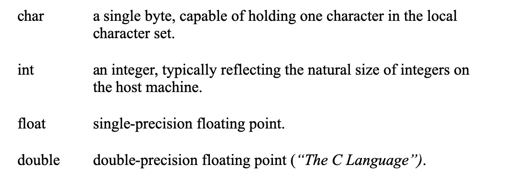*

*对这本书感兴趣的可以在这里找到[。](https://www.amazon.com/Programming-Language-2nd-Brian-Kernighan/dp/0131103628)*

# *哪些数字可以用单个字节表示？*

*用基本的数学术语来说，一个字节能够代表 **2⁸ - 1** 。换句话说就是**(2 x 2 x 2 x 2 x 2 x 2 x 2 x 2 x 2 x 2)-1**。*

***2⁸ = 256。** ***为什么最大的数是 256 - 1？*** 我们需要一个数字来表示 **0** 。因此，用一个字节表示的数字的可表示范围是从**0–255。***

## ****代表带符号的数字****

*如果我们想表示负数，我们就把可能的数字范围减半，用“可以存储的最小(负)数”*

*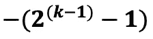*

*可以存储的最大(正)数是*

**

*(***)表示负二进制数)。****

***根据这个公式，我们可以用单个**字节** ( **8 位**)来表示从 **-128** 到 **127** 的数字范围。***

***我们使用第一位来确定一个数是负数还是正数。我们“借助于在二进制数表示系统中称为符号位或符号标志的额外位或标志”来表示这种符号……[并且]它的值对于正数为……**0**，对于负二进制数为**1**(*“负二进制数”*)。***

***使用第一位来表示整数的符号有几个值得研究的结果。我们现在只有**字节** 的 **7 位**来表示整数。这种数字编码也存在令人不安的模糊性。***

***记住，我们少了一个二进制数字**来处理，因为我们需要它来表示 **0** 。如果我们将 **MSB(最高有效位)**，或者最左边的数字设为 **0，**则表示**正 0** 。另一方面，如果 **MSB** 是 **1，**我们现在有了**负 0** 的理论构造。*****

***虽然计算机不会关心这种或那种方式，但这对人类来说是一个令人不安的想法，因为我们认为 **0** 既不是负的，也不是正的，而是出现在右边的正整数流和左边的负整数流之间的数字线连续统的中心。***

***由于这个原因，最普遍的有符号二进制数表示使用 **2s 补码方法**，因为它产生的值的模糊性最小。简而言之， **2s 补码**通过“反转”位(0 变为 1，1 变为 0)并将 1 加到结果数(芬利， *"* [*二进制补码*](https://www.cs.cornell.edu/~tomf/notes/cps104/twoscomp.html) *)来表示负数。****

******这在实践中是什么样子的？******

***假设我们想用 **8 位**来表示十进制数 **-34** 。我们将从 **34** 的无符号二进制表示开始，它是***

***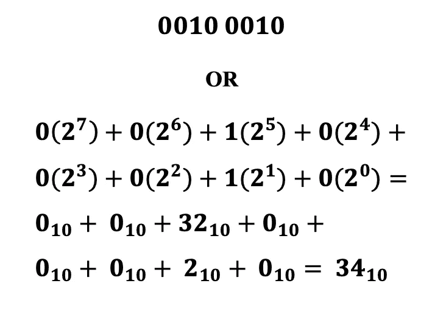***

***为了将这个整数的符号改为负数，首先我们将得到的每个二进制数字**反转*****

***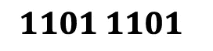***

***最后我们给最右边的 **7** 位加 **1** (记住最左边的位是代表整数符号的 **MSB** )。***

***得到的二进制数是***

***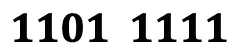***

***现在等于十进制的 **-34。*****

# ***与计算机相关的另外两个数字基数***

***计算机还有另外两种基数。到目前为止，两者中比较流行的是**十六进制记数法**，也就是**基数 16** 。另一个不常用的基数是**八进制记数法**，或**基数 8** 。***

## ***十六进制符号***

*****十六进制记数法**必须代表数字**0–15**(16 位数)，并且使用阿拉伯数字**0–9**和字母 **A-F** 来表示。正如我们将看到的，**十六进制符号**与网络开发
和设计有着密切的关系。***

******与网页开发/设计的相关性******

*****十六进制记数法**与网页开发设计有什么关系？从某种角度来看，这个问题可以比作氧气如何与我们的肺部系统相关的问题。**十六进制符号**从根本上与后端 web 开发和前端开发/设计都有关系。***

***除了对 web 应用程序后端使用的数据结构非常有用之外，**十六进制符号**与 **CSS(级联样式表)**密切相关，开发人员用它来指定颜色。***

***显示器如何在网页上显示颜色首先取决于颜色编码标准所提供的颜色深度，此外还取决于硬件和浏览网页的浏览器所支持的颜色空间。当今最典型的应用是 **32 位颜色**，它支持多达 **16，777，216** 种颜色加上“…一个阿尔法通道[它]可以创建…令人信服的渐变、阴影和透明”(*“*[*)16 位、24 位和 32 位颜色之间有什么区别？*](https://www.computerhope.com/issues/ch001557.htm#:~:text=Like%2024%2Dbit%20color%2C%2032,colors%2C%20more%20memory%20is%20required) *”)。****

*****24 位颜色**已经提供了 **16，777，216** 种颜色，但是缺少 **32 位颜色**编码中提供的 **alpha 通道**的细微差别。***

## *****CSS 颜色编码*****

***在 **CSS** 中的颜色编码以几种不同的方式完成，其中最流行的是 **RGB** (红绿蓝) **RGBA** (红绿蓝阿尔法) **HSL** (色调-饱和度-亮度)。Mozilla Developer Network 发表了一篇精彩的文章，阐述了 **< color > CSS** 数据类型，并列举了使用不同**颜色空间**定义颜色的关键词，比如 **sRGB** (标准 RGB)和 **HSL** ，正如我们已经看到的。列表中增加了 **HSLA** (色相-饱和度-明度-alpha)和 **HWB/HWBA** (色相-白度-黑度/色相-白度-黑度-alpha)(*[*<颜色> - CSS:级联样式表:MDN*](https://developer.mozilla.org/en-US/docs/Web/CSS/color_value) *)。*****

***所有这些编码方法都有一个共同点。它们可以用十进制或十六进制表示。***

***例如， **rgb()** **CSS** 属性对每个**颜色通道**(红、绿、蓝)使用 8 位。***

***对颜色**黄色**进行编码的语法是`**rgb(255, 255, 0);**`***

***用 **CSS** 中的**十六进制表示法**表示**黄色**的等价语法是`**color: #ffff00;**`***

***请注意，`**rgb()**`属性包含范围为 0–255 的 **3 个十进制**数字。这些十进制数中的每一个都表示为 **8 位**，总共 **24 位**，对应前面提到的 **24 位**颜色编码。***

***由于我们处理的是无符号整数，我们可以暂时不用 **2s 补码**编码。***

***这将为我们提供以下颜色**黄色**的二进制表示:***

***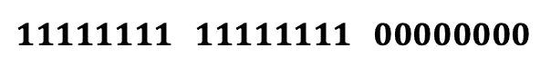***

***十六进制等效值是**三组 2 个十六进制数字**:***

******

***注意两个十六进制数字相当于 **8 位**。因此，总共有 6 个十六进制数字**与 24 个二进制数字**做同样的工作。花在颜色编码上的时间大大减少。***

## ***三种不同的计数方式***

***为了展示历史上在计算中使用的基数所提供的计数方法，让我们看看它们从最少到最多的记数法的效率(至少从人类的角度来看):***

******二进制计数******

***当我们用二进制计数时，数字以惊人的速度增长:***

***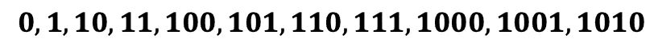***

***而 **1010** 的大二进制数在**底数 10** 中等于什么？这两者惊人地相似:***

***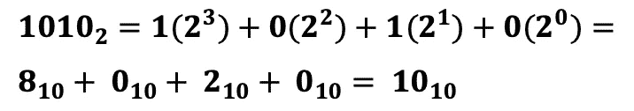***

******以八进制计数******

***八进制记数法或**基数 8** 或许不那么令人畏惧。下面是我们如何在**中计算基数 8:*****

***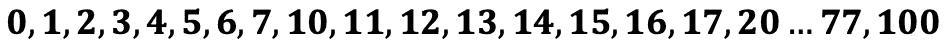***

***这里，我们总共有 8 个数字代表从**0–7**的值。那么，100 个₈相当于多少呢？下面是等式:***

***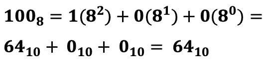***

***如前所述，**八进制记数法**在
目前的计算机平台上并没有大量使用。它的主要用途是与旧的小型计算机
和大型机一起使用，如 IBM System/360，“由 IBM 于 1965 年 4 月 7 日
宣布……旨在涵盖商业和科学应用，并涵盖从小到大的完整应用范围”(*[*IBM System 360—维基百科*](https://en.wikipedia.org/wiki/IBM_System/360) *)。*****

******十六进制计数******

***乍看之下，用十六进制的**(基数为 16)计数令人望而生畏，因为
必须用个位数表示数字**0–15**。因此我们这样计算
:*****

***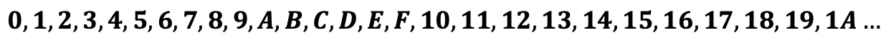***

***这个模式挑战了我们的认知。毕竟，我们没有能够数出 T2 数字的手指。按照我们的思路， **16** 是**十个**加**六个**的 **1 个**单位。但是现在让我们来看看十进制的 1A 的等价物:***

***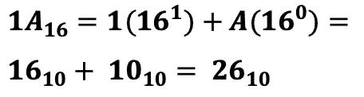***

***这种表示很好，也很紧凑。但是它真正的优势在大数的表示上变得更加明显，比如那些在 **CSS** 中用来表示颜色的数字。***

***我们知道，每个**十六进制**位相当于 **4 位(1 个半字节**)。因为一个**字节**由 **8 位组成，所以**二进制**中的 **8 位**所表示的**只能用**十六进制**中的 **2 位**来表示。这对于在 **CSS** 中编码非常有利。***

***因此，与二进制**中的 **8 位**不同，我们仅使用十六进制中的 **2 个半字节**来表达相同的思想。*****

***为了真正展示**十六进制记数法**如何在 **CSS** 中大放异彩，这只是其更广为人知的用例之一，让我们看看另一个 **CSS** 颜色编码。***

***假设我们想要将**银**的颜色应用到一个 **HTML** 元素。***

***下面是颜色**银色的笨拙的**二进制符号**:*****

***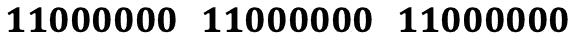***

***这里有 **24 位**或 **3 字节**，每一个都有十进制等价的 **192** ，如下式所示。***

******将颜色通道值从十六进制转换为十进制******

***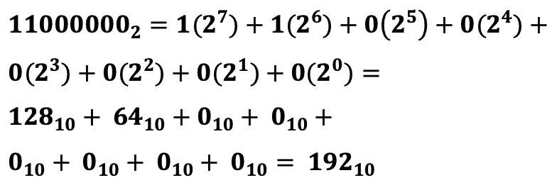***

***而这里的**是十六进制**的等价物:***

***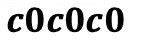***

***记住，每个十六进制数字代表一个**半字节**(或 **4 位**)。每对**半字节**代表 **8 位**或 **1 字节**对应**红色、绿色**或**蓝色通道**。***

***下面是第一个字节的转换(在这种情况下，与剩余的两个字节相同):***

***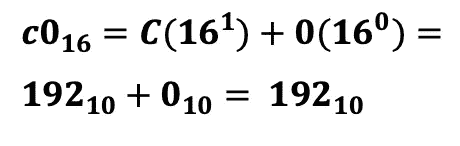***

***每个**通道—红色、绿色**和**蓝色—** 都有一个十进制值 **192** ，当使用 **CSS** 的`**rgb()**` **属性**来表示时，该值为`rgb(192, 192, 192);` 虽然没有上面所示的二进制表示法那么麻烦，但我想我们可以同意对颜色**银色—** `color: #c0c0c0;`使用**十六进制 CSS 规则**会更加简洁***

# ***结论***

***我们已经在一定程度上深入探讨了计算机上数字编码这一看似神秘却至关重要的概念，并通过网页设计/开发的镜子提炼了这一知识。尽管与 web 开发和设计的技术没有明显的联系，但是数字编码对于 web 技术的重要性是无可辩驳的。***

***在今天的**万维网**中，我们过去称之为网站的东西不可否认地趋向于**网络应用**，它比以往任何时候都有更多的用户交互，并且开始看起来更像它们的桌面对应物。***

***因此，**网络应用程序**可能会涉及到数字操作，通常比以前遇到的更复杂。***

***最后，如果我们真正对自己诚实，有时当我们需要为二进制或十六进制计算的复杂性而烦恼时，它会变得乏味和令人沮丧，因为我们的技能已经有点生疏了。***

***这篇文章的目的是给那些长期远离基础理论的人一些支持，也许是对这些概念的新的评价。***