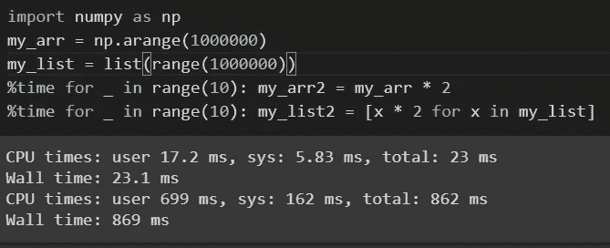
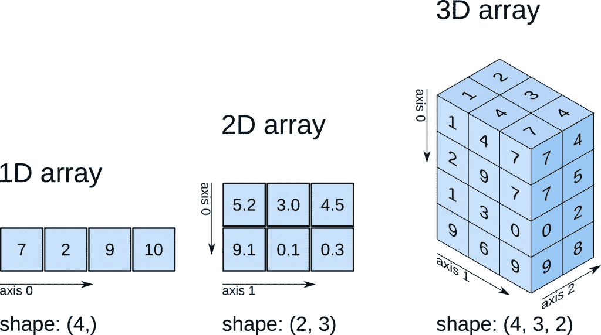

# NumPy 福利套餐！！！

> 原文：<https://medium.com/nerd-for-tech/numpy-a-boon-package-a278e4ed7d4e?source=collection_archive---------22----------------------->


NumPy(数值 Python)是一个开源 Python 库，是 Python 中科学计算的基础包。我们将在 NumPy 中找到的一些功能:

1.  它是一个多维数组对象，提供快速的面向数组的算术运算和跨维度的高效广播操作。
2.  用于向磁盘读写数组数据和处理内存映射文件的工具，旨在提高大型数据数组的效率。
3.  提供跨线性代数、统计的许多函数的实现。
4.  NumPy 操作在整个数组上执行复杂的计算，而不需要 Pythons for 循环。

## 比较性能:



创建 numpy 数组和列表的时间消耗

考虑一个包含一百万个整数的 NumPy 数组，以及等效的 Python 列表:

基于 NumPy 的算法通常比 Python list 快 10 到 100 倍(甚至更多),并且使用的内存也少得多。

# NumPy ndarray:一个多维数组对象



***创建阵列:***

```
**arr = np.array([[1,1,2,3],[5,8,13,21]])
arr
>> array([[ 1,  1,  2,  3],  
         [ 5,  8, 13, 21]])
arr.shape #shape attribute gives size of array along each dimension
>> (2,4)
arr.ndim   #ndim attribute gives the dimensions of an array
>> 2****This array has 2 axes. First axis has a length of 2 and the second axis has a length of 4.
Note : In NumPy, dimensions are called axes.**
```

# 数字运算

我们可以在 n 数组(n 维数组)中执行算术运算，如 add()、subtract()、multiply()和 divide()。n 数组必须具有相同的形状，或者符合数组广播规则。NumPy 的一些操作如下所示:

```
'**Adding** the two arrays a and b' : >>  **np.add(a,b) or a+b** '**Subtracting** the two arrays a and b' : >>  **np.subtract(a,b) or a-b** '**Element-wise multiplication**of a and b': >> **np.multiply(a,b) or a*b** '**Matrix wise multiplication** of a and b' **:** >> **np.dot(a,b)** '**Exponential** of all elements in a': >> **np.exp(a)**
'**Sine function** of all element in a': >> **np.sin(a)**
'**Squareroot** of all element in a' : >> **np.sqrt(a)**
'**Zeros Matrix** of size (a x b)' : >> **np.zeros((a, b))**
```

# 广播


它描述了 numpy 在算术运算中如何处理不同的形状。较小的阵列被“**广播**”到较大的阵列，以便它们具有兼容的形状。

# NumPy 的统计数据

NumPy 有很多有用的统计函数，可以找到最小值、最大值、百分位数、标准偏差和方差等。数组中给定元素的。

```
**np.amin(a)** >>Return the minimum of an array or minimum along an axis
**np.amax(a)** >>Return the maximum of an array or maximum along an axis
**np.mean(a)** >>Compute the arithmetic mean along the specified axis
**np.std(a)** >>Compute the standard deviation along the specified axis
```

感谢您的阅读！！😊

参考

[https://numpy.org/doc/stable/contents.html](https://numpy.org/doc/stable/contents.html)

[https://numpy . org/doc/stable/reference/routines . statistics . html](https://numpy.org/doc/stable/reference/routines.statistics.html)