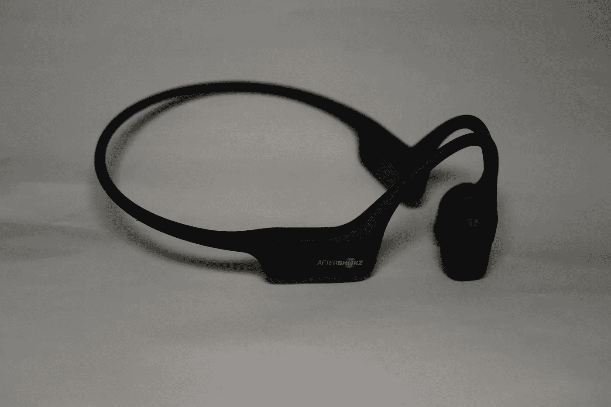
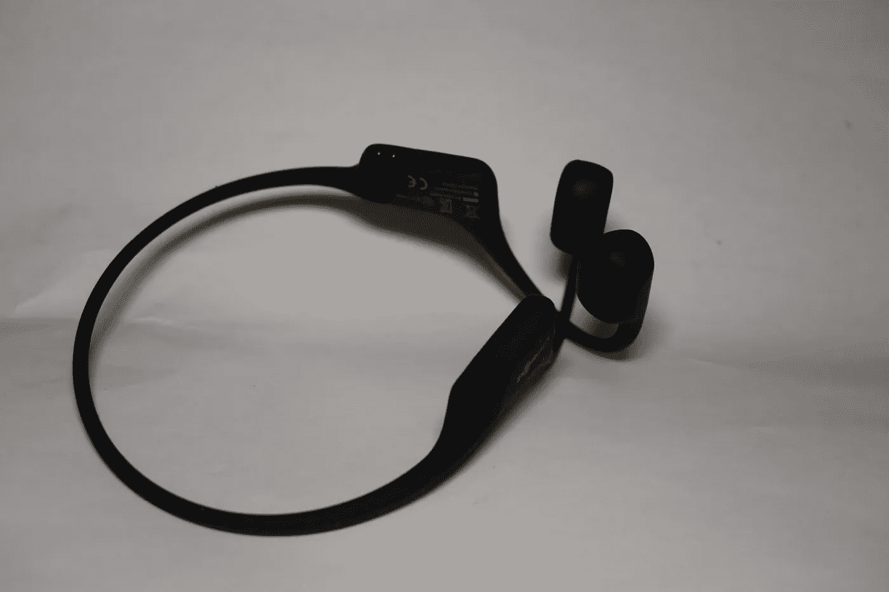

# Aeropex 可能会让你大吃一惊

> 原文：<https://medium.com/nerd-for-tech/oafteraeropex-might-shokz-you-after-4007b3726de6?source=collection_archive---------5----------------------->

Aftershokz(现为 Shokz) Aeropex 骨传导耳机(现已停产，但 Shokz Openrun 类似)放在耳朵上，与皮肤接触，而不是像“普通”耳机或耳机那样将音频发送到耳道内，它们振动并使用头骨将音频发送到耳朵本身。

Aftershokz Aeropex

前部包含骨传导技术，然后一个环路将耳朵交给另一个包含电池/电子设备和蓝牙的单元，另一个环路位于头部后面，连接到另一只耳朵上的相同设置。

这款耳机重量很轻，只有 26 克，预计播放时间为 8 小时，等级为 IP67(防汗性能很好，但不适合游泳)。有一个 USB 电缆，可以用磁性连接器充电，以确保它与 2 针充电端口对齐(不能放反)。

充气口

骨导技术有点像马麦技术(也就是说，你爱它或者恨它)。当它运行良好时，它可以运行得很好，也可以不运行。

声称的频率响应为 20Hz 至 20KHz，但是较低的频率往往不能很好地通过骨传导，因为它们会在设备到皮肤的边界上丢失。

还有双麦克风来拾取通话声音等。

多功能按钮执行以下操作:-

*下一首歌—双击—一声蜂鸣*

*上一首歌——三次点击——一次嘟嘟声*

*接听电话——点击一次——两声蜂鸣*

*结束通话—点击一次—蜂鸣一声*

*接听电话等待并结束当前通话——按住 2 秒钟——发出一声蜂鸣声*

*忽略来电——按住 2 秒钟——两声蜂鸣声*

*激活语音助手—按住 2 秒—蜂鸣声*

*重拨最后一个号码—双击待机—重拨最后一个号码*

功率/音量+/音量组合:-

*开机—按住 vol+2 秒钟—欢迎使用 Aftershokz*

*关机—按住 vol+3 秒钟—关机*

*静音——按住 vol+/vol-2 秒(通话中)——静音开/关*

*改变均衡器—按住 vol+/vol-2 秒钟(音乐播放)—均衡器改变*

*检查电池状态—点击 vol+或 vol-(音乐暂停)—电池电量高/中/低/给我充电*

*调节音量— vol-或 vol-(音乐播放)—一声蜂鸣声*

如果耳机插入充电器，水分检测器将指示耳机是湿的，它们应该被干燥。

骨传导耳机确实需要适应音频直接进入耳后，同时允许耳朵正常听到。这对于骑自行车或跑步非常有用，这样你就能意识到你周围的环境和正在发生的事情。可能不太适合在繁忙的办公环境中穿着，也不太适合外出。它们非常轻，因为它们没有坐在耳朵里(或者盖住耳朵)，所以不会有很长的不适感。

唯一有点恼人的问题是，如果音量太大或频率在特定范围内，皮肤会振动，但这真的是一个小问题。

虽然 Aeropex 已经停产，但仍可在体育用品商店买到，替代的 Openrun 可直接从 [UK Shokz 网站](https://shokz.uk/?sca_ref=2763572.AuiO1ju0S0)购买，价格为 129.95 英镑，有黑色/灰色、蓝色/深蓝色、深灰色/浅灰色和红色/深红色。

现在还有 Openrun Pro 和 Openrun Pro mini，这是支持蓝牙 5.1 的新型号，额定 IP55，12 小时播放时间，更大的多功能按钮和增强型底座，也来自[英国 Shokz 网站](https://shokz.uk/?sca_ref=2763572.AuiO1ju0S0)，售价 159.95 英镑，尽管它们比 3g 重。

[Shokz](https://shokz.uk/?sca_ref=2763572.AuiO1ju0S0) 现在也做游泳骨传导 MP3 播放器和 UC 耳机。

*原载于*[*http://eurotechnews.blogspot.com*](https://eurotechnews.blogspot.com/2022/11/aeropex-might-shokz-you-after.html)*。*