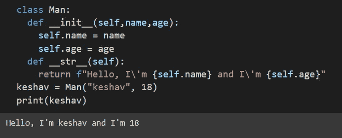
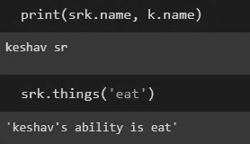

# python 中的面向对象编程。

> 原文：<https://medium.com/nerd-for-tech/object-oriented-programming-in-python-bcb9e7c40385?source=collection_archive---------15----------------------->


**面向对象编程**是将相关属性捆绑到单个对象中的方法。

OOP 是这样的，我们构建一个程序，使属性和行为捆绑到单独的对象中。一个对象可以用名字、年龄、身高和行为(如走路、说话等)来表示一个人。

关键的一点是，在 Python 中，对象是面向对象编程的核心，不仅像在过程编程中一样表示数据，而且在程序的整体结构中也是如此。

我们使用 python 中的类，这样可以使代码更易于管理和维护。

# 类别和实例

类用于创建用户定义的数据结构。类定义了称为方法的函数，这些函数标识了从类创建的对象可以对其数据执行的行为和动作。一个类是应该如何定义的蓝图。它不包含任何数据。

现在，如果我们定义一个名为 man 的类，它包含一个人的名字和年龄。该类指定姓名和年龄对于定义一个男人很重要，但是它不包含男人的任何姓名或年龄。

实例是从类中构建的包含真实数据的对象。

# 定义类别

所有的类定义都以 class 关键字开始，后跟类名和冒号。缩进到类定义下面的任何代码都被认为是类体的一部分。

```
class Man:
  pass
```

pass 关键字通常用作占位符，指示代码最终的去向。它允许您在 Python 不抛出错误的情况下运行这段代码。

所有 Man 对象的属性都必须在一个名为 **__init__** ()的方法中定义。每次创建一个新的人， **__init__** ()通过分配对象的属性值来设置对象的初始状态。因此， **__init__** ()初始化该类的每个新实例。

**__init__** ()的第一个参数应该是一个名为 **self** 的变量。当创建一个新的类实例时，该实例被自动传递给 **__init__** ()中的 **self** 参数，以便可以在对象中定义新的属性。

```
class Man:
  def __init__(self, name, age):
    self.name = name
    self.age = age
```

self.name = name:创建名为 name 的属性，并为其分配 name 参数的值。

self.age = age:创建一个名为 age 的属性，并为其分配 age 参数的值。

创建的属性称为实例属性。这些特定于类的特定实例。所有的 Man 对象都有一个名字和年龄，但是不同实例的值不同。

类属性是所有类实例都具有相同值的属性。您可以通过在 **__init__** ()之外给变量名赋值来定义类属性。

```
class Man:
  planet = 'earth'
  def __init__(self, name, age):
    self.name = name
    self.age = age
```

类属性直接在类名的第一行下面定义。它们必须总是被赋予一个初始值。当创建类的实例时，会自动创建类属性并将其赋给初始值。

使用类属性为每个类实例定义应该具有相同值的属性。对于因实例而异的属性，请使用实例属性。

# **实例方法**

实例方法是在类中定义的函数，只能从类的实例中调用。

```
class Man:
  def __init__(self,name,age):
    self.name = name
    self.age = age
  def things(self,ability):
    return f"{self.name}\'s ability is {ability}"
  def about(self):
    return f"{self.name} and is {self.age}"
keshav = Man("keshav", 18)print(keshav.things("sleeping"))
print(keshav.about())
```

从上面可以看出，如果我们打印 keshav，我们会得到类似于"<__main__.man at="">"的结果。现在，为了解决这个问题



# **从其他类继承**

继承是一个类继承另一个类的属性和方法的过程。新形成的类称为子类，子类派生的类称为父类。

子类可以重写或扩展父类的属性和方法。换句话说，子类继承父类的所有属性和方法，但也可以指定自己独有的属性和方法。

```
class Man:
  def __init__(self,name,age):
    self.name = name
    self.age = age
  def things(self,ability):
    return f"{self.name}\'s ability is {ability}"
  def about(self):
    return f"{self.name} and is {self.age}"sr = Man('SR Keshav', 18)
k = Man('Keshav', 18)
print(sr.things('sleep'),";",k.things('eat'))
```



为了检查一个类是否是一个实例，我们使用一个内置函数 isinstance()。如果指定的对象是指定的类型，函数`isinstance()`返回`True`，否则返回`False`。

```
class myObj:
  name = "John"
y = myObj()
x = isinstance(y, myObj)
```

要重写在父类上定义的方法，需要在子类上定义一个同名的方法。

你坚持到了最后，谢谢你！