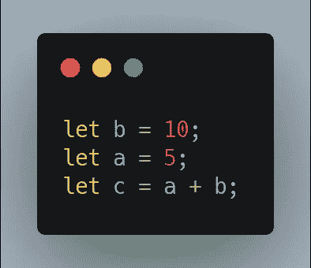
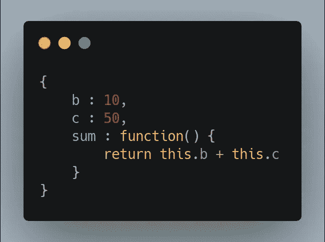
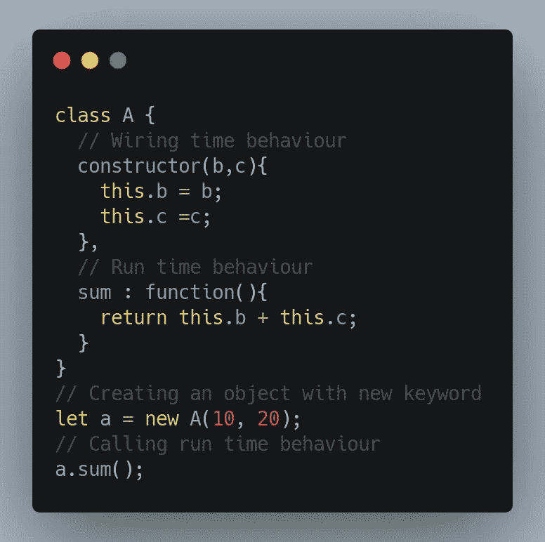
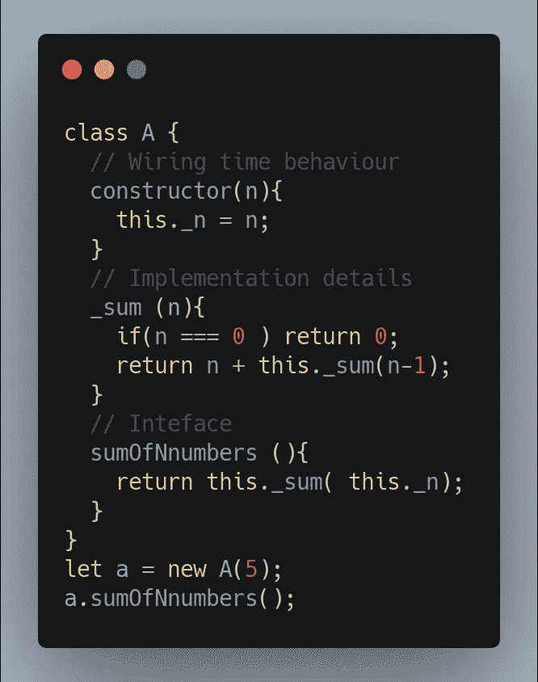
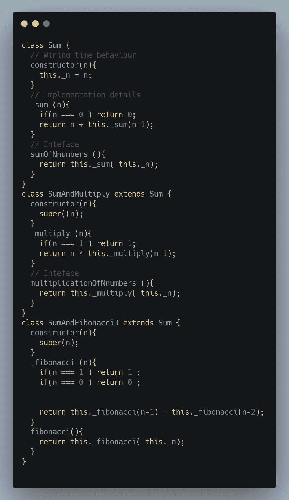
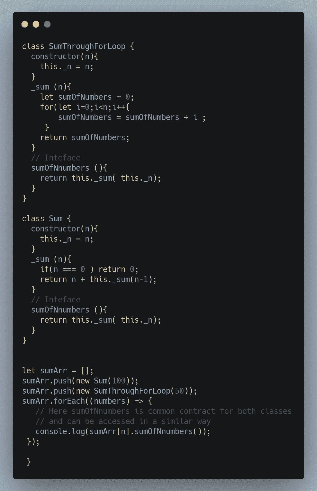

# 面向对象程序设计—简介

> 原文：<https://medium.com/nerd-for-tech/object-oriented-programming-introduction-993f6066d54?source=collection_archive---------20----------------------->

# 步骤顺序

编程是给计算机执行某些操作的一系列指令。这一系列的语句如下。我使用的例子是用 JavaScript 语言编写的。

步骤顺序

# 功能

但是要执行复杂的操作，组织代码是很重要的。我们可以通过编写函数将代码组织成更小的单元。这将促进重用。我们可以多次使用同一个函数。

功能

# 目标

但是我们需要的不仅仅是函数来构造一个复杂的程序。于是我们有了既有函数又有数据的 ***对象*** 。拥有状态和行为的独立实体。状态是信息或数据，行为是它能做什么或功能。

在上面的例子中，对象的数据是 b 和 c，行为是 sum

# 班级

该类是创建对象的模板。这抽象了对象的概念，帮助我们创建更多的对象。一个对象的构造是通过 n 个 **ew** 关键字发生的。该类有两个主要流程。第一个是构造时间行为或布线时间行为，第二个是运行时间行为。

类 A 用 new 实例化，这个关键字用于接受变量。

# 连接

接口给了我们适量的信息，隐藏了所有的细节。这将使我们集中精力决定向外界显示和隐藏复杂细节的正确信息量。

接口在不同的地方有不同的含义。我们能想到的最常见的例子是汽车。除了车轮、齿轮、油门和刹车，汽车的内部细节对我们是隐藏的。这个界面有助于在不了解细节的情况下控制汽车。

接口在所有语言中都很重要。在 JavaScript 中，我们认为使用 **_ (like _sum)** 的函数和变量是私有变量。这个变量不能在对象之外使用。不带 _ 的函数和方法是公共的**(像 sumOfNnumbers)** 可以使用。

sumOfNnumbers 是接口，sum 是实现细节

# 遗产

我们讨论了如何通过创建类和对象来更好地组织代码。主要目标是编写更少的代码。当我们创建更多的类来创建对象时，就有可能在这些类之间复制代码。为了避免这种情况，我们尝试识别类之间的公共功能，并创建一个父类。子类可以从父类继承并获得所有的通用功能。它可以通过添加自己的功能来扩展父级。

SumAndMultiply 和 SumAndFibonocci 继承自 Sum

# 多态性

这就像为了某个目的接受任何对象，如果该对象遵循某个接口。接口有助于在多态中建立契约。

例如，如果我们购买手机，有一个耳机插孔的插槽。如果你丢失了耳机，你可以再买一个，因为如果插槽合适的话，手机会接受。

这是多态性，因为它接受任何实体，如果他们遵循合同。

多态性 sumOfNumbers 是 Sum 和 SumThroughtForLoop 之间的常见契约，即使它们有不同的实现。

# 概述

面向对象编程就是通过考虑对象来解决问题。

它侧重于

1.  思考接口和对象提供的功能。
2.  通过抽象内部细节和公开接口来创建类和对象。
3.  思考对象中的连接时间行为和运行时间行为。
4.  挑选出公共功能并使用继承创建父类。
5.  认为不同的对象是相同的，如果他们遵循相同的契约实践多态性。