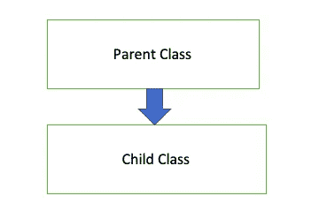
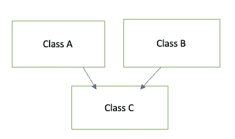
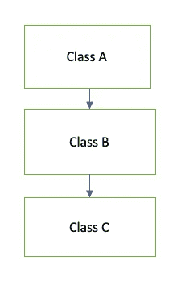
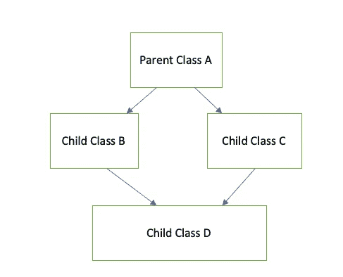

# 用 Swift 进行面向对象编程

> 原文：<https://medium.com/nerd-for-tech/object-oriented-programming-simplified-swift-38d3dc82c58f?source=collection_archive---------6----------------------->

[Unsplash](https://unsplash.com?utm_source=medium&utm_medium=referral) 上 [AltumCode](https://unsplash.com/@altumcode?utm_source=medium&utm_medium=referral) 拍摄的照片

在每一次编程面试中，你可能经常会遇到招聘人员提出的关于面向对象编程的问题，并用现实世界的例子来解释它。根据我在学术上的经验，我们学习所有的概念和它是如何工作的，但当涉及到现实世界的例子时，作为一个新生或大学毕业生，我们可能会被这个问题卡住。

让我们试着解决 OOP 的神秘。

**问:什么是面向对象编程？**

面向对象编程的范例侧重于将数据和功能绑定在一起。在面向对象编程中，我们有类、属性、函数和对象。类是对象的蓝图。对象是用定义的数据(属性)创建的类的实例。函数在类中定义，描述对象如何工作或操作。属性是类的实例，由类声明，由对象定义。

简单来说，我们可以说面向对象编程使用类和对象将复杂的代码逻辑分解成简单的可重用部分。

问:给出一个现实世界中面向对象编程的例子？

让我们考虑一个网站销售汽车的例子。

例如，假设我们在一个销售汽车的汽车网站上。我们想买辆车。所以我们向他们提供姓名和预算等信息。根据预算，他们提供了客户可能感兴趣的汽车的完整列表。

为了便于理解，我们采用了一个 swift 代码，其类别为 CarWebsite，具有属性或特性名称和预算以及处理数据的函数 getDetails()。

使用 swift 的 OOP

可能会有成千上万像我们这样的客户提交购车申请。因此，每位顾客都可以被视为一件物品，并根据他们的动态需求为他们提供个性化服务。

当我们用自定义数据初始化一个对象时。类的实例是用对象数据创建的。

例如，对于用户 1，值是名称:“阿克谢”和预算:1000，因此 getDetails 将返回价格为 1000 及以下的汽车。user2 对象提供的值为“Devkate”和 budget: 2000，因此 getDetails 函数将返回价格为 2000 及以下的汽车。

**问:解释一下 OOP 中的术语继承、抽象、封装和多态？**

这是 OOP 的四个核心原则

OOP 中的继承有助于消除重复编写相同代码函数的代码冗余。为了消除 OOP 中的代码冗余，我们将父类的属性和方法继承给子类。父类是其属性和方法被继承的类。子类是从父类继承属性的类。

OOP 中有不同形式的继承，它们是单一继承、多重继承、多级继承、混合继承、层次继承。

1.  单一遗传

单一遗传

在这种类型的继承中，一个类只继承一个父类。这是最基本的继承类型，也称为单一继承。

swift 中的单一继承

2.多重遗传

多重遗传

当一个类从一个以上的父类继承时，这个继承就变成了多重继承。从几个父类继承属性后，子类可以访问它们的所有对象。

由于历史问题，如[致命钻石](https://en.wikipedia.org/wiki/Multiple_inheritance)和其他模糊性，多重继承在 Swift 和许多其他语言中被类的使用所约束。Swift 中的协议可用于在某些层面上实现多重继承。

3.多层次继承

多层次继承

当一个类有多个子类，或者多个子类有相同的父类时，就会发生多重继承。

多层次继承

子类由 ParentB 类继承，ParentA 类继承。

4.混合遗传

混合遗传

术语“混合继承”是指一种以上的继承结合在一起。

混合遗传将多重遗传和多级遗传结合在一起。Swift 或许多其他编程语言不支持多重继承，因为它会导致歧义，因此这种类型的继承只能通过使用接口来实现。

**抽象**指的是处理思想而非事件的品质。它本质上需要隐藏细节，只向观众显示最重要的信息。例如，我们只需要在我们的移动应用程序中看到我们帐户的余额，而不是看到获取您帐户当前余额的 http 请求和代码。抽象是隐藏所有不必要的信息，只向用户显示必要信息的强大机制或设计。

封装通常指 OOP 中的信息隐藏。这也确保了隐藏数据和方法不会受到外部干预或方法的修改。

例如，考虑下面的代码

Swift 中的封装

从上面的例子中我们可以看到，变量或属性被定义为 private 来实现封装，这在 EncapsulationSwift 类之外是无法访问的。但是它可以被自己的类中的函数或方法访问。

多态性与 OOPs 有着千丝万缕的联系，是所有面向对象编程语言中的一个基本概念。一般来说，对象或引用在不同的上下文中可以采用不同的形式。从整体上看，多态性意味着“具有多种形式的属性”，顾名思义，“poly”意味着“许多”，“morph”指向“形式”。

swift 中有两种类型的多态性。

1.  运行时多态性

方法重写是运行时多态性的全部内容。
Swift 在程序运行时使用运行时多态来调用 real 方法。

Swift 中的运行时多态性

2.编译时多态性

在编译时，它不知道调用哪个方法。
配合继承使用。

swift 中的编译时多态性