# Unity 中的对象池设计模式

> 原文：<https://medium.com/nerd-for-tech/object-pooling-design-pattern-in-unity-de5334b0fe3d?source=collection_archive---------3----------------------->

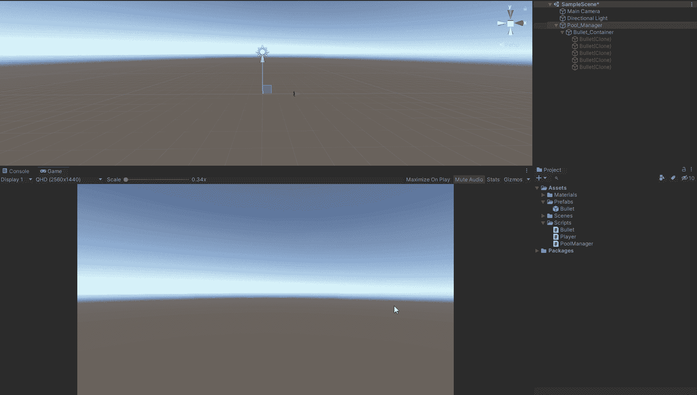

对象池是一种设计模式，它允许您在实例化多个对象时减少垃圾收集的数量。一个最简单的例子就是在射击游戏中使用子弹。

为此，您将创建一个空的游戏对象，作为游戏的池管理器。您还将创建池管理器脚本，并将其附加到池管理器游戏对象。您还需要制作一个游戏对象，用于保存子弹以保持层次结构的整洁。

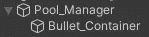

使池管理器脚本成为单例脚本，以允许所有脚本轻松访问它。

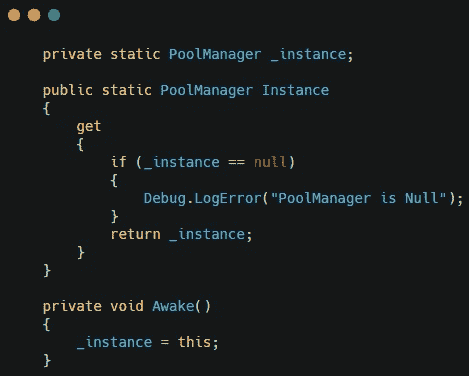

创建对预设的引用。创建一个列表来保存预置，并创建一个变量来告诉游戏要实例化多少个预置。你也可以为子弹容器制作一个容器预置。

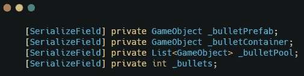

创建一个将作为列表返回的方法。这个方法将接受一个整数参数，循环遍历，并基于给定的整数创建一个预置。一旦项目符号被实例化，它将成为容器的父级并被禁用。

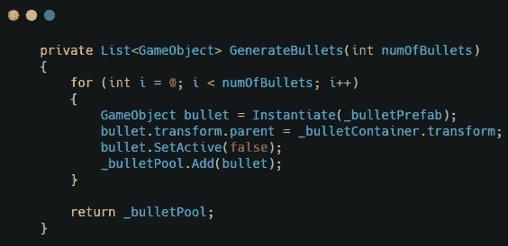

将您的列表设置为等于生成项目符号方法。

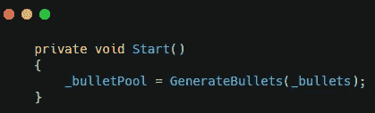

您可以创建一个公共方法来查找列表中的非活动项目符号，并将其用作您正在发射的项目符号。如果没有不活动的项目符号，它将创建一个。这允许游戏在大多数情况下使用现有的子弹预置，而不是创建新的。

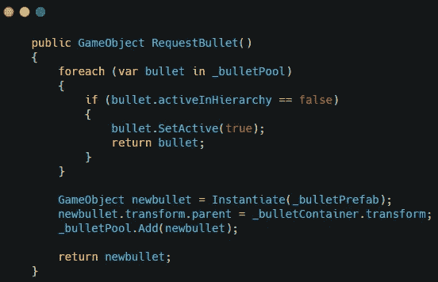

在这个例子中，我创建了一个简单的玩家脚本来拍摄，并将其附加到主摄像机上。当玩家单击鼠标左键时，请求 bullet 方法被调用，并且 bullet 的位置被设置为(0，0，0)。

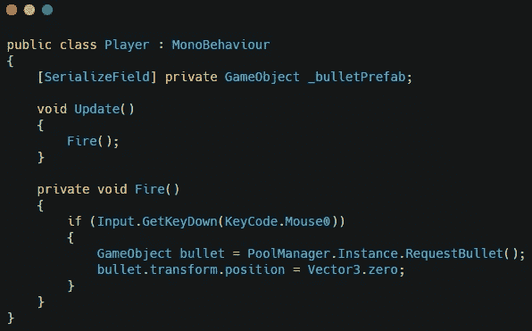

最后一部分是在一段时间后将项目符号设置为非活动状态。这是通过使用 OnEnble 并调用一个在特定时间后将对象设置为非活动的方法来完成的。

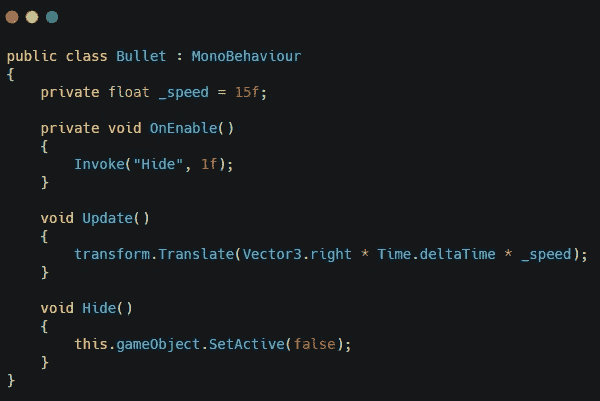

在 unity 中，确保设置所有的引用和你想要的初始项目符号数。

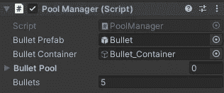

这将允许你的游戏创建一定数量的预设，并回收它们，而不是实例化多个预设。这将减少游戏中的垃圾收集量，并提高效率。

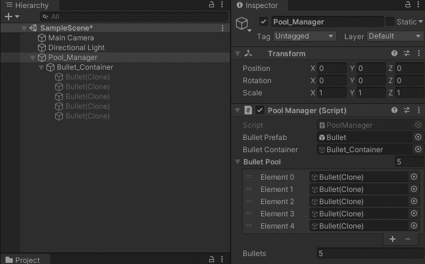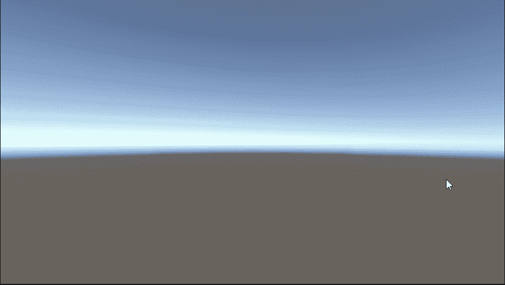