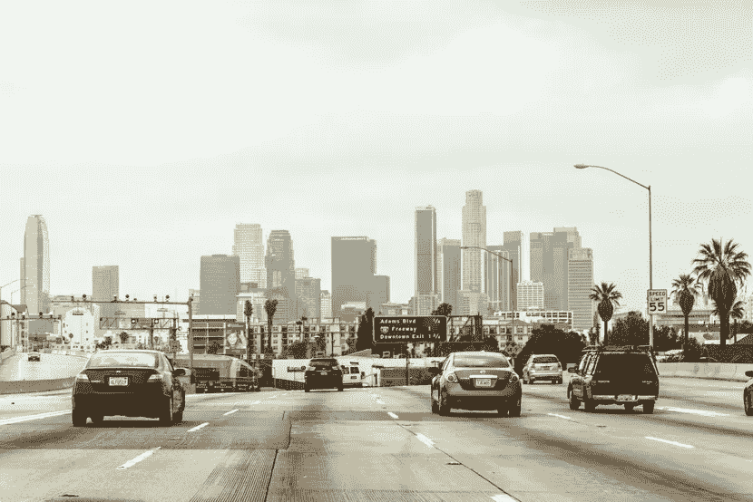
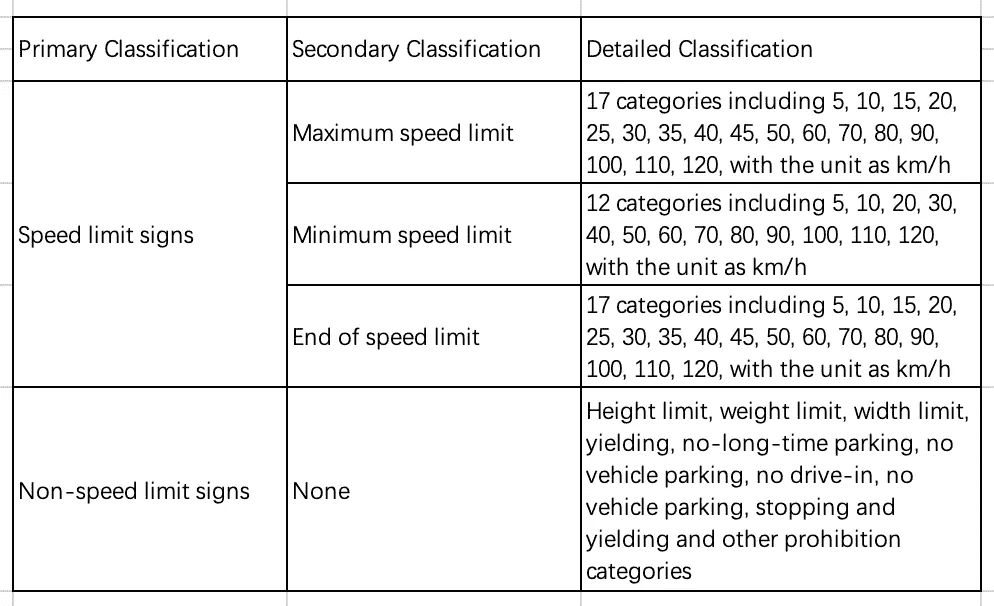
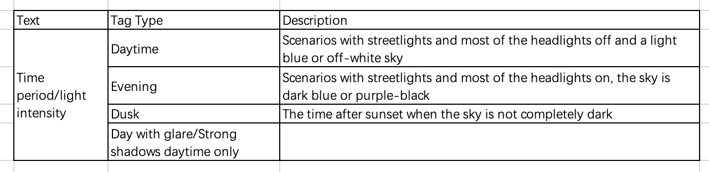
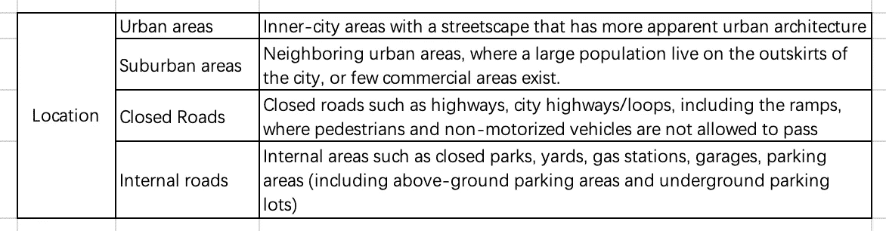
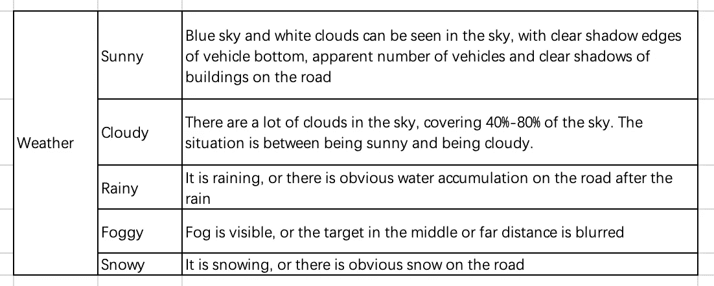
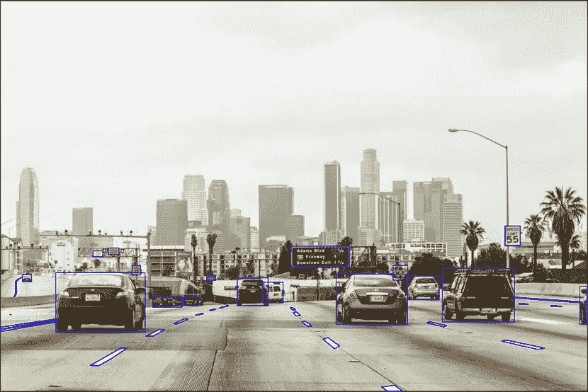

# 自动驾驶中的物体识别——交通标志标注案例研究

> 原文：<https://medium.com/nerd-for-tech/object-recognition-traffic-signs-annotation-case-study-in-automatic-driving-9042b9c7fd2c?source=collection_archive---------1----------------------->

道路交通标志的自动识别技术在自动驾驶中非常重要。在现实场景中，光照强度、障碍物和拍摄角度等干扰因素往往会给标牌识别带来挑战。

从 AI 技术的研究方向来看，无论是在传统的机器学习还是深度学习中，基于有明确标签或结果的训练样本的监督学习仍然是一种主要的模型训练方法。

要让自动驾驶汽车更加“智能”，自动驾驶应用需要在不同垂直落地场景下形成商业闭环，这就需要海量、高质量的真实道路数据的支撑。

我们来看一个交通标志标注案例。

## **标签类别规格**

**1.1 交通标志的标注:交通标志分为限速标志和非限速标志。**

非限速标志包括常见的重量限制标志、高度限制标志、宽度限制标志、轴重限制标志、警告标志、禁止标志、龙门架、大广场标志、信息标志、分离器和其他类型，分类如下表所示。

**1.2 最高限速标志**

最高限速标志包括两种类型，两种类型的特征差异很大。一种是常见的不可更改的标志，特点是一块圆板，红圈，白底，黑字。另一类是可变标志，特点是电子标志，数值可变。但是最高限速标牌的核心是价值。例如，值 50 始终与最大速度限制 50 公里/小时保持一致。

**1.3 最低限速标志**

这种类型的标志有明显的特征，如圆板、蓝底、白字和平底。

**1.4 拆除最高限速标志**

这种类型的标志有明显的特征，如一个圆板，黑圈，黑字和四五条平行的黑线。

**1.5 非限速标志**

重量限制、高度限制、宽度限制、让行、禁止长时间停车、禁止车辆停车、禁止驾驶、让行停车和其他禁止类别为非限速标志，如下所示:

*   分离器
*   信息标志
*   禁止标志
*   轴负载
*   重量
*   高度
*   宽度
*   警告
*   构台
*   禁止标志

## 场景注释

**场景类别注释如下:**

**2.1 场景时间**

**2.2 场景领域**

**2.3 场景天气**

## **标注要求**

**3.1 注释对象**

所列场景中的所有图像交通标志都应贴上标签。

**3.2 盒子的边框必须与目标的轮廓紧密匹配**

所有类型的标志应以顺时针方向标示。以左上角为起点，序号为 0，标注整个图像中标志的坐标。

**3.3 规格**

1)当最小边框长度小于 10 像素时，不需要注释。

2)当长度和宽度小于 15 个像素且无法识别标志时，不需要标注。

3)如果标志被部分遮挡，应标注不可见部分。

## **提醒**

*   框的边界应该靠近目标的 4 个边缘(3 个像素以内)。
*   不需要给肉眼无法识别的图像贴标签。
*   交通标志的目标很小，很可能不被注意到。要注意路口的路边和隐蔽角落。
*   如果交通标志的侧角或转弯角度过大，就不要标注。
*   如果长宽比大于 1.6，就不要标注。
*   无需标注褪色或严重变形的交通标志。

## 输出

字节桥对象识别案例研究

## 结束

把你的数据标注任务外包给 [ByteBridge](https://tinyurl.com/y4b6syjt) ，你可以更便宜更快的获得高质量的 ML 训练数据集！

*   无需信用卡的免费试用:您可以快速获得样品结果，检查输出，并直接向我们的项目经理反馈。
*   100%人工验证
*   透明和标准定价:[有明确的定价](https://www.bytebridge.io/#/?module=price)(包括人工成本)