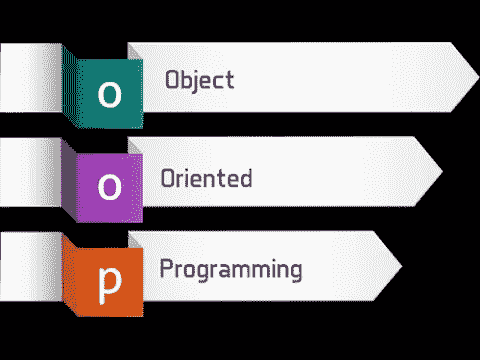
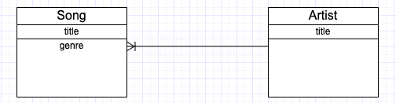
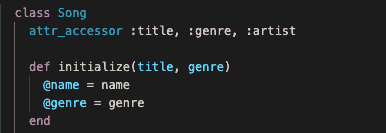
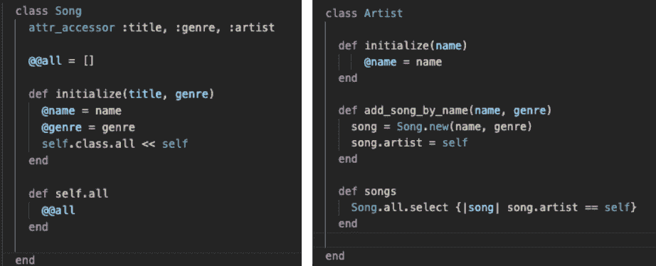
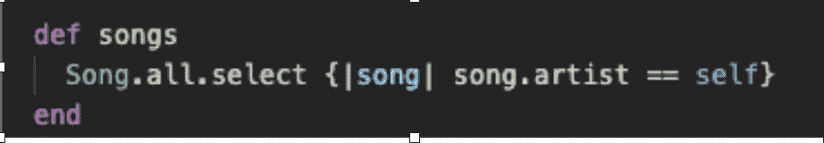

# Ruby 中的对象关系

> 原文：<https://medium.com/nerd-for-tech/object-relationship-in-ruby-5d6df482148f?source=collection_archive---------17----------------------->

我成为软件工程师的旅程始于几个月前，当时我决定加入熨斗学校的全日制沉浸式项目。不过，在我加入之前，我需要完成一项前期工作。它涵盖了任何编程语言的基本技能。它从讨论标量数据类型开始，如整数、字符串、布尔值…包括操作它们的方法，并扩展到集合数据类型，如数组和散列。

对任何人来说，花时间真正理解这些概念是非常重要的，因为这将在前进的道路上有很大帮助。加入后，我开始接触面向对象编程语言。在这篇博客中，我将谈论它是什么，以及其中一种关系是如何运作的。

面向对象编程(OOP)语言是一种使我们能够将任何事物表示为对象的语言。想想现实世界中存在的任何东西，它在 OOP 中被认为是一个对象，可以使用类的概念来创建。类允许我们通过合并它们的行为和功能来定义和创建真实世界的对象。

当我们看到物体时，它们不能自己退出，而是以这样或那样的方式与其他物体相互作用。作为程序员，我们的工作是将现实世界的交互映射和反映到我们的代码中，以解决任何问题。

在本文中，我们将看到 Ruby 编程语言中的两种对象关系。具有多/属于和多对多关系

有许多/属于关系

让我们举两个班级的例子，一首歌和一个艺术家。让我们假设一首歌属于一个艺术家，但事实上一个艺术家可以有很多首歌。

我们可以使用下面的实体关系图来显示这种关系。

但是我们如何用代码来显示这种关系呢？它有两个简单的步骤。

步骤 I —属于

在 Song 类中，放置 artist 的 setter (attr_writer)和 getter (attr_reader)方法或简单的 attr-accessor 来指示这两个方法，将自动创建属于关系。

因此，每当我们创建 song 类的实例时，我们都需要通过指定艺术家的实例而不是他的名字(字符串值)来说明艺术家是谁

第二步—有许多关系

指示一个艺术家类有许多歌曲的正确方法是在 song 类中声明一个类变量(@@all)并设置为一个空数组。这将使我们能够在初始化时捕获歌曲的每个实例。注意，通过隶属关系，我们可以知道每首歌曲的艺术家是谁。

这个实现将维护一个真实的单一来源，而不是在两个类中捕获数据，我们只是在一个地方这样做(Song 类),没有失去任何功能。

通过使用歌曲方法，建立的关系将帮助艺术家了解他的所有歌曲，这是多么令人敬畏！

无论我们是使用 song.new()还是使用 artist class 下的 add_song_by_name 方法来创建歌曲的新实例，它总是会被推送到 Song 类变量@@all，并且 artist 的一个实例也被分配给歌曲。…未完待续