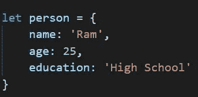
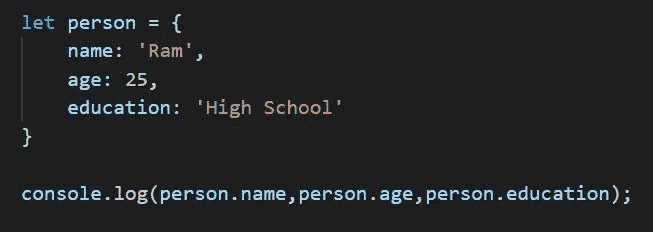

# JavaScript 中的对象

> 原文：<https://medium.com/nerd-for-tech/objects-in-javascripts-7414d237ad9f?source=collection_archive---------15----------------------->

关于 JS 对象的一切…

在 JS 中定义对象

在 Javascript 中，除了原始数据类型，一切都是对象。
对象可以包含许多值，但是这些值被声明为**键值**对。
一个简单的对象可以创建如下:

创建名为 person 的对象

这里创建了一个名为 person 的对象，其中包含这个人的姓名、年龄和教育程度。
姓名、年龄和教育被称为属性或键，它们对应的值被称为值，因此称为键-值对。
在 Javascript 中，对象不是通过值来寻址，而是通过引用来寻址，因此
让 a = person
不会创建人员类型的另一个对象“a ”,但现在“a”和“人员”是同一个对象,“a”中的任何更改都会影响“人员”对象。

通过编写 **objectName.propertyName** 可以访问对象的特定属性，我们可以获得相应属性的值。

考虑下面的程序，

人对象

在这里，person 是对象，其相应属性的值使用 person.name、person.age 和 person.education 来访问

以下程序的输出将是，

输出

对象关键字的值也可以改变，就像我们对变量所做的那样，把它赋给新的值。
下面的语句将把 person 对象的名称改为' Alex '
person . name = ' Alex '；

javascript 中 object 的一个有趣而神奇的地方是，我们可以在 object 内部拥有一个函数。并且这些函数被称为**函数方法**。

可以如下创建一个简单的函数方法，
这里 myInformation 是我们定义的显示姓名和年龄的函数的关键。

函数方法

要访问该函数，我们只需使用 **objectName.keyName()** ，这里是 person . my information()；
在定义函数时，我们使用了**这个**关键字，这是一个特殊的关键字，当我们必须引用特定对象的局部变量时使用。这里，this.name 指的是对象 person 的“name”键，因此名称“Ram”显示在输出中，this.age 指的是我们提到的年龄“25”。

上述程序的输出将是，

函数方法的输出

我们还可以将参数传递给函数方法，如下所示，

这里，参数被传递给函数，因此在输出中，我们将获得新的姓名和年龄，即姓名将为“Alex ”,年龄将为 20 岁，如下所示。

更多详细信息，你可以参考这个[网站](https://www.w3schools.com/js/js_object_methods.asp)。