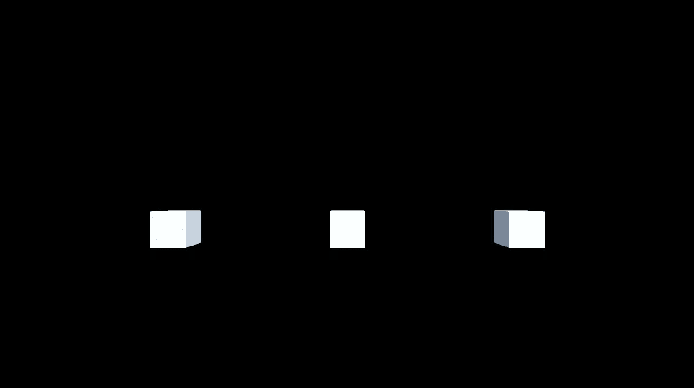
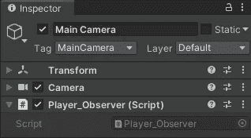
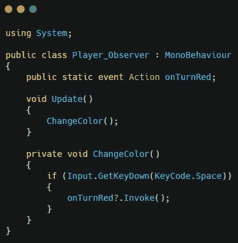
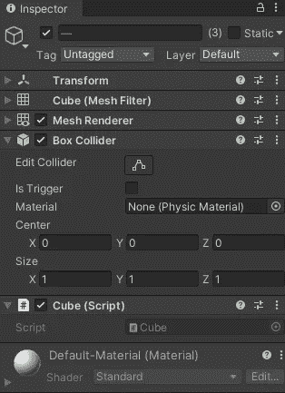
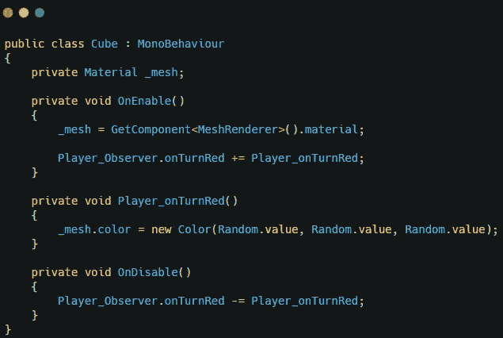
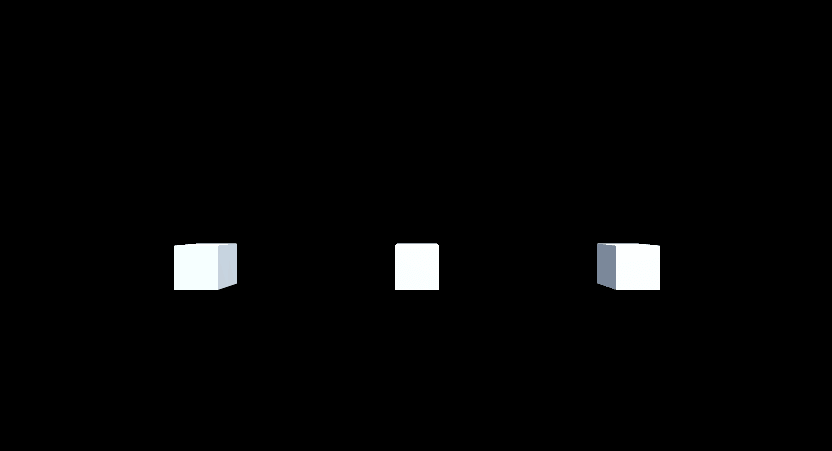

# Unity 中的观察者设计模式

> 原文：<https://medium.com/nerd-for-tech/observer-design-pattern-in-unity-69651a1c65c7?source=collection_archive---------5----------------------->

观察者设计模式是一种行为设计模式，它允许一个对象通知另一个对象其状态的变化。这允许对象订阅和取消订阅应用程序或游戏中对象发生的事件。

作为一个例子，我在 unity 中创建了一个有三个立方体场景。

我创建了一个玩家脚本，并将其添加到主摄像头。

这个脚本将使用名称空间系统来允许脚本使用一个动作。这个脚本将允许玩家按空格键，如果有任何东西在监听这个动作，它将调用它。

现在创建一个立方体脚本，并将其附加到场景中的立方体上。

这个脚本将获得对立方体上的材料的引用。它还将使用 OnEnable 和 OnDisable 方法来订阅和取消订阅操作。这个脚本的最后一个功能是将立方体的颜色改为随机颜色。

这将允许任何具有多维数据集脚本的多维数据集在调用该操作后改变颜色。

