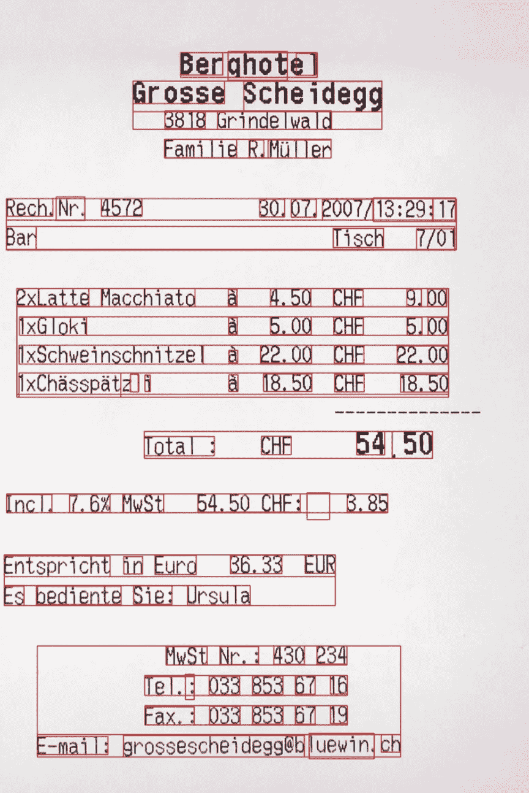

# OCR 数据注释案例研究

> 原文：<https://medium.com/nerd-for-tech/ocr-data-annotation-case-study-ef01a2341b18?source=collection_archive---------2----------------------->

作为计算机视觉领域中一个非常重要的研究方向，OCR 技术涉及到多种应用领域。如今，各种应用领域已经出现了很多产品，包括卡片识别、车票识别、视频中的结构化文本信息、自然场景中的文本识别等。

OCR 是从各种图像中识别相应的文本内容(包括不同的语言和其他字符类型)。OCR 主要用作 AI 的眼睛过滤器，从非结构化数据中识别相应的字符，然后进行后续处理，如扫描和翻译。

让我们分享一个 OCR 注释的例子

## 项目需求介绍

内容:行李牌+包装盒发货贴 OCR 标注

检测标注:标注场地的四个角点，第一个点在左上角，然后是右上角，顺时针方向。

识别:转录每个字符串的内容:例如，公司名称、采购订单、重量、交货地址)

## 注意

1、对于弯曲的文本，用偶数点标记轮廓

2、被遮挡的文本需要想象

3、当文本之间的距离很近时，方框可以重叠

4、被遮挡或模糊的文本取决于它是否可通过纯视觉识别

5、每行一个标签。那些不在同一行或以不同顺序阅读的不能被一起标记

6、在同一行中，距离上的两个单词应分开标注

# 结束

把你的数据标注任务外包给 [ByteBridge](https://tinyurl.com/54hb5hmr) ，你可以更便宜更快的获得高质量的 ML 训练数据集！

*   无需信用卡的免费试用:您可以快速获得样品结果，检查输出，并直接向我们的项目经理反馈。
*   100%人工验证
*   透明标准定价:[有明确的定价](https://www.bytebridge.io/#/?module=price)(含人工成本)

## 为什么不试一试？