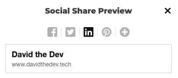
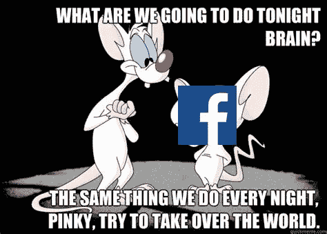
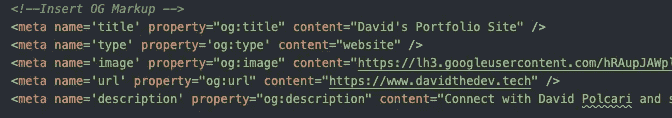
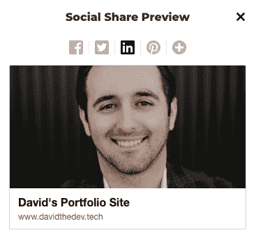
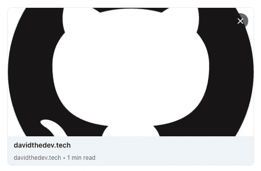
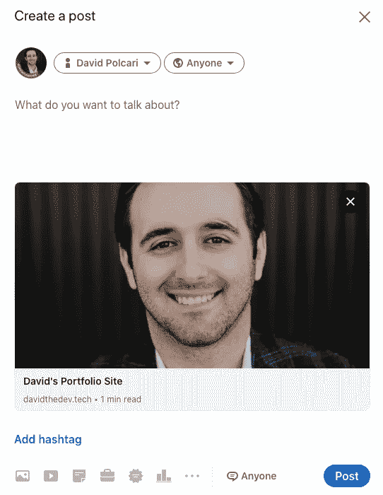

# 链接预览:OG 元标签

> 原文：<https://medium.com/nerd-for-tech/og-meta-tags-9cc121f5fec4?source=collection_archive---------1----------------------->

由[ján vla uha](https://unsplash.com/@flowixxcom)通过[unsplash.com](https://unsplash.com/photos/92_wMoF-yds)拍摄

作为求职的一部分，我最近创建了一个小型投资组合网站。完成后，我真的很兴奋在 LinkedIn 上分享它，并得到所有这些很酷的互动。所以我在 LinkedIn 上的一个帖子里留下了我的网址，这就是我看到的。

这实际上不是 LinkedIn 的截屏，因为我是在解决问题后写的。稍后会详细介绍。这个想法是，虽然链接预览不是很有信息量，也没有我们已经习惯看到的图片。

作为一个天真的软件开发人员，我认为这些事情就像魔术一样发生了。我错了，这就是为什么我写这篇文章来帮助记录和巩固我在解决问题的过程中学到的东西。

在做了一些研究后，我发现不是魔法而是元数据导致了这些链接预览。更确切地说，是脸书发明的一种叫做开放图的互联网协议。这并不奇怪，因为脸书似乎已经为 web 开发创造了大量新工具(参见 React 和 GraphQL)。

# 什么是开放图？

根据[freecodecamp.org](https://www.freecodecamp.org/news/what-is-open-graph-and-how-can-i-use-it-for-my-website/):

> Open Graph 是一种互联网协议，最初由脸书创建，用于标准化网页中表示页面内容的元数据的使用。

基本上，这意味着在你的 HTML 文档的`<head>`部分，你可以添加一些标签来帮助传达你的站点是什么。由于浏览器不会显示内容，大多数用户也不会钻研原始的 HTML，这实际上只对阅读你页面的机器人有用。

我在试图解决我的社交媒体链接预览时偶然发现了 Open Graph。大多数社交媒体网站，看着你[Twitter](https://developer.twitter.com/en/docs/twitter-for-websites/cards/overview/markup)，坚持使用开放图表标准，并利用这些信息来创建他们找到的数据的某种独特的视觉表示。

事实证明，这也是一个非常有效的搜索引擎优化工具，因为搜索引擎机器人可以读取和解释这些数据。我还没有做这方面的大量研究，但想把它留给我未来的自己。

# 你如何使用 Open Graph？

现在我们知道了什么是 Open Graph，我想向你展示一下我是如何在我的网站上使用它的，以及为什么我认为它还没有 100%发挥作用。

根据[开放图协议](https://ogp.me/)，您需要将四个必需属性放入每个网页的`<head>`部分的`<meta>`标签中:

*   `og:title`
*   `og:type`
*   `og:image`
*   `og:url`

因为我只是想让我的链接预览工作，我只使用了这四个和一个标签与一个`og:description`属性，但如果你点击上面的链接，你可以看到完整的列表，包括可选属性和一个**整个**更多。每个`<meta>`标签也应该有一个`content`属性，它将是链接预览中显示的信息。

*你可以把这个信息想象成一个对象，其中属性是键，内容是值。*

这是我用的标签。我不得不删掉一些内容，因为它太长了，而且太小了，无法阅读，但你应该明白。标题、url 和描述`content`非常简单明了，尽管我已经看到了关于标题和描述中的字符数的不同建议，所以你必须对它进行修改。

据我所知，大多数情况下类型`content`应该是网站，而图片`content`只是图片所在位置的绝对路径。

*注意:预览图像的推荐尺寸为 1200 像素乘以 630 像素，或者比例为 1.9:1。这可以防止边缘出现任何奇怪的空白。*

加上所有这些，我在 LinkedIn 上的链接预览应该是这样的。

这是它实际上的样子。

经过大量的研究之后，我发现我的站点所在的 Netlify 缓存了他们的元数据，并且每 24-48 小时才更新一次。实际上显示的是我第一次尝试纠正这个问题，所以我们将在一两天内看到它是否真的有效。

我使用了一个名为[社交分享预览](https://socialsharepreview.com/)的 chrome 扩展来解决我的链接预览看起来像什么的问题。假设他们的代码工作正常，我应该在几天内有一个伟大的预览。

更新:成功了！Netlify 在 24 小时后更新了他们的缓存。然而，LinkedIn 也缓存了这些元数据，为了手动刷新，你必须使用他们的 [post inspector 工具](https://www.linkedin.com/post-inspector/)。这是 Netlify 的缓存自动更新和我手动更新 LinkedIn 的缓存后的最终产品。

成功！

如果我错过了什么或者你在我的标签中看到了什么问题，请在下面的评论中告诉我！