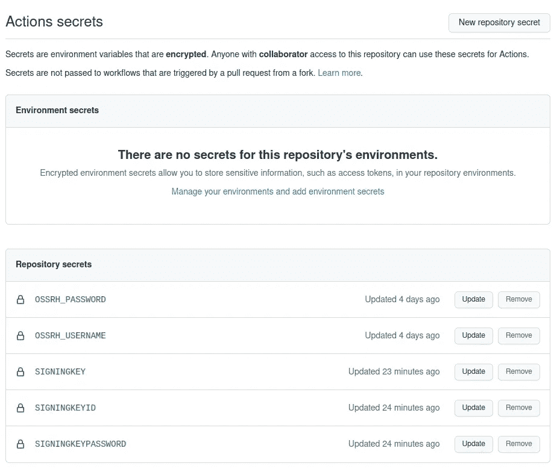

# 哦，不-另一个发布 Android 工件到 Maven 中央指南？

> 原文：<https://medium.com/nerd-for-tech/oh-no-another-publishing-android-artifacts-to-maven-central-guide-9d7f300ebd74?source=collection_archive---------1----------------------->


是的，这是另一个关于如何将 Android 工件发布到 Maven Central 的指南。与其他指南不同，它涵盖了额外的“东西”:

*   Gradle 使用 **Kotlin DSL** 构建文件。
*   发布 **AAR 文件**工件。
*   发布包括一个**源 Jar** 文件(hello `withSourcesJar`)。
*   该出版物包括一个 **Javadoc Jar** 文件(hello `withJavadocJar`)。
*   该出版物通过 **CI/CD** 渠道发布。
*   我有没有提到这是 **Android only** ？

对于那些不喜欢阅读的人，这里有我的两个使用解释发布机制的回复:

*   [https://github.com/1gravity/Android-RTEditor](https://github.com/1gravity/Android-RTEditor)
*   [https://github.com/1gravity/Android-ColorPicker](https://github.com/1gravity/Android-ColorPicker)

# Sonatype OSSRH

Maven Central 实际上只是多个存储库的一个门面。一个这样的储存库是 [Sonatype OSSRH](https://central.sonatype.org/publish/publish-guide/) 。为了发布您的工件，您需要一个他们的帐户(或者另一个库提供者)。有一堆关于如何开户和正确配置的好文章。我将在这里引用这些并完成它(这是一个繁琐的过程，所以请确保您有时间…):

*   [https://central.sonatype.org/publish/publish-guide](https://central.sonatype.org/publish/publish-guide/)
*   [https://Mr 好奇. medium . com/publishing-your-Android-kot Lin-library-to-maven-central-in-2021-df 263 a4 F2 CBC](https://mrcurious.medium.com/publishing-your-android-kotlin-library-to-maven-central-in-2021-df263a4f2cbc)
*   [https://getstream . io/blog/publishing-libraries-to-maven central-2021](https://getstream.io/blog/publishing-libraries-to-mavencentral-2021/)
*   [https://dev . to/mad head/no-bullsh-guide-on-publishing-your-grad le-projects-to-maven-central-3ok 4](https://dev.to/madhead/no-bullshit-guide-on-publishing-your-gradle-projects-to-maven-central-3ok4)
*   [https://www . waseefakhtar . com/Android/publishing-your-first-Android-library-to-maven central](https://www.waseefakhtar.com/android/publishing-your-first-android-library-to-mavencentral/)

# 插件

此时的假设是:

*   您拥有 Sonatype OSSRH 的**账户**。
*   您使用 Sonatype OSSRH 创建了一个存储库，并验证了您的域名的**所有权。**
*   您为签名工件创建了一个 **GPG 密钥对**，发布了您的公钥并导出了您的私钥。
*   你已经有一个用 Kotlin DSL 构建文件的 app 了(对比 Groovy 构建文件)-> **build.gradle.kts** 。

现在，第一步是向您的构建文件添加两个插件:

```
plugins **{** id("com.android.library")
 **id("maven-publish")
    id("signing")
}**
```

*   [**Maven-publish**](https://docs.gradle.org/current/userguide/publishing_maven.html)**:**提供了将构建工件发布到 [Apache Maven](http://maven.apache.org/) 存储库中的能力
*   [**签名**](https://docs.gradle.org/current/userguide/publishing_signing.html) **:** 用于对组成出版物的所有工件和元数据文件进行签名

# 出版

第二步是创建并配置*发布*扩展，将它添加到您的 gradle 构建文件中:

```
afterEvaluate **{** *publishing* **{** publications {
            **// here goes your configuration**
        }
    }
}
```

`afterEvaluate`确保项目已经被评估并且可以在配置块中被访问。

配置包括三个步骤:

1.  配置存储库
2.  配置发布
3.  在艺术品上签名

```
afterEvaluate **{** *publishing* **{** publications **{
            *// 1\. configure repositories
            // 2\. configure publication
            // 3\. sign the artifacts* **        }
    }
}
```

## 仓库

这部分配置定义了目标存储库。在我们的例子中，它是 Sonatype OSSRH，或者是发布或者是快照存储库。

目标储存库的确定基于版本名称。带有“-SNAPSHOT”后缀的版本将被上载到快照存储库中。

## 出版

配置发布非常简单。

首先，我们定义要发布的工件:

```
from(*project*.*components*["release"])
artifact(*tasks*.*named*<Jar>("withJavadocJar"))
artifact(*tasks*.*named*<Jar>("withSourcesJar"))
```

`project.components["release"]`是 Android 项目产生的工件，如果是 Android 库，应该是一个 *aar* 文件。另外两行将 Javadoc 和源 jar 文件声明为要发布的工件。在本文的后面，我将解释这两个工件是如何产生的。

配置的其余部分定义了 Maven POM 文件，这是一个 Maven 项目(项目元信息)的 XML 表示。

需要配置的最重要的属性是 *groupId* 、 *artifactId* 和*版本*(例如对于`com.android.tools.build:gradle:7.0.2`， *groupId* 是*com . Android . tools . build*、 *artifactId* 是*grade*、*版本*显然是 *7.0.2 所有其他属性都是可选参数，用于定义软件许可证、标识公司/开发者、源代码等。*

如你所见，所有属性都是从`project.properties`中读取的，这些属性是在一个`gradle.properties`文件中定义的(项目或库特定属性文件)。下面是这样一个属性文件的例子:[https://github . com/1 gravity/Android-rt editor/blob/master/rt editor/grad le . properties](https://github.com/1gravity/Android-RTEditor/blob/master/RTEditor/gradle.properties)。

注意，存储库的用户名和密码没有在项目属性文件中定义，而是应该在您的`~/.gradle/gradle.properties`文件中定义(~代表您的主目录)，这样凭证就不会提交给源代码控制。如果没有该文件，您需要创建它并添加凭据:

```
ossUsername=<your OSS user>
ossPassword=<your OSS password>
```

## 签署

对工件进行签名很简单:

```
*signing* **{** sign(*publishing*.*publications*.getByName(publicationName))
**}**
```

签名插件使用您之前创建的密钥(参见“您为签名工件创建了一个 **GPG 密钥对**，发布了您的公钥并导出了您的私钥”)。插件需要您在`~/.gradle/gradle.properties`文件中定义的*私钥*文件、 *keyId* 和*密码*。将此添加到文件中:

```
signing.secretKeyRingFile=/<user>/.gnupg/secring.gp
g
signing.keyId=<last 8 characters of your key id>
signing.password=<the password>
```

注意`~/.gnupg/secring.gpg`不能工作，因为 Android 不能解析到你的主目录。

就是这样。如果您从项目目录运行`./gradlew publish`，它将构建您的库并将其发布到 Sonatype OSSRH。您仍然需要手动关闭和发布库，虽然这也可以自动化，但您应该熟悉手动过程:[https://central.sonatype.org/publish/release/](https://central.sonatype.org/publish/release/)。

## 使用 CI/CD 签名

大多数构建管道将秘密作为字符串读取，而不是从文件中读取(就像我们上面使用的`secretKeyRingFile`)。虽然有很多方法可以将文件送入管道(关于位桶管道的描述可以在[这里](/nerd-for-tech/ci-cd-for-android-using-bitbucket-pipelines-and-gradle-play-publisher-f00d6047ecb5)找到)，但这是一个相当麻烦的过程。最好完全避免文件。

在我们的例子中，我们可以通过在创建签名任务之前调用`useInMemoryPgpKeys`来使用内存中的 PGP 密钥和密码:

如果在本地编译，这三个参数将从属性文件中读取，所以将这些值放在您的 *~/中。gradle/gradle.properties* 文件:

```
signingKeyId=<last 8 characters of your key id>
signingKeyPassword=<the password>
signingKey=<the key>
```

密钥需要被“保护”,这意味着转换为完全由纯文本模式/ ASCII 字符组成的文件的加密表示。它还需要去掉典型的包装器 *gpg* 来包装实际的密钥(“--”BEGIN PGP 私有密钥块— -”部分)。

使用这个一行程序获得关键值:

```
gpg --export-secret-keys --armor <KEY_ID> |grep -v '\-\-' |grep -v '=.' |tr -d '\n'
```

要在构建管道中运行它，您需要在相应的秘密管理器中配置秘密。对于 GitHub，这看起来像这样:



定义管道时，您需要将机密作为参数传递给 gradle/gradlew。

对于 [GitHub 动作](https://github.com/features/actions)，语法是:

```
./gradlew -PossUsername=${{ secrets.OSSRH_USERNAME }}
```

对于[位桶流水线](https://support.atlassian.com/bitbucket-cloud/docs/get-started-with-bitbucket-pipelines/)，语法是:

```
./gradlew -PossUsername=$OSSRH_USERNAME
```

# withSourcesJar

在 Java 项目中，有一种为源代码和 Javadoc 创建 Jar 文件的简单方法:

```
*java* **{** withSourcesJar()
    withJavadocJar()
**}**
```

不幸的是，这在 Android 项目中不起作用。不过，使用 withSourcesJar 进行复制相当简单:

```
*tasks* **{** *register*<Jar>("withSourcesJar") **{** *archiveClassifier*.set("sources")
        from(*android*.sourceSets.getByName("main").java.srcDirs)
    **}
}**
```

这将注册一个名为`withSourcesJar`的任务。它创建一个 jar 文件(因此有了`Jar`类型定义，并使用 Android 源目录(`*android*.sourceSets.getByName(“main”).java.srcDirs`)作为 Jar 文件的输入。

# withJavadocJar

为 Javadoc 创建 jar 文件同样简单:

```
*tasks* {
   *archiveClassifier*.set("javadoc")
   dependsOn(named("withJavadoc"))
   val destination = *named*<Javadoc>("withJavadoc")
                        .get()
                        .*destinationDir* from(destination)
}
```

唯一的问题是，在创建 Jar 文件之前，我们需要先创建 Javadoc。正如您在上面看到的，我们引用了一个名为`withJavadoc`的任务来创建实际的文档:

# 摘要

这是所有放在一起的代码:

此处使用了该代码:

[](https://github.com/1gravity/Android-RTEditor/blob/master/RTEditor/build.gradle.kts) [## Android-rt editor/build . grad le . kts at master 1 gravity/Android-rt editor

### Android RTEditor 是一个面向 Android 的富文本编辑器组件，可以用作 EditText 的插件…

github.com](https://github.com/1gravity/Android-RTEditor/blob/master/RTEditor/build.gradle.kts) 

还有这里:

[](https://github.com/1gravity/Android-ColorPicker/blob/master/library/build.gradle.kts) [## Android-color picker/build . gradle . kts at master 1 gravity/Android-color picker

### Android 颜色选择器是一个设计精美的颜色选择器，显示在一个对话框中…

github.com](https://github.com/1gravity/Android-ColorPicker/blob/master/library/build.gradle.kts) 

像往常一样，如果你有建议或问题，请不要犹豫，发表意见。

编码快乐！

# 附录

如果你认为在 Maven Central 上发布很麻烦，你并不孤单。在我看来，有一个更好/更容易的选择:[更好的 Maven Central](/nerd-for-tech/the-better-maven-central-90d7e529d606) 。